# RESUMEN — Sistemas Inteligentes Artificiales

> Resumen integral de la materia, construido a partir de: slides del cursado nuevo (clases 0 a 9 + anexos), slides del cursado viejo (como respaldo), los dos resúmenes previos (`SIA_Resumen_Parcial_1.pdf` y `SIA_Resumen_Parcial_2.pdf`), la guía "De dónde estudiar", la bibliografía de la cátedra y los parciales/recuperatorios 2023.

## Menú rápido

**Parte I — 1er parcial:**
[1. Intro a la IA](#1-introducción-a-la-inteligencia-artificial) ·
[2. Agentes inteligentes](#2-agentes-inteligentes) ·
[3. Aprendizaje automático](#3-aprendizaje-automático--fundamentos) ·
[4. Árboles de decisión](#4-árboles-de-decisión-tdidt) ·
[5. 1R y PRISM](#5-algoritmos-generadores-de-reglas-1r-y-prism) ·
[6. WEKA](#6-weka) ·
[7. Métricas de evaluación](#7-evaluación-de-clasificadores-métricas-de-weka) ·
[8. Clustering y escalado](#8-clustering-aprendizaje-no-supervisado)

**Parte II — 2do parcial:**
[9. Regresión lineal](#9-regresión-lineal) ·
[10. Redes neuronales](#10-redes-neuronales--fundamentos) ·
[11. Hopfield](#11-modelo-de-hopfield) ·
[12. Perceptrón](#12-perceptrón) ·
[13. Backpropagation](#13-redes-multicapa--backpropagation) ·
[14. Kohonen](#14-redes-competitivas--red-de-kohonen) ·
[15. Algoritmos genéticos](#15-algoritmos-genéticos-ag) ·
[16. Evolucionarios y AG paralelos](#16-algoritmos-evolucionarios-y-ag-paralelos-cursado-nuevo--clase-8) ·
[17. Sistemas expertos](#17-sistemas-expertos-cursado-nuevo--clase-9)

**Para repasar:**
[Convención de notación](#convención-de-notación) ·
[Mapa de la materia](#mapa-de-la-materia) ·
[🎯 Mapa de examen](#18-mapa-de-examen) ·
[Formulario rápido](#19-formulario-rápido) ·
[Fichas de fórmulas](#20-repaso-de-fórmulas-calculables-fichas-de-estudio)

**Para el final:**
[⚖️ 21. Comparador de modelos](#21-comparador-de-modelos--características-diferencias-y-elección)

**Resolución de parciales:**
[22. Parcial 1 (2023)](#22-resolución--parcial-1-2023) ·
[23. Recuperatorio P1 (2023)](#23-resolución--recuperatorio-parcial-1-2023) ·
[24. Parcial 2 (2023)](#24-resolución--parcial-2-2023) ·
[25. Recuperatorio 2 (2023)](#25-resolución--recuperatorio-2-2023) ·
[26. Parcial 1 (2025)](#26-resolución--parcial-1-2025) ·
[27. Parcial 2 (2025)](#27-resolución--parcial-2-2025)

## Convención de notación

- **Texto sin marca** = contenido fiel al material de la cátedra (slides, anexos, resúmenes), sin conflicto con la teoría estándar.
- **📖 Cátedra** = lo que dice textualmente el material de la cátedra, en los puntos donde difiere de la teoría corroborada.
- **✅ Corroborado** = corrección o ampliación verificada con la bibliografía estándar, que difiere de (o no figura en) el material de la cátedra.
- **🎯 en un título** = ese punto fue **pregunta textual en los parciales/recuperatorios 2023**: no te puede faltar.
- <mark>Texto resaltado</mark> = la frase que es **la respuesta** de esa pregunta de examen (si solo te acordás de algo, que sea esto).

Cuando aparecen ambas marcas juntas, **estudiá la versión ✅** y tené presente la 📖 por si el enunciado o el corrector siguen la letra de las slides: desarrollar la justificación completa en la hoja te cubre en ambos casos.

Además: los **diagramas** están en Mermaid (se renderizan en GitHub y en VS Code con la extensión *Markdown Preview Mermaid Support*), y cada fórmula o algoritmo tiene su **pseudocódigo paso a paso** con los números del ejemplo como traza — el mismo desarrollo "fórmula → pasos → resultado" que hay que escribir a mano en el parcial.

## Mapa de la materia

| Parcial | Clases | Temas | Bibliografía de apoyo |
|---|---|---|---|
| **1er parcial** | 0–3 + anexos | Introducción a la IA, agentes inteligentes, aprendizaje automático, árboles de decisión (ID3), cálculo de la información, 1R y PRISM, WEKA, métricas de evaluación, Kappa, clustering (K-means, EM, Cobweb), normalización/escalado | Russell & Norvig caps. 1 y 2; "Aprendizaje Automático" caps. 1–3; VERA_kuaa_Ferrante (K-medias) |
| **2do parcial** | 4–9 | Regresión lineal, redes neuronales (Hopfield, Perceptrón, Backpropagation, Kohonen), algoritmos genéticos, algoritmos evolucionarios, AG paralelos, sistemas expertos | Ponce Cruz caps. 3 y 4; "Los mapas auto-organizados de Kohonen (SOM)" |

---

# PARTE I — PRIMER PARCIAL

## 1. Introducción a la Inteligencia Artificial

### 1.1 ¿Qué es la inteligencia?

Preguntas disparadoras: ¿es la capacidad para responder preguntas?, ¿la habilidad para enfrentar nuevas situaciones?, ¿la habilidad para resolver problemas?

**Definición RAE**: es la capacidad para entender o aprender, como así también la capacidad para resolver problemas.

### 1.2 ¿Qué es la IA?

Existen **dos grandes grupos de definiciones**:

1. **Relacionadas con procesos mentales** (pensar):
   - "Lograr que las computadoras piensen… máquinas con mentes, en el más amplio sentido literal" (Haugeland, 1985).
2. **Relacionadas con la conducta** (actuar):
   - "El estudio de cómo lograr que las computadoras realicen tareas que, por el momento, los humanos hacen mejor" (Rich y Knight, 1991).
   - "Es el estudio del diseño (y desarrollo) de agentes inteligentes" (Poole, 1998).

En el enfoque de Russell y Norvig estas dos dimensiones se cruzan con otras dos: sistemas que piensan/actúan **como humanos** vs. sistemas que piensan/actúan **racionalmente**. La materia adopta principalmente la visión de **agentes racionales** (actuar racionalmente).

### 1.3 Ciencias fundamentales de la IA

La IA es interdisciplinaria; se apoya en:

- **Filosofía**: lógica, razonamiento, mente/cuerpo, origen del conocimiento.
- **Matemáticas**: lógica formal, probabilidad, computabilidad, algoritmos.
- **Investigación Operativa y Economía**: teoría de la decisión, utilidad, optimización.
- **Neurociencia**: cómo procesa la información el cerebro (inspiración del conexionismo).
- **Psicología**: cómo piensan y actúan los humanos (psicología cognitiva).
- **Ingeniería computacional**: el hardware y software que hacen posible la IA.
- **Teoría de Control y Cibernética**: sistemas que se autorregulan (retroalimentación).
- **Lingüística**: relación entre lenguaje y pensamiento (procesamiento de lenguaje natural).

### 1.4 Orígenes e historia de la IA

Etapas vistas en clase:

1. **Nacimiento**: teoría de autómatas, primeras redes neuronales (McCulloch y Pitts, 1943), el "Teórico Lógico" (Logic Theorist de Newell y Simon, primer programa que demostraba teoremas). La conferencia de Dartmouth (1956) da nombre al campo.
2. **Inicios**: el SRGP (Solucionador de Problemas de Propósito General / General Problem Solver de Newell y Simon) y el programa de **juego de damas** de Samuel (que aprendía a jugar mejor que su creador).
3. **Realidad y pérdida de interés** ("invierno de la IA"): las promesas exageradas no se cumplen, los problemas reales resultan intratables (explosión combinatoria), se recortan los fondos.
4. **Sistemas expertos y resurgimiento**: sistemas basados en conocimiento de dominio específico. El sistema **R1** (McDermott, 1982), usado por DEC para configurar pedidos de computadoras, fue el primer sistema experto comercial exitoso (ahorraba ~40 millones de dólares al año).

### 1.5 Aplicaciones de la IA

Robótica, medicina (diagnóstico, imágenes), educación, entretenimiento (videojuegos), gestión de la información, biología (plegado de proteínas), etc.

### 1.6 Reflexiones del cursado nuevo (clase 0)

El cursado nuevo dedica una clase a debatir el uso responsable de la IA:

- **¿Reemplazar o acompañar al humano?** La postura de la cátedra favorece el enfoque que **acompaña** al humano (el humano dirige, la IA asiste).
- **Confianza en los resultados**: James Gosling plantea la pregunta clave ante la IA generativa: *"¿cuál es la tolerancia al error que estamos dispuestos a aceptar?"* — no es lo mismo un chatbot de recetas que un sistema médico.
- **Sesgo algorítmico**: los modelos de lenguaje generativo heredan y amplifican sesgos sociales presentes en sus datos de entrenamiento (representación social distorsionada).
- **Seguridad**: los LLM tienen un "lado oscuro": inyección de prompts, jailbreaks, generación de contenido malicioso, fugas de datos.

---

## 2. Agentes inteligentes

### 2.1 Definición

> "Es cualquier cosa capaz de **percibir** su medio con la ayuda de **sensores** y **actuar** en ese medio utilizando **actuadores**" (Russell y Norvig, 2004).

Ejemplos: un humano (ojos/oídos como sensores; manos/voz como actuadores), un robot (cámaras; motores), un agente de software (lecturas de archivos/red; escritura en pantalla/archivos).

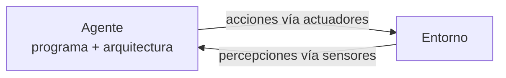

### 2.2 Función del agente vs. programa del agente

- **Función del agente**: descripción **abstracta** que asigna una acción a cada secuencia de percepciones posible (matemáticamente, una tabla percepción → acción).
- **Programa del agente**: la **implementación** concreta de esa función, que corre sobre una arquitectura.
- **Agente = Programa + Arquitectura**.

### 2.3 El mundo de las aspiradoras

Ejemplo canónico: dos cuadrículas (A y B), la aspiradora percibe en qué cuadrícula está y si hay suciedad; acciones: aspirar, moverse a izquierda/derecha, no hacer nada. Su función de agente se puede tabular (percepción → acción). Pregunta típica de clase: ¿qué debería hacer si ambas cuadrículas están limpias? (p. ej., no hacer nada para no gastar energía).

### 2.4 Cuadro REAS

Siempre que se modele un agente se debe especificar un cuadro **REAS** (en inglés PEAS) para describir el **entorno de trabajo** de la forma más completa posible:

- **R**endimiento: medida de éxito (¿qué es "hacerlo bien"?).
- **E**ntorno: dónde opera el agente.
- **A**ctuadores: con qué actúa.
- **S**ensores: con qué percibe.

Ejemplo — **taxista automático**:

| Elemento | Descripción |
|---|---|
| Rendimiento | Viaje seguro, rápido, legal, cómodo; maximizar ganancias |
| Entorno | Calles, tráfico, peatones, clientes, clima |
| Actuadores | Volante, acelerador, freno, bocina, pantalla |
| Sensores | Cámaras, GPS, velocímetro, sensores del motor, teclado |

### 2.5 Agente racional y racionalidad

- **Racionalidad = "hacer lo correcto"**: emprender la acción que **maximice la medida de rendimiento**, dada la evidencia disponible.
- Definición formal: *"En cada posible secuencia de percepciones, un agente racional deberá emprender aquella acción que maximice su medida de rendimiento, basándose en las percepciones y decisiones anteriores que mantiene almacenadas."*
- **Racionalidad ≠ Omnisciencia**: el agente racional maximiza el resultado *esperado* con la información que tiene; el omnisciente conocería el resultado *real* de sus acciones (imposible en la práctica).
- **Autonomía**: el agente posee **menor autonomía** cuanto **más se apoya en el conocimiento inicial** proporcionado por su diseñador, y mayor autonomía cuanto más aprende de sus propias percepciones.

### 2.6 Tipos de programas de agente

De menor a mayor sofisticación:

1. **Agente reactivo simple**: actúa solo según la percepción actual, mediante reglas condición-acción ("si el auto de adelante frena, frenar"). No tiene memoria. Solo funciona si el entorno es totalmente observable.
2. **Agente reactivo basado en modelos**: mantiene un **estado interno** (modelo del mundo) que le permite manejar entornos parcialmente observables: sabe cómo evoluciona el mundo y cómo lo afectan sus acciones.
3. **Agente basado en objetivos**: además del modelo del mundo, tiene **metas** que describen situaciones deseables; elige acciones que lo acercan a la meta (implica búsqueda y planificación).
4. **Agente basado en utilidad**: cuando hay varios caminos hacia la meta, una **función de utilidad** permite comparar qué tan "deseable" es cada estado (más rápido, más seguro, más barato) y elegir el de mayor utilidad esperada.
5. **Agente que aprende**: agrega componentes que le permiten mejorar con la experiencia: **elemento de aprendizaje** (mejora), **elemento de actuación** (decide), **crítico** (evalúa el desempeño contra un estándar) y **generador de problemas** (propone acciones exploratorias).

---

## 3. Aprendizaje automático — fundamentos

### 3.1 El aprendizaje animal como inspiración

Tipos de aprendizaje animal vistos en clase:

- **Habituación**: dejar de responder a un estímulo repetido e irrelevante.
- **Asociativo**: vincular dos estímulos o un estímulo con una respuesta.
- **Condicionamiento**: asociación estímulo-respuesta reforzada (Pavlov, Skinner).
- **Prueba y error**: repetir lo que funciona, descartar lo que no.
- **Latente**: se aprende sin refuerzo aparente y se manifiesta después.
- **Imitación**: copiar el comportamiento de otro individuo.
- **Impronta**: aprendizaje en período crítico temprano (p. ej., patitos que siguen a la madre).

### 3.2 ¿Qué es el aprendizaje automático?

Metáfora habitual: resolver problemas es un tipo de aprendizaje que consiste, una vez resuelto un tipo de problema, en **ser capaz de reconocer la situación problemática y reaccionar usando la estrategia aprendida**.

Se busca que un agente tome decisiones sobre el curso más apropiado para resolver un problema y **modifique esas decisiones cuando las condiciones lo requieran**: sistemas capaces de **adaptarse dinámicamente**.

**Fórmula de la cátedra:**

> **Aprendizaje = Selección + Adaptación**

- **Selección**: las características más relevantes de un objeto se comparan con otras conocidas mediante un proceso de cotejamiento (**Pattern Matching**).
- **Adaptación**: cuando las diferencias son significativas, el sistema **adapta su modelo** según el resultado del cotejamiento.

### 3.3 Reseña histórica del aprendizaje automático

1. **Entusiasmo inicial (1955–1965)**: aprendizaje sin conocimiento de respaldo, *neural modelling* (perceptrones), aprendizaje evolutivo.
2. **Etapa oscura (1965–1976)**: adquisición simbólica de conceptos, adquisición del lenguaje; decae el interés (limitaciones del perceptrón demostradas por Minsky y Papert).
3. **Renacimiento (1976–1986)**: exploración de diferentes estrategias, *knowledge-intensive learning*, primeras aplicaciones exitosas.
4. **Desarrollo (1986–actualidad)**: aprendizaje conexionista (backpropagation), sistemas multiestrategia, comparaciones experimentales.

### 3.4 🎯 Medidas de actuación del aprendizaje automático

**(Pregunta de recuperatorio)** Las principales medidas de actuación son:

- **Generalidad**: capacidad del método de aplicarse a distintos dominios/problemas (no solo al que fue diseñado).
- **Robustez**: capacidad de funcionar correctamente ante ruido, datos incompletos o inconsistentes.
- **Eficacia**: qué tan bien resuelve la tarea (calidad de los resultados).
- **Eficiencia**: cuántos recursos (tiempo, cómputo, datos) consume para lograrlo.

### 3.5 Clasificación del aprendizaje automático

**Por estrategia de aprendizaje:**

- **Deductivo**: de lo general a lo particular; deduce nuevo conocimiento a partir de reglas y hechos conocidos.
- **Analógico**: transfiere soluciones de problemas conocidos a problemas nuevos similares.
- **Inductivo**: de ejemplos particulares a reglas generales (árboles de decisión, la mayoría del ML actual).
- **Mediante descubrimiento**: explora y descubre regularidades sin guía externa.
- **Algoritmos genéticos**: evolución de poblaciones de soluciones.
- **Conexionismo**: redes neuronales artificiales.

**🎯 Por tipo de supervisión (los dos/tres grandes grupos — pregunta de recuperatorio):**

1. **Supervisado**: <mark>el algoritmo se entrena con un **histórico de datos etiquetados** y "aprende" a asignar la etiqueta de salida adecuada a un nuevo valor</mark> (predice la salida). Se usa típicamente para **clasificación** y **regresión**.
   - Ejemplos: detector de spam, árboles de decisión (**ID3, C4.5, J48**), regresión lineal, perceptrón, backpropagation.
2. **No supervisado**: <mark>**no se dispone de datos etiquetados**; se conocen las entradas pero no hay salida asociada. Tiene **carácter exploratorio**</mark>: busca estructura oculta en los datos.
   - Ejemplos: **clustering o agrupamiento** (K-means, EM, Cobweb), redes de Kohonen, Hopfield.
   - ⚠️ Cuidado con las **correlaciones espurias**: que dos variables se agrupen o correlacionen no implica causalidad.
3. **Por refuerzo**: el agente aprende interactuando con el entorno mediante **premios y castigos** (recompensas); no se le dice qué acción es correcta, lo descubre por prueba y error.

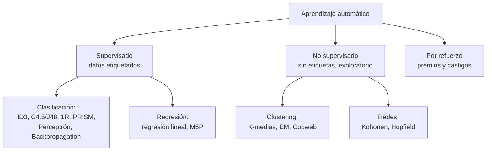

### 3.6 ¿Qué tareas resuelve?

Según la pregunta que se quiera responder es el tipo de algoritmo a usar: ¿predecir una categoría? → clasificación (supervisado); ¿predecir un valor numérico? → regresión (supervisado); ¿descubrir grupos? → clustering (no supervisado); ¿optimizar una estrategia de acciones? → refuerzo.

---

## 4. Árboles de decisión (TDIDT)

### 4.1 Concepto

TDIDT = *Top-Down Induction of Decision Trees* (inducción descendente de árboles de decisión). Familia desarrollada desde los años 60: CLS (Hunt, 1966), **ID3 (Quinlan, 1979)**, CART (Breiman, 1984), ACLS, ASSISTANT, **C4.5 (Quinlan, 1993)** y su implementación en WEKA, **J48**.

- El aprendizaje de árboles es **sencillo, fácil de implementar y poderoso**; es el ejemplo clásico de aprendizaje **supervisado inductivo**.
- Un árbol recibe un objeto o situación descrita por un **conjunto de atributos** y regresa una **decisión** (la clase).

### 4.2 🎯 Partes constitutivas (pregunta de parcial)

- **Nodo raíz**: el atributo con mayor ganancia de información; punto de entrada del árbol.
- **Nodos internos**: cada uno corresponde a una **prueba sobre un atributo**.
- **Ramas (arcos)**: etiquetadas con los **posibles valores** del atributo del nodo del que salen.
- **Hojas**: especifican el **valor de la clase** (la decisión final).

### 4.3 🎯 Reglas de decisión (pregunta de parcial)

Para obtener las reglas de un árbol se recorre **cada camino desde la raíz hasta cada hoja**, conjugando con AND las condiciones (atributo = valor) de cada rama atravesada; la hoja da el consecuente:

```
SI atributo1 = valor1 Y atributo2 = valor2 ... ENTONCES Clase = C
```

Se genera **una regla por hoja**, de manera ordenada (típicamente de izquierda a derecha). El conjunto de reglas es equivalente al árbol.

**Proceso inverso (construir el árbol a partir de reglas)** — también se toma en examen:

1. Elegir como **raíz** uno de los atributos que aparecen en las reglas (conviene el que aparece en más reglas).
2. **Ramificar** por cada valor posible del atributo.
3. En cada rama, continuar con el siguiente atributo mencionado en las reglas que siguen vigentes por ese camino.
4. Los caminos cubiertos por una regla terminan en una **hoja con su clase**; todos los caminos **no cubiertos** por ninguna regla terminan en la clase del "SINO" (clase por defecto).
5. Verificar que **cada regla original corresponda a al menos un camino** raíz→hoja del árbol.

### 4.4 Algoritmo ID3 (pseudocódigo de la cátedra)

```
R = conjunto de atributos no clasificadores
C = atributo clasificador
S = conjunto de entrenamiento

ID3(R, C, S):
  Si S está vacío:
      devolver un único nodo con valor "falla"
  Si todos los registros de S tienen el mismo valor para C:
      devolver un único nodo con dicho valor
  Si R está vacío:
      devolver un único nodo con el valor más frecuente de C en S
  Si R no está vacío:
      D ← atributo con mayor GANANCIA entre los atributos de R
      Sean {d1..dm} los valores del atributo D
      Sean {S1..Sm} los subconjuntos de S correspondientes a cada dj
      devolver un árbol con raíz D y arcos d1..dm que van a los subárboles
          ID3(R−{D}, C, S1), ID3(R−{D}, C, S2), ..., ID3(R−{D}, C, Sm)
```

La clave del algoritmo es **elegir en cada paso el atributo con mayor ganancia de información**.

### 4.5 🎯 Cálculo de la información: información total, entropía y ganancia

**(Ejercicio seguro de parcial — cae siempre)**

La cantidad de información, medida en **bits**, producida por la ocurrencia de un evento es **inversa a la probabilidad** de ocurrencia de dicho evento:

$$I(P(V_1), ..., P(V_n)) = -\sum_{i=1}^{n} P(V_i) \cdot \log_2 P(V_i)$$

Para un problema de dos clases con **p** ejemplos positivos y **n** negativos:

**1) Información total de la tabla:**

$$I(p;n) = -\frac{p}{p+n}\log_2\frac{p}{p+n} - \frac{n}{p+n}\log_2\frac{n}{p+n}$$

**2) Entropía de un atributo A** (promedio ponderado de la información de cada valor del atributo):

$$E(A) = \sum_{i=1}^{v} \frac{p_i+n_i}{p+n} \cdot I(p_i;n_i)$$

donde el atributo A tiene $v$ valores posibles y $p_i, n_i$ son los positivos/negativos del subconjunto con el valor $i$.

**3) Ganancia del atributo A:**

$$G(A) = I(p;n) - E(A)$$

**Ejemplo completo (tabla león / no león):**

| Peludo | Edad | Tamaño | Clase |
|---|---|---|---|
| SÍ | VIEJO | GRANDE | LEÓN |
| NO | JOVEN | GRANDE | NO LEÓN |
| SÍ | JOVEN | MEDIANO | LEÓN |
| SÍ | VIEJO | PEQUEÑO | NO LEÓN |
| SÍ | JOVEN | PEQUEÑO | NO LEÓN |
| SÍ | JOVEN | GRANDE | LEÓN |
| NO | JOVEN | PEQUEÑO | NO LEÓN |
| NO | VIEJO | GRANDE | NO LEÓN |

p = 3 (LEÓN), n = 5 (NO LEÓN):

- **Información total**: $I(3;5) = -\frac{3}{8}\log_2\frac{3}{8} - \frac{5}{8}\log_2\frac{5}{8} = 0{,}531 + 0{,}424 = 0{,}9544$ bits
  (📖 el PDF de la cátedra escribe "0,531 + 0,884" por un typo en el segundo término; ✅ el valor correcto es 0,424 — el resultado final 0,9544 coincide en ambos)

- **Atributo Peludo**:
  - SÍ: $p_1=3, n_1=2 \Rightarrow I(3;2) = 0{,}971$
  - NO: $p_2=0, n_2=3 \Rightarrow I(0;3) = 0$ (subconjunto puro → información nula)
  - $E(peludo) = \frac{5}{8}(0{,}971) + \frac{3}{8}(0) = 0{,}607$
  - $G(peludo) = 0{,}9544 - 0{,}607 = 0{,}3475$

- **Atributo Edad**:
  - VIEJO: $I(1;2) = 0{,}918$; JOVEN: $I(2;3) = 0{,}971$
  - $E(edad) = \frac{3}{8}(0{,}918) + \frac{5}{8}(0{,}971) = 0{,}951$
  - $G(edad) = 0{,}9544 - 0{,}951 = 0{,}0033$

- **Atributo Tamaño**:
  - GRANDE: $I(2;2) = 1$; MEDIANO: $I(1;0) = 0$; PEQUEÑO: $I(0;3) = 0$
  - $E(tamaño) = \frac{4}{8}(1) + \frac{1}{8}(0) + \frac{3}{8}(0) = 0{,}5$
  - $G(tamaño) = 0{,}9544 - 0{,}5 = 0{,}4544$

**Escala de ganancia**: G(tamaño) = 0,4544 > G(peludo) = 0,3475 > G(edad) = 0,0033 → **Tamaño es la raíz del árbol** y se repite el proceso recursivamente en cada rama.

Interpretación útil: un subconjunto **puro** (todos de la misma clase) tiene información 0 (no aporta incertidumbre); un subconjunto 50/50 tiene información 1 bit (máxima incertidumbre). La ganancia mide **cuánta incertidumbre elimina** conocer el valor del atributo.

**Árbol resultante** (aplicando ID3 recursivamente: en la rama GRANDE, Peludo es el atributo de mayor ganancia; MEDIANO y PEQUEÑO ya son puros):

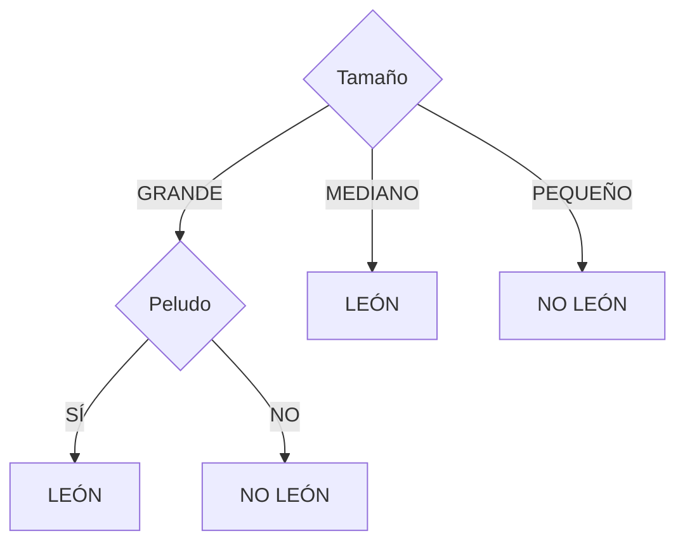

Reglas equivalentes (una por hoja, §4.3): `SI Tamaño=GRANDE Y Peludo=SÍ → LEÓN` · `SI Tamaño=GRANDE Y Peludo=NO → NO LEÓN` · `SI Tamaño=MEDIANO → LEÓN` · `SI Tamaño=PEQUEÑO → NO LEÓN`.

**La fórmula como procedimiento** (pseudocódigo con la traza del ejemplo):

```
FUNCIÓN informacion(p, n):                     // I(p;n)
    total ← p + n
    resultado ← 0
    PARA cada cantidad c en {p, n}:
        SI c > 0:                              // un subconjunto puro aporta 0
            prob ← c / total
            resultado ← resultado − prob · log2(prob)
    DEVOLVER resultado                         // informacion(3, 5) = 0,9544

ALGORITMO ganancia(atributo A):
    p ← positivos de la tabla                  // 3 LEÓN
    n ← negativos de la tabla                  // 5 NO LEÓN
    total ← informacion(p, n)                  // I(3;5) = 0,9544
    entropia ← 0
    PARA cada valor v de A:                    // Tamaño: GRANDE, MEDIANO, PEQUEÑO
        Sv ← ejemplos con A = v                // GRANDE: 4 casos (2 LEÓN, 2 NO LEÓN)
        pv ← positivos de Sv;  nv ← negativos de Sv
        entropia ← entropia + |Sv|/(p+n) · informacion(pv, nv)
                                               // E(Tamaño) = 4/8·I(2;2) + 1/8·I(1;0) + 3/8·I(0;3)
                                               //           = 0,5·1 + 0 + 0 = 0,5
    DEVOLVER total − entropia                  // G(Tamaño) = 0,9544 − 0,5 = 0,4544
```

Se repite `ganancia` para cada atributo y **el de mayor valor es la raíz**; en cada rama se vuelve a aplicar el mismo procedimiento sobre el subconjunto correspondiente (sin el atributo ya usado).

---

## 5. Algoritmos generadores de reglas: 1R y PRISM

### 5.1 Algoritmo 1R

Genera un **árbol de decisión de un solo nivel**, o visto de otra manera, una regla de decisión que evalúa **un solo atributo**: `SI atributo_i = valorA ENTONCES Clase = C`.

```
Para cada atributo:
    Para cada valor del atributo, crear una regla:
        1. Contar las ocurrencias de cada clase
        2. Encontrar la clase más frecuente
        3. Crear la regla que asigne esa clase al par atributo-valor
    Calcular la proporción de error del conjunto de reglas del atributo
Elegir el conjunto de reglas con la MENOR proporción de error
```

La proporción de error se determina contando los errores sobre los datos de entrenamiento: las instancias que **no** pertenecen a la clase mayoritaria de cada regla. Cada atributo genera un conjunto de reglas (una por valor); gana el atributo cuyo conjunto tenga menos errores. En WEKA es el clasificador **OneR**.

### 5.2 Algoritmo PRISM ("separa y reinarás")

Método de **cobertura**: toma cada una de las clases y busca la manera de **cubrir todas las instancias que pertenecen a ella excluyendo las que no**. Cada regla se construye **condición por condición**, eligiendo siempre la condición que maximiza la **precisión p/t** (p = instancias positivas cubiertas; t = total de instancias cubiertas).

```
Para cada clase C:
    Inicializar E con todas las instancias del conjunto
    Mientras E contenga instancias de la clase C:
        Crear una regla R con antecedente vacío que predice C
        Repetir hasta que R sea perfecta (o no haya más atributos):
            Para cada atributo A no mencionado en R y cada valor v:
                Considerar agregar la condición A=v al antecedente
            Seleccionar A y v que MAXIMICEN p/t
            (empates: elegir la condición con mayor p)
            Agregar A=v a R
        Eliminar de E las instancias cubiertas por R
```

**Ejemplo (tabla león)** — construcción de la primera regla para la clase LEÓN:

Se evalúa p/t de cada condición candidata: Peludo=SÍ → 3/5 = 0,6; Peludo=NO → 0/3 = 0; Edad=VIEJO → 1/3 = 0,33; Edad=JOVEN → 2/5 = 0,4; Tamaño=GRANDE → 2/4 = 0,5; **Tamaño=MEDIANO → 1/1 = 1** ✓; Tamaño=PEQUEÑO → 0/3 = 0.

Se elige Tamaño=MEDIANO (mayor p/t). ✅ Según el criterio estándar de PRISM, la regla ya es perfecta (p/t = 1) y se detiene aquí: `SI Tamaño=MEDIANO ENTONCES Clase=LEÓN` (cubre 1 caso). 📖 El anexo de la cátedra continúa agregando condiciones hasta `SI Tamaño=MEDIANO Y Peludo=SÍ Y Edad=JOVEN ENTONCES Clase=LEÓN`; si el corrector sigue la letra del anexo, mostrá ese desarrollo. Se eliminan los casos cubiertos y se repite: en la segunda pasada se llega a `SI Peludo=SÍ Y Tamaño=GRANDE ENTONCES Clase=LEÓN` (cuando un atributo restante tiene igual p/t para todos sus valores, la regla queda como está). Luego se continúa igual para la clase NO LEÓN.

**Diferencia clave**: 1R elige *un* atributo y clasifica todo con él (simple, rápido, sorprendentemente competitivo); PRISM genera reglas exactas por clase mediante cobertura sucesiva.

---

## 6. WEKA

### 6.1 Qué es

Software de aprendizaje automático **de código abierto** desarrollado por la Universidad de Waikato (Nueva Zelanda). Accesible por interfaz gráfica, consola o API Java. Permite hacer ML **sin programar**: reglas de asociación, agrupación (clustering), clasificación, regresión, manipulación de datos y combinación de modelos. Versión estable usada: 3.8.

### 6.2 Formato ARFF

Los archivos de WEKA son de tipo **.arff**: una cabecera que declara los atributos y su tipo, y una sección `@data` con las instancias:

```
@attribute outlook {sunny, overcast, rainy}   ← atributo nominal
@attribute temperature numeric                ← atributo numérico
@attribute play {yes, no}                     ← clase
@data
sunny,85,85,FALSE,no
...
```

### 6.3 Los cuatro entornos de trabajo

1. **Simple CLI**: consola para invocar directamente los paquetes de WEKA con Java.
2. **Explorer**: entorno visual principal (pestañas Preprocess, Classify, Cluster, Associate, Select attributes, Visualize).
3. **Experimenter**: automatización de tareas para experimentos a gran escala (comparar varios algoritmos sobre varios datasets).
4. **KnowledgeFlow**: proyectos de minería de datos mediante flujos de información (diagramas de bloques).

### 6.4 Modos de evaluación en Classify

- **Use training set**: evalúa sobre los mismos datos con que entrenó (optimista, tiende a sobreestimar).
- **Cross-validation** (k *folds*): divide el dataset en k partes; entrena con k−1 y evalúa con la restante, rotando; promedia los resultados. Es el método más robusto con pocos datos.
- **Supplied test set**: evalúa con un archivo de prueba independiente.
- **Percentage split**: separa un porcentaje para test.

---

## 7. Evaluación de clasificadores (métricas de WEKA)

### 7.1 🎯 Matriz de confusión

Herramienta que permite **visualizar el desempeño** de un algoritmo de aprendizaje supervisado. Con dos clases:

|  | Predicho Positivo | Predicho Negativo |
|---|---|---|
| **Real Positivo** | TP (verdadero positivo) | FN (falso negativo) |
| **Real Negativo** | FP (falso positivo) | TN (verdadero negativo) |

Los aciertos (TP y TN) quedan en la **diagonal principal**; los errores (FP y FN) fuera de ella.

### 7.2 🎯 Métricas derivadas (fórmulas + interpretación)

| Métrica | Fórmula | Qué mide |
|---|---|---|
| **Exactitud (Accuracy)** | $(TP+TN)/(TP+FN+FP+TN)$ | Porcentaje de predicciones correctas sobre el total |
| **TPR / Recall / Sensibilidad / Cobertura** | $TP/(TP+FN)$ | Capacidad de detectar los casos positivos o relevantes |
| **TNR / Especificidad (Specificity)** | $TN/(TN+FP)$ | Capacidad de discriminar correctamente los casos negativos |
| **FPR (False Positive Rate)** | $FP/(FP+TN)$ | Probabilidad de "falsa alarma" |
| **FOR (False Omission Rate)** | $FN/(FN+TN)$ | Predicciones negativas incorrectas sobre el total de predicciones negativas |
| **Precisión (Precision)** | $TP/(TP+FP)$ | Porcentaje de las predicciones positivas que son correctas |
| **F-measure** | $2 \cdot \frac{Precision \cdot Cobertura}{Precision + Cobertura}$ | Caracteriza con un único valor la bondad del clasificador (media armónica de precisión y cobertura) |

**Advertencia clave sobre la exactitud** (cae en los parciales): <mark>en conjuntos de datos **poco equilibrados no es una métrica útil**: si el algoritmo clasifica a **todos** como sanos ante una enfermedad rara, puede tener 99% de exactitud y ser **totalmente inútil** (no detecta ni un enfermo)</mark>.

En matrices de más de dos clases: el TPR de una clase es el elemento de la diagonal dividido por la suma de su **fila**; el FPR es la suma de su **columna** menos la diagonal, dividida por la suma de las filas de las otras clases.

**Ejemplo completo de cálculo** (test de una enfermedad sobre 200 personas; fila = clase real, columna = predicción; "enfermo" como clase positiva):

|  | Pred. Enfermo | Pred. Sano |
|---|---|---|
| **Real Enfermo** | TP = 40 | FN = 10 |
| **Real Sano** | FP = 20 | TN = 130 |

- Exactitud = (40+130)/200 = **0,85** → el modelo acierta el 85% del total de casos.
- TPR = 40/(40+10) = **0,80** → detecta el 80% de los enfermos reales.
- TNR = 130/(130+20) = **0,867** → discrimina correctamente el 86,7% de los sanos.
- FPR = 20/(20+130) = **0,133** → el 13,3% de los sanos son "falsa alarma".
- FOR = 10/(10+130) = **0,071** → el 7,1% de las predicciones "sano" son en realidad enfermos.
- Precisión = 40/(40+20) = **0,667** → de los que el modelo marca como enfermos, el 66,7% lo son.
- F-measure = 2·(0,667·0,80)/(0,667+0,80) = **0,727**.

**Cómo interpretar cada medida en un examen** (siempre piden "explique qué significa el valor obtenido"):

- *Exactitud X*: "el modelo clasifica correctamente el X% del total de casos" (+ advertencia de desbalance si aplica).
- *TPR X*: "el modelo detecta el X% de los casos positivos reales" (capacidad de detectar casos relevantes).
- *TNR X*: "el modelo discrimina correctamente el X% de los casos negativos".
- *FPR X*: "la probabilidad de que una predicción positiva sea una falsa alarma sobre el total de negativos es X%".
- *FOR X*: "el X% de las predicciones negativas son incorrectas (positivos omitidos)".
- *Precisión X*: "de todo lo que el modelo predijo como positivo, el X% es correcto".

**Todas las métricas paso a paso** (pseudocódigo con la traza del ejemplo):

```
ALGORITMO metricas(matriz de confusión):
    TP, FN, FP, TN ← celdas de la matriz       // 40, 10, 20, 130
    total ← TP + FN + FP + TN                  // 200

    Exactitud ← (TP + TN) / total              // 170/200  = 0,85
    TPR       ← TP / (TP + FN)                 //  40/50   = 0,80   (fila de los positivos reales)
    TNR       ← TN / (TN + FP)                 // 130/150  = 0,867  (fila de los negativos reales)
    FPR       ← FP / (FP + TN)                 //  20/150  = 0,133
    FOR       ← FN / (FN + TN)                 //  10/140  = 0,071  (columna "predicho negativo")
    Precisión ← TP / (TP + FP)                 //  40/60   = 0,667  (columna "predicho positivo")

    F ← 2·Precisión·TPR / (Precisión + TPR)    // 2·0,667·0,80/1,467 = 0,727 (media armónica)
    MCC ← (TP·TN − FP·FN) /
          √((TP+FP)·(TP+FN)·(TN+FP)·(TN+FN))   // 5000/√(60·50·150·140) = 5000/7937 = 0,63
```

Truco para no perderse: TPR y TNR se leen por **fila** (lo real); Precisión y FOR se leen por **columna** (lo predicho).

### 7.3 Curva ROC (Receiver Operating Characteristic)

- En problemas complejos un clasificador aumentará el número de TP **a costa de incrementar también los FP**. Se busca un clasificador que incremente TP a un ritmo (mucho) mayor que FP.
- Gráfico **bidimensional**: eje X = **FPR**, eje Y = **TPR**. Muestra el **compromiso entre beneficio (TP) y coste (FP)**.
- La diagonal representa un clasificador aleatorio; cuanto más se "abomba" la curva hacia la esquina superior izquierda, mejor.

```
 TPR
 1,0 | *(0;1) ideal    . . . . *
     |        . . * '
     |    . '                      curva ROC de un buen
     |  .'             /           clasificador (AUC → 1)
     | .             /
     |.            /    diagonal: clasificador aleatorio
     |.          /      (TPR = FPR, AUC = 0,5)
     |.        /
 0,0 +------/------------------ FPR
     0,0                     1,0
```

### 7.4 AUC / ROC Area

El **área bajo la curva ROC** representa en un **único valor** el rendimiento del clasificador. Mientras más cercano a 1, mejor. Útil para **comparar clasificadores** entre sí.

### 7.5 MCC (Coeficiente de Correlación de Matthews)

Informa la **calidad de la clasificación de las clases**. Es considerada una **medida equilibrada** (funciona bien incluso con clases desbalanceadas).

- 📖 **Cátedra**: "se tienen en cuenta los valores TP, FP y FN".
- ✅ **Corroborado**: la fórmula real usa **las cuatro celdas** de la matriz (incluye TN):

$$MCC = \frac{TP \cdot TN - FP \cdot FN}{\sqrt{(TP+FP)(TP+FN)(TN+FP)(TN+FN)}}$$

Da valores entre −1 y +1: +1 = predicción perfecta, 0 = azar, −1 = desacuerdo total.

### 7.6 Área PRC (Precisión vs. Recall)

Dice **cómo es el comportamiento de cada clase** usando precisión vs. recall. Igual que ROC: más cercano a 1, mejor. Indica en qué porcentaje los clasificadores se comportan de manera correcta (preferible a ROC cuando hay fuerte desbalance de clases).

### 7.7 Estadística de Kappa (Kappa de Cohen)

Es una medida de **concordancia entre dos muestras categóricas dependientes**; se utiliza para saber si las mediciones de **dos evaluadores concuerdan** (la variable evaluada debe ser **nominal**). Es una medida de la **fiabilidad** con la que dos evaluadores miden lo mismo. En WEKA compara el clasificador contra un clasificador aleatorio.

$$\kappa = \frac{p_o - p_e}{1 - p_e}$$

- $p_o$ = concordancia **observada** (proporción de casos donde ambos evaluadores coinciden).
- $p_e$ = concordancia **esperada por azar**: para cada categoría, se multiplica la proporción con que cada evaluador la asigna, y se suman esos productos.

**Ejemplo de la cátedra** (2 médicos evalúan depresión en 50 personas): coinciden en 36 de 50 → $p_o = 0{,}72$. Evaluador 1 dice "no deprimido" al 50% y evaluador 2 al 46% → azar "no deprimido" = 0,5 × 0,46 = 0,23; azar "deprimido" = 0,5 × 0,54 = 0,27 → $p_e = 0{,}23 + 0{,}27 = 0{,}50$. Entonces $\kappa = (0{,}72-0{,}50)/(1-0{,}50)$ (✅ valor exacto: **0,44**; 📖 el anexo lo redondea a 0,4).

```
ALGORITMO kappa:
    po ← coincidencias entre evaluadores / total          // 36/50 = 0,72
    PARA cada categoría c:
        pe_c ← proporción(evaluador1 dice c) · proporción(evaluador2 dice c)
                                               // "no deprimido": 0,50 · 0,46 = 0,23
                                               // "deprimido":    0,50 · 0,54 = 0,27
    pe ← Σ pe_c                                // 0,23 + 0,27 = 0,50
    DEVOLVER (po − pe) / (1 − pe)              // (0,72 − 0,50) / (1 − 0,50) = 0,44
```

**Interpretación (Landis & Koch, 1977):**

| κ | Concordancia |
|---|---|
| < 0 | Pobre (peor que el azar) |
| 0,00 – 0,20 | Leve |
| 0,21 – 0,40 | Aceptable |
| 0,41 – 0,60 | Moderada |
| 0,61 – 0,80 | Considerable |
| 0,81 – 1,00 | Casi perfecta |

---

## 8. Clustering (aprendizaje no supervisado)

### 8.1 Concepto y aplicaciones

Agrupar instancias **sin etiquetas** por similitud. Aplicaciones vistas: **segmentación de mercado**, **análisis de redes sociales**, **análisis de datos astronómicos**. En WEKA: pestaña *Cluster*; algoritmos relevantes: **K-means (SimpleKMeans)**, **EM** y **Cobweb**.

### 8.2 K-means (K-medias)

**Idea**: agrupa objetos en **k grupos (clusters)** basándose en sus características, **minimizando la suma de distancias entre cada objeto y el centroide (semilla)** de su cluster.

**Algoritmo (paso a paso):**

1. Comenzamos con los datos.
2. Plantamos las k semillas (centroides iniciales, usualmente al azar).
3. Asignamos cada dato a la semilla más cercana.
4. Desplazamos las semillas al centro (media) de cada grupo.
5. Repetimos 3–4 hasta que **los centroides ya no se mueven** o **no hay cambios en la asignación**.

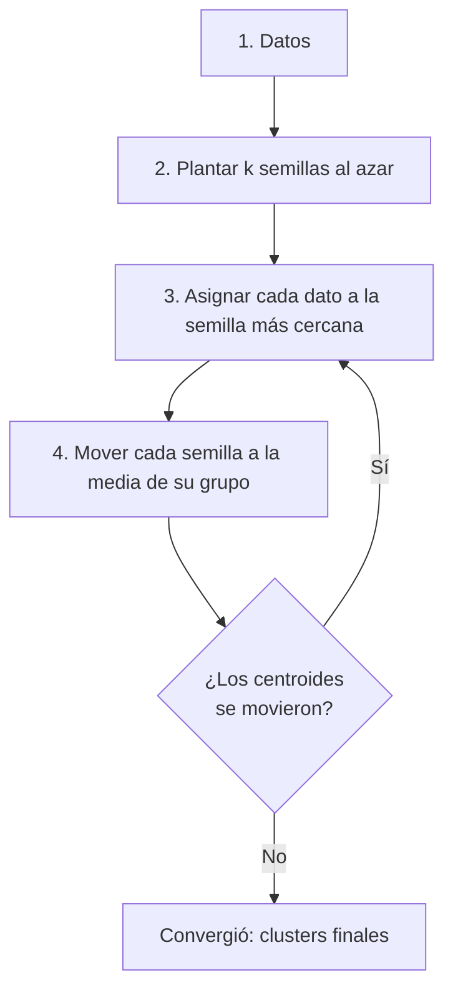

**Formulación**: los objetos son vectores reales de $d$ dimensiones; se construyen k grupos $S=\{S_1,...,S_k\}$ minimizando $\sum_{i=1}^{k}\sum_{x_j \in S_i} \lVert x_j - \mu_i \rVert^2$.

**🎯 Características (lista de parcial):**

- Solo **datos numéricos**.
- Usa **distancia cuadrática** (euclídea al cuadrado).
- **Requiere normalización** de los datos.
- **Admite ruido**.
- Produce agrupaciones **fijas y disjuntas** (cada punto pertenece a exactamente un cluster).
- **Depende mucho de las semillas** iniciales (puede converger a soluciones distintas).
- Está basado en los **grafos o diagramas de Voronoi**: cada centroide define una región de Voronoi (el conjunto de puntos más cercanos a él que a cualquier otro centroide); las fronteras son las mediatrices entre semillas.
- Nota de la cátedra: **no usar con k > 25**.

**¿Cómo elegir k? — Método del codo:**

- Utiliza la **distancia media de las observaciones a su centroide** (varianza intra-cluster).
- Cuanto más grande es k, la varianza intra-cluster **tiende a disminuir**; cuanto menor la distancia intra-cluster, más **compactos** los clusters.
- Se busca el valor de k que satisfaga que **un incremento de k no mejore sustancialmente** la distancia media intra-cluster (el "codo" de la curva).

**K-medias paso a paso** (pseudocódigo con una traza 1D para ver el algoritmo desnudo):

```
ALGORITMO k_medias(datos, k):                  // traza: datos {1,2,3,10,11,12}, k = 2
    centroides ← k datos elegidos al azar      // supongamos {3, 10}
    REPETIR:
        PARA cada dato x:                      // 3. asignación
            asignar x al centroide con menor distancia²
                                               // {1,2,3} van con 3 · {10,11,12} van con 10
        PARA cada grupo g:                     // 4. actualización
            centroide(g) ← media de los datos de g
                                               // media{1,2,3} = 2 · media{10,11,12} = 11
    HASTA que los centroides no cambien        // 2ª vuelta: mismas asignaciones,
                                               // mismas medias → convergió
    DEVOLVER centroides y grupos               // {2, 11} con grupos {1,2,3} y {10,11,12}
```

### 8.3 EM (Expectation-Maximization)

**Mejora K-medias usando gaussianas**: en lugar de asignaciones duras, cada dato tiene un **grado de pertenencia** probabilístico a cada cluster (campanas de Gauss).

**🎯 Características (lista de parcial):**

- Mejora K-medias con **gaussianas**.
- Permite un número de clases **NO fijo**.
- Agrupaciones **NO disjuntas** (un dato puede pertenecer parcialmente a varios clusters).
- **Calcula las semillas con estadística** (media y varianza).
- Solo valores **numéricos**.
- **Requiere normalización**.

**Conceptos de la campana de Gauss** (preguntas de la cátedra):

- La **media** se encuentra en el **centro** de la campana.
- La **desviación estándar** se ubica en el **punto de inflexión** de la curva.
- La intersección de coordenadas de un dato con la curva da su **grado de pertenencia**: mientras más alta la Y, más alto el grado de pertenencia al conjunto.

**Los dos pasos del algoritmo:**

- **Esperanza (E)**: cálculo del **grado de pertenencia** de cada dato a cada gaussiana (probabilidad de pertenecer a cada una, donde μ es el centroide de la gaussiana).
- **Maximización (M)**: se **recalculan la media y la varianza** de cada gaussiana para que se ubiquen en el centro de su conjunto de datos.
- Termina cuando las medias/varianzas son **muy similares al paso anterior**.

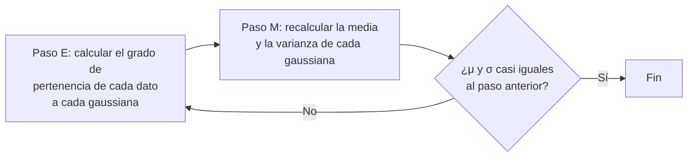

**(Pregunta de final)** La **matriz de pesos $W_k$ representa conocimiento**: se calcula con la probabilidad de pertenencia del dato al conjunto.

**Ajuste del número de clases:**

- Opción 1: crear k clases iniciales, correr EM, eliminar clases cuyo aporte (según la fórmula de coste) sea bajo comparado con las demás; si no hay que quitar ninguna, terminar.
- Opción 2: crear un número de nuevas clases; si una tiene **varianza casi nula** se quita; si dos tienen **medias y varianzas muy similares** se quita una de ellas. El **coste es un parámetro más** que depende de los datos del problema.

**Interpretar la desviación estándar al comparar clusters** (cayó en el parcial 2025):

A **menor σ**, los datos están **más concentrados alrededor de la media** → ese cluster **agrupa mejor** sus datos.

Caso de parcial: EM devuelve Cluster 1 (μ = 0,38, σ = 0,1) y Cluster 2 (μ = 0,37, σ = 0,001). Como 0,001 < 0,1, los datos del Cluster 2 están mucho más pegados a su media → **el Cluster 2 agrupa mejor**.

⚠️ **No confundir** con la regla de arriba "varianza casi nula → se quita la clase": esa regla pertenece al **ajuste del número de clases** (poda de clases degeneradas o duplicadas mientras EM busca cuántas clases usar), **no** habla de la calidad de agrupamiento cuando se comparan dos clusters finales. Comparando clusters ya formados, una σ chica es una **virtud** (datos bien concentrados), no un motivo de eliminación.

### 8.4 Cobweb

- Algoritmo de **clustering jerárquico** e **incremental**: realiza las agrupaciones **instancia a instancia**.
- Durante la ejecución se forma un **árbol de clasificación**: las **hojas** representan los clusters y el **nodo raíz** engloba todos los datos. Se comienza con un único nodo raíz; las instancias se agregan una a una y el árbol se actualiza en cada paso; encontrar el mejor lugar para una instancia nueva **puede requerir reconstruir todo el árbol**.
- Usa la medida **category utility** para guiar el aprendizaje y determinar la pertenencia de cada instancia a un grupo: valores altos = **alta similitud intra-grupo y baja similitud entre grupos**.
- Es sensible a dos parámetros:
  - **Acuity**: medida de error de un nodo; controla el **factor de ramificación**.
  - **Cut-off**: evita el **crecimiento desmesurado** del número de clusters (poda).

### 8.5 🎯 Normalización y escalado

Al usar cualquier algoritmo de clustering es **buena idea normalizar** los datos, porque los grupos se forman **a partir de distancias**: si hay atributos con escalas muy diferentes, **los de escala mayor dominarán las distancias**.

- **Normalizar**: lograr que los valores de cada atributo estén en **escalas similares**.
- **Escalado (Feature Scaling / MinMaxScaler)**: transforma los valores para confinarlos en un rango $[a,b]$, típicamente $[0,1]$ o $[-1,1]$:

$$x' = \frac{x - x_{min}}{x_{max} - x_{min}}$$

  Ejemplo: para los valores {2, 5, 8, 10} → min = 2, max = 10 → escalados: 0; 0,375; 0,75; 1. El mínimo siempre queda en 0 y el máximo en 1.

```
PARA cada x en {2, 5, 8, 10}:                  // min = 2, max = 10, rango = 8
    x' ← (x − min) / (max − min)
// 2 → (2−2)/8 = 0  ·  5 → 3/8 = 0,375  ·  8 → 6/8 = 0,75  ·  10 → 8/8 = 1
```

  **Qué significa escalar con este método** (pregunta de examen): <mark>transformar los valores para confinarlos en un rango fijo [0,1], de modo que atributos con escalas muy distintas queden comparables y ninguno domine las distancias</mark>.

- **Escalado estándar (StandardScaler) / normalización estadística**: a cada dato se le **resta la media** y se lo **divide por la desviación típica**, de forma que todas las características compartan una misma media (0) y desviación (1):

$$x' = \frac{x - \mu}{\sigma}$$

  **Ejemplo con el dataset del parcial 2025** {5, 98, 6, 200}, usando σ poblacional (N = 4):

```
μ  = (5 + 98 + 6 + 200) / 4 = 309 / 4 = 77,25

σ² = [(5−77,25)² + (98−77,25)² + (6−77,25)² + (200−77,25)²] / 4
   = [(−72,25)² + (20,75)² + (−71,25)² + (122,75)²] / 4
   = [5220,0625 + 430,5625 + 5076,5625 + 15067,5625] / 4
   = 25794,75 / 4 = 6448,6875
σ  = √6448,6875 ≈ 80,30

x' = (x − 77,25) / 80,30:
  5   → −72,25 / 80,30 ≈ −0,90
  98  →  20,75 / 80,30 ≈  0,26
  6   → −71,25 / 80,30 ≈ −0,89
  200 → 122,75 / 80,30 ≈  1,53
```

  Verificación rápida: los valores escalados suman ≈ 0 (−0,90 + 0,26 − 0,89 + 1,53 = 0), como corresponde a datos centrados en media 0.

**Limitaciones señaladas por la cátedra**: el método min-max **no es adecuado para datos estables** ni para datos que presentan **variaciones como picos** (outliers comprimen todo el resto del rango).

---

# PARTE II — SEGUNDO PARCIAL

## 9. Regresión lineal

### 9.1 Concepto

Método **causal** en el que una variable conocida como **dependiente** está relacionada con una o más variables **independientes** por medio de una **ecuación lineal**.

- **Variable dependiente**: la que se desea **pronosticar** (su comportamiento depende de las independientes).
- **Variable independiente**: la que **influye** en la dependiente y por ende es causa de los resultados obtenidos en el pasado.
- La salida es **continua** (a diferencia de la clasificación, que produce categorías).

**El modelo** (la recta de regresión pasa siempre por el centro de la nube de dispersión):

$$\hat{y} = ax + b \qquad \equiv \qquad h_\theta(x) = \theta_1 x + \theta_0$$

donde $\theta_1$ (o $a$) es la **pendiente** y $\theta_0$ (o $b$) la **intercepción u ordenada al origen**; $\hat{y}$ es la estimación de $y$ según el modelo.

### 9.2 🎯 ¿Cómo debe ser el dataset? (pregunta de parcial)

1. **Relación lineal** entre las variables.
2. **Suficientes datos** (mínimo ~30 observaciones).
3. Variables **continuas**.
4. **Poca multicolinealidad** (las independientes no deben estar fuertemente correlacionadas entre sí).

### 9.3 🎯 Función a minimizar y descenso por el gradiente (pregunta de parcial)

<mark>El algoritmo se basa en **minimizar el Error Cuadrático Medio (MSE)** siguiendo el principio del **descenso por el gradiente**</mark>, que busca minimizar la **función coste** $J(\theta)$:

$$MSE = J(\theta) = \frac{1}{2n}\sum_{i=1}^{n}\left(\hat{y}^{(i)} - y^{(i)}\right)^2 = \frac{1}{2n}\sum_{i=1}^{n}\left(h_\theta(x^{(i)}) - y^{(i)}\right)^2$$

Se buscan valores de $\theta_i$ para los que $h_\theta(x)$ se acerque lo máximo posible a los $y$ de los ejemplos. La regla de actualización, **repetir hasta converger**:

$$\theta_j \Leftarrow \theta_j - \alpha \frac{\partial}{\partial \theta_j} J(\theta)$$

El mínimo se alcanza cuando $\frac{\partial}{\partial \theta_j} J(\theta) = 0$ (se calculan las derivadas parciales en cada punto hasta encontrar el mínimo de la función).

**Tasa de aprendizaje α:**

- **α pequeña**: desciende lento; tarda más pero es preciso.
- **α grande**: desciende rápido; tarda poco pero podría pasarse del mínimo e incluso **divergir**.

**Derivadas parciales** (resultado del desarrollo):

$$\frac{\partial}{\partial \theta_0} J(\theta) = \frac{1}{n}\sum_{i=1}^{n}\left[h_\theta(x^{(i)}) - y^{(i)}\right]$$

$$\frac{\partial}{\partial \theta_1} J(\theta) = \frac{1}{n}\sum_{i=1}^{n}\left[h_\theta(x^{(i)}) - y^{(i)}\right]\cdot x^{(i)}$$

**Algoritmo**: mientras los θ sigan cambiando, calcular ambas derivadas y actualizar $\theta_0$ y $\theta_1$ simultáneamente con la regla anterior.

**El descenso por el gradiente como procedimiento** (traza con datos que cumplen y = 2x + 1 exacto; el algoritmo debe descubrirlo):

```
ALGORITMO regresion_lineal(pares (x, y)):      // {(0,1), (1,3), (2,5), (3,7), (4,9)}
    θ0 ← 0;  θ1 ← 0;  α ← 0,05                 // arranque en cero, tasa de aprendizaje
    REPETIR hasta converger:
        // derivadas parciales evaluadas con los θ actuales
        d0 ← (1/n) · Σ (θ1·x + θ0 − y)         // promedio de los errores h(x) − y
        d1 ← (1/n) · Σ (θ1·x + θ0 − y) · x     // errores ponderados por x
        // actualización SIMULTÁNEA de ambos parámetros
        θ0 ← θ0 − α · d0
        θ1 ← θ1 − α · d1
    DEVOLVER θ0, θ1                            // converge a θ0 = 1, θ1 = 2 → y = 2x + 1
                                               // con J(θ) = 0: ajuste perfecto, MSE mínimo
```

Sobre α: con α grande (p. ej. 0,4) cada paso **se pasa del mínimo** y el coste oscila o diverge; con α muy chica (0,001) converge igual pero necesita muchísimas más iteraciones — ese es el compromiso de la tasa de aprendizaje descrito arriba.

### 9.4 Algoritmo vectorizado (múltiples variables)

Con X = matriz donde cada ejemplo es una fila y cada columna un atributo (sin olvidar la fila para el **BIAS**), Θ = vector columna de parámetros, Y = vector columna de salidas conocidas:

- **Salida**: $H = X^T \Theta$
- **Error**: $D = H - Y$
- **Coste**: $J = \frac{1}{2n} D^T D$
- **Actualización**: $\Theta = \Theta - \alpha \cdot \frac{1}{n} X D$
- **Condición de parada**: $|j_t - j_{t-1}| < \varepsilon$ ó $|\Theta_t - \Theta_{t-1}| < \varepsilon$

### 9.5 Underfitting y Overfitting

- **Underfitting (subajuste)**: el modelo **no es capaz de capturar** la relación entre entrada y salida → alto índice de errores tanto en entrenamiento como en datos no vistos.
- **Overfitting (sobreajuste)**: el modelo **se ajusta exactamente a los datos de entrenamiento** → no puede hacer predicciones precisas sobre ningún dato distinto del de entrenamiento.

### 9.6 🎯 Medidas a tener en cuenta (preguntas de parcial)

**Coeficiente de correlación (R)**: medida que indica el **nivel de asociación** entre las variables dependiente e independiente. Es **adimensional**:

- $R = 0$: variables independientes.
- $R = 1$: relación lineal exacta.
- $R > 0$: relación **directa** (al aumentar x, aumenta y).
- $R < 0$: relación **inversa** (al aumentar una, disminuye la otra).

**Coeficiente de determinación (R²)**: medida que indica **porcentualmente el cambio** de la variable dependiente respecto a la independiente. <mark>Da valores **entre 0 y 1**; mientras más cerca de 1, mejor (mayor proporción de la variabilidad explicada por el modelo)</mark>.

| Medida | Descripción |
|---|---|
| **Error Absoluto Medio (EAM / MAE)** | Promedio de la suma de los errores absolutos entre valores predichos y observados |
| **Raíz del Error Cuadrático Medio (RECM / RMSE)** | Raíz cuadrada del promedio de los errores al cuadrado. **Un valor 0 significa ajuste perfecto** |
| **Error Relativo Absoluto (ERA / RAE)** | Porcentaje que relaciona la suma de los errores de predicción respecto de la suma de las diferencias entre la media y los valores observados |
| **Raíz del Error Cuadrático Relativo (RECR / RRSE)** | Igual que el anterior pero con raíz cuadrada de los cuadrados |
| **Suma de cuadrados del error (SSE)** | La parte de la variabilidad de la variable dependiente que **no** conseguimos explicar con el modelo |
| **Error estándar** | Cuantifica cuánto se apartan los valores de la media de la población |

Diferencia absoluto vs. relativo: el **absoluto** es cuánto se desvía el resultado del valor real; el **relativo** es una medida porcentual en comparación con el valor real.

### 9.7 Árboles de regresión

Para salida continua también existen árboles: en WEKA, el algoritmo **M5P** (dentro de *trees*) construye árboles de regresión/modelo. En la práctica se comparan el coeficiente de correlación y los errores contra la regresión lineal clásica.

---

## 10. Redes neuronales — fundamentos

### 10.1 El modelo conexionista

Rama de la IA que **toma como modelo la mente humana**, intentando simular por computadora el funcionamiento del cerebro. Se inspira en una forma "primitiva" de representación del conocimiento y el razonamiento: **la neurona y sus relaciones**. Muchas neuronas conectadas en varias **capas** dan un potencial enorme para resolver casi cualquier tipo de problema.

### 10.2 🎯 La neurona biológica (pregunta de parcial)

Partes principales y funcionamiento:

- **Dendritas**: **reciben** señales de entrada desde otras células a través de los puntos de conexión llamados **sinapsis**.
- **Soma (cuerpo celular)**: **combina e integra** las señales (procesa) y emite señales de salida. Cuerpo más o menos esférico de 5 a 10 micras.
- **Axón**: **transporta** las señales de salida a los terminales axónicos (rama principal que se ramifica en su extremo).
- **Terminales sinápticos/axónicos**: **distribuyen** la información a un nuevo conjunto de neuronas (liberan neurotransmisores).

Funcionamiento (aclaración informal de la cátedra): <mark>las señales que llegan por las dendritas pueden ser **excitatorias o inhibitorias**; si la **suma ponderada** de éstas, realizada en el cuerpo, **supera el umbral de activación** en tiempo suficiente, la neurona **se dispara** enviando un impulso por su axón</mark>.

Datos: el cerebro humano tiene ~10¹⁵ conexiones. Las señales son de dos tipos: **eléctrica** (generada por la neurona, viaja por el axón) y **química** (entre terminales axónicos de una neurona y dendritas de otra).

### 10.3 Elementos de una red neuronal artificial

Una RNA está compuesta por:

- Un **gran número de elementos muy simples** que procesan de modo similar a las neuronas.
- Un **gran número de conexiones con "pesos"** entre los elementos: **los pesos codifican el conocimiento de la red**.

**Tres tipos de neuronas:**

| Tipo | Función |
|---|---|
| **De entrada** | Reciben los estímulos externos (relacionadas con el aparato sensorial) |
| **Ocultas** | Generan el procesado y la representación interna de la información |
| **De salida** | Dan la respuesta del sistema |

### 10.4 🎯 La neurona artificial (equivalencia con la biológica — pregunta de parcial)

| Neurona biológica | Neurona artificial |
|---|---|
| Dendritas / sinapsis | Entradas $x_i$ con pesos $w_{ij}$ |
| Soma (integración) | Suma ponderada $\sum_i w_{ij} x_i$ |
| Umbral de disparo | Función de activación $g(\cdot)$ |
| Axón / terminales | Salida $y_j$ hacia otras neuronas |

Funcionamiento (con j = neurona observada, i = neurona conectada):

- Cada conexión tiene un **peso numérico** que determina la fuerza y el signo de la conexión: si $W_{ij} > 0$ es **excitadora**; si $W_{ij} < 0$ es **inhibidora**; si $W_{ij} = 0$ **no hay conexión**.
- Cada unidad primero calcula la **suma ponderada de sus entradas**: $suma_j = \sum_{i=0}^{n} w_{ij}\, x_i$.
- Luego aplica una **función de activación g** a esa suma para producir la salida: $y_j = g(suma_j)$.
- La función de activación **habilita** (salida cerca de +1) la unidad cuando se dan las entradas adecuadas y la **desactiva** en caso contrario.

```
  x0 = 1 ───w0──╮
  x1 ─────w1────┤
  x2 ─────w2────┼──▶  Σ = Σ wi·xi  ──▶  g(Σ)  ──▶  y
   ⋮            │     (soma:            (umbral /      (axón: salida
  xn ─────wn────╯     integración)      activación)     hacia otras neuronas)
 (dendritas con
  pesos sinápticos)
```

---

## 11. Modelo de Hopfield

### 11.1 Qué es

Una **memoria asociativa** (analogía física de la memoria): memoriza patrones y, ante una entrada parecida (incluso **parcial o incompleta**), evoluciona hasta el patrón almacenado más similar.

### 11.2 🎯 Características (lista de parcial — cae siempre)

- Red neuronal **monocapa**.
- Suele manejar valores de **[1, −1]** (bipolares).
- La salida de cada nodo **se conecta a todos los demás** (red totalmente conectada).
- Conexiones **multidireccionales** (simétricas: $w_{ij} = w_{ji}$).
- **No se permiten conexiones de una neurona consigo misma** → la **diagonal principal de W es 0**.
- La red **siempre converge** a la solución de uno de los patrones aprendidos, aun con información parcial en la entrada.
- Usa función de activación **tipo escalón** para el modelo discreto.
- Aprendizaje **no supervisado de tipo Hebbiano**: $\Delta w_{ij} = y_i \cdot y_j$.
- Muy buena para **reconocer patrones**.
- **Capacidad**: <mark>se estima empíricamente que **cada 7 neuronas se puede almacenar 1 patrón**</mark>; regla general: $\text{cantidad de patrones} = 0{,}14 \cdot N$ (N = cantidad de neuronas).

**Gráfico correcto de una red de Hopfield de 4 neuronas** (para el ejercicio "¿el gráfico es correcto?"): todas conectadas con todas, ninguna consigo misma —

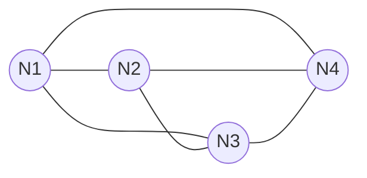

Con N neuronas debe haber $\binom{N}{2} = N(N-1)/2$ conexiones (aquí 6): si falta alguna, o si aparece un lazo de una neurona a sí misma, el gráfico es **incorrecto**.

### 11.3 Funcionamiento

- Consiste en **memorizar varios patrones** como si de una memoria se tratase.
- Si se presenta a la entrada alguna de las informaciones almacenadas, la red **evoluciona hasta estabilizarse** en ella.
- Puede evolucionar a la salida **más parecida** pese a recibir entradas parciales o incompletas.
- La información de entrada debe codificarse como **vector**; cada neurona recibe **un elemento** del vector.

### 11.4 🎯 Aprendizaje (cálculo de la matriz W)

El mecanismo es **no supervisado u off-line**: la red calcula la matriz de pesos W a partir de un conjunto de patrones de ejemplo que se pretende que memorice, y luego entra en funcionamiento.

$$W = \sum_{k=1}^{m} E_k^T E_k - m \cdot I$$

Se calcula el producto de cada patrón (vector fila) por su transpuesta, se suman todos los productos y **se resta la identidad** (multiplicada por la cantidad de patrones) **porque las neuronas no pueden conectarse consigo mismas** → todos los elementos de la diagonal principal quedan en **0**.

**(Pregunta de parcial)** ¿Qué significa la matriz W? <mark>Representa las **conexiones sinápticas entre las neuronas** y determina la **fuerza de esas conexiones** (es donde reside el conocimiento de la red)</mark>. ¿Qué significa que la diagonal sea 0? <mark>Que **no se permite la conexión de una neurona consigo misma**: por eso toda posición con i = j vale siempre 0</mark>.

**Patrones binarios 0/1** (cayó en el parcial 2025): si los patrones vienen dados en binario {0, 1}, **primero se convierte cada 0 en −1** — la red trabaja con valores bipolares (§11.2) — y recién después se aplica W = Σ Ekᵀ·Ek − m·I.

Ejemplo completo con P1 = [1 0], P2 = [1 1], P3 = [0 1] (m = 3 patrones de 2 componentes):

```
1) Conversión 0 → −1:
   E1 = [1 −1] · E2 = [1 1] · E3 = [−1 1]

2) Productos externos Ekᵀ·Ek:
   E1ᵀ·E1 = [ 1 −1]    E2ᵀ·E2 = [1 1]    E3ᵀ·E3 = [ 1 −1]
            [−1  1]             [1 1]             [−1  1]

3) Suma de los tres productos:
   Σ Ekᵀ·Ek = [ 3 −1]
              [−1  3]

4) Restar m·I = 3·I:
   W = [ 3 −1] − [3 0] = [ 0 −1]
       [−1  3]   [0 3]   [−1  0]
```

Chequeo final: diagonal en 0 ✓ y matriz simétrica (w12 = w21 = −1) ✓, como exige §11.2. El error típico de examen es **no convertir** los 0 a −1: con los patrones en 0/1 crudos saldría w12 = 1 en lugar de −1.

### 11.5 Funcionamiento (reconocimiento)

Dado un patrón de prueba T:

1. Calcular $T \cdot W$.
2. Aplicar la función de activación **escalón** al resultado (positivo → 1, negativo → −1).
3. Si la salida **es igual a la entrada**, la red **convergió** (reconoció el patrón).
4. Si es distinta, tomar la salida como nueva entrada y **repetir** hasta estabilizarse. La red converge al patrón de entrenamiento más parecido.

**Ejemplo de la cátedra**: con patrones de 4 componentes, para T1 se obtiene F(6,6,6,−6) = [1,1,1,−1] = T1 → convergió en un paso. Para T2 = [−1,−1,−1,−1]: primera pasada da [−1,−1,−1,1] ≠ entrada; segunda pasada da otra vez [−1,−1,−1,1] → convergió al patrón E2 = [−1,−1,−1,1] (reconoció la entrada ruidosa como E2).

**Hopfield paso a paso** (aprendizaje + reconocimiento, con la traza del ejemplo):

```
ALGORITMO aprender(patrones E1..Em):           // E1 = [1,1,1,−1] · E2 = [−1,−1,−1,1]
    W ← Σ Ek^T · Ek − m·I                      // fuera de la diagonal: W[i][j] = Σ Ek[i]·Ek[j]
                                               //        [ 0  2  2 −2]
                                               //  W  =  [ 2  0  2 −2]
                                               //        [ 2  2  0 −2]
                                               //        [−2 −2 −2  0]   ← diagonal en 0

ALGORITMO recordar(entrada T):
    REPETIR:
        salida ← escalón(T · W)                // componente > 0 → 1 · componente < 0 → −1
        SI salida = T: DEVOLVER T              // salida = entrada → convergió
        T ← salida                             // si no, realimentar y repetir

// recordar([1,1,1,−1]):    T·W = (6, 6, 6, −6) → [1,1,1,−1] = entrada → E1 en 1 paso
// recordar([−1,−1,−1,−1]): 1ª pasada → [−1,−1,−1,1] ≠ entrada → realimentar
//                          2ª pasada → [−1,−1,−1,1] = entrada → convergió a E2
//                          (reconoció la entrada ruidosa como el patrón más parecido)
```

**Cómo se usa la capacidad en la práctica** (método, no memorizar casos):

- *Verificar un gráfico de red de Hopfield*: chequear que **todas** las neuronas estén conectadas con todas las demás y que **ninguna** se conecte consigo misma.
- *De neuronas a patrones*: una red de N nodos almacena aproximadamente $0{,}14 \cdot N$ patrones.
- *De patrones a neuronas* (despejar N): para almacenar P patrones, $N = P / 0{,}14$, **redondeando hacia arriba a entero** (la cantidad de neuronas debe ser un número entero; una cantidad fraccionaria de patrones no es almacenable como tal, pero el despeje indica cuántas neuronas cubrirían esa capacidad).

---

## 12. Perceptrón

### 12.1 Características

- Inventado por **Frank Rosenblatt** (✅ en **1957–1958**, Cornell Aeronautical Laboratory; 📖 las slides citan 1962, que es el año de su libro *Principles of Neurodynamics*). Fue **uno de los primeros modelos neuronales**.
- **Imita a una neurona**: toma la **suma ponderada de sus entradas** y envía a la salida un **1** si la suma es más grande que algún **valor umbral ajustable** (de otro modo devuelve 0, o −1 según la convención).
- Conexiones **unidireccionales** (feedforward).
- **Ideal para problemas linealmente separables**.
- Entrenamiento **supervisado**.

### 12.2 Modo de cálculo

- **Función suma ponderada**: $suma = \sum_{i=0}^{n} w_i x_i$ (con $x_0 = 1$ como entrada de umbral/bias).
- **Función salida** (escalón): $y = 1$ si $suma > 0$; $y = 0$ (o −1) en caso contrario.
- Igualando la suma a cero se obtiene la **ecuación de la recta** (superficie de decisión): para dos entradas, $w_0 + w_1 x_1 + w_2 x_2 = 0$ define la recta que separa las dos clases en el plano.

Ejemplos linealmente separables: compuertas **AND** y **OR** (existe una recta que separa los 0 de los 1).

**Topología de un perceptrón de 2 entradas** (la que se pide graficar en los parciales):

```
  x0 = 1 ───w0──╮
  x1 ─────w1────┼──▶  Σ  ──▶  escalón  ──▶  y ∈ {0, 1}
  x2 ─────w2────╯
```

### 12.3 🎯 Algoritmo de entrenamiento (pregunta de parcial)

1. **Inicializar** los pesos con valores aleatorios (pequeños).
2. Para cada patrón de entrada, **calcular la salida**.
3. Si hay error, **ajustar los pesos**: $\Delta w = \eta \cdot (d - y) \cdot x$ (donde d = salida deseada, y = salida obtenida, η/α = tasa de aprendizaje).
4. **Repetir** hasta la convergencia (error 0 sobre el conjunto de entrenamiento).

En el ejemplo de la cátedra se usa una tasa de apreciación α = 0,5, se entrenan los primeros patrones y se testea con los restantes: cuando el error es 0 para todos los patrones de entrenamiento, termina el proceso.

**El algoritmo paso a paso** (traza con la compuerta AND de 2 entradas):

```
ALGORITMO entrenar_perceptron(patrones):       // AND: (0,0)→0 (0,1)→0 (1,0)→0 (1,1)→1
    w ← [0, 0, 0]                              // 1. inicializar (w0 = umbral/bias, x0 = 1)
    η ← 0,5                                    //    tasa de aprendizaje
    MIENTRAS alguna pasada tenga errores:      // 4. repetir hasta convergencia
        PARA cada patrón (x, d):
            y ← escalón(Σ wi·xi)               // 2. calcular la salida
            SI y ≠ d:                          // 3. hay error → ajustar cada peso
                w ← w + η · (d − y) · x
    DEVOLVER w

// Con el AND converge en 6 pasadas a w = [−1; 1; 0,5]
// → recta separadora: 1·x1 + 0,5·x2 − 1 = 0
//   (verificación: (1,1) da 1+0,5−1 = 0,5 > 0 → 1 ✓; los otros tres dan ≤ 0 → 0 ✓)
// Con el XOR el MIENTRAS no termina NUNCA: la recta no existe y los
// pesos giran en círculos — esa es la falla del Perceptrón, hecha algoritmo.
```

### 12.4 🎯 El problema XOR — cuándo falla el Perceptrón (pregunta de parcial)

- <mark>El Perceptrón **falla ante problemas que NO son linealmente separables**. El caso emblemático es la compuerta **XOR**: no existe ninguna recta que separe los puntos {(0,1),(1,0)} de {(0,0),(1,1)}</mark>.

```
  x2
  1 |  ●(0,1)        ○(1,1)       ● = clase 1     ○ = clase 0
    |
    |       ¿recta?  ← imposible: cualquier recta que deje
    |                  a los dos ● del mismo lado, deja
    |                  también a un ○ (y viceversa)
  0 |  ○(0,0)        ●(1,0)
    +──────────────────── x1
       0             1
```
- **Método general para analizar una tabla de verdad de n variables**: ubicar los $2^n$ puntos en el (hiper)cubo unitario, marcar la clase de cada uno y analizar si existe una **recta (2D) o hiperplano (3D+)** $w_0 + w_1x_1 + \dots + w_nx_n = 0$ que separe perfectamente los 1 de los 0. Si existe, la tabla es resoluble con un Perceptrón simple y la topología es un perceptrón de n entradas + bias con esos pesos; si no existe, hay que justificar por qué ningún plano puede separar las clases.
- ✅ **Corroborado — casos de referencia**: el **OR de n variables ES linealmente separable** (salida 0 solo en el origen; sirve el hiperplano $x_1+\dots+x_n-0{,}5=0$) y el **AND de n variables también ES linealmente separable** (salida 1 solo en (1,…,1); sirve $x_1+\dots+x_n-(n-0{,}5)=0$; para n=3: $x_1+x_2+x_3-2{,}5=0$). Un único punto positivo ubicado en un vértice del cubo **siempre** puede separarse con un plano. Las únicas funciones booleanas de referencia NO separables son **XOR y su negación (XNOR)**.
- 📖 **Cátedra**: en el resumen previo quedó registrada como respuesta esperada que "el AND de 3 variables NO es linealmente separable porque el único caso con salida 1 es cuando todas las entradas son 1". ✅ Ese razonamiento es incorrecto según la teoría estándar (ver punto anterior). Si un enunciado presenta una tabla distinta del AND puro, no asumas nada: aplicá el método del hiperplano a esa tabla concreta y dejá el desarrollo completo en la hoja.

**Solución al XOR con dos perceptrones**: la salida del primer perceptrón (AND con pesos 1,0; 1,0; umbral −1,5) sirve como entrada del segundo (OR con pesos 1,0; 1,0; umbral −0,5) mediante una **conexión contrapesada muy negativa** (−9,0). **El inconveniente**: el algoritmo de aprendizaje del perceptrón **no puede ajustar correctamente los pesos entre los perceptrones** (no sabe repartir el error hacia atrás) → se necesita **backpropagation**.

---

## 13. Redes multicapa — Backpropagation

### 13.1 Estructura

El objetivo es tomar una masa relativamente "amorfa" de elementos similares a las neuronas y **enseñarles a realizar cualquier tipo de tarea**: las redes multicapa permiten calcular "cualquier cosa" (aproximadores universales).

- Capas: **entrada → oculta(s) → salida** (puede haber más de una oculta).
- $W1_{ij}$: pesos entre la capa de **entrada y la oculta**.
- $W2_{ij}$: pesos entre la capa **oculta y la de salida**.
- Las activaciones "**saltan**" desde la capa de entrada hacia la oculta y de ésta hacia la de salida.
- **El conocimiento de la red está codificado en los pesos** de las conexiones.
- Los niveles de activación de la capa de salida determinan la **salida de la red**.

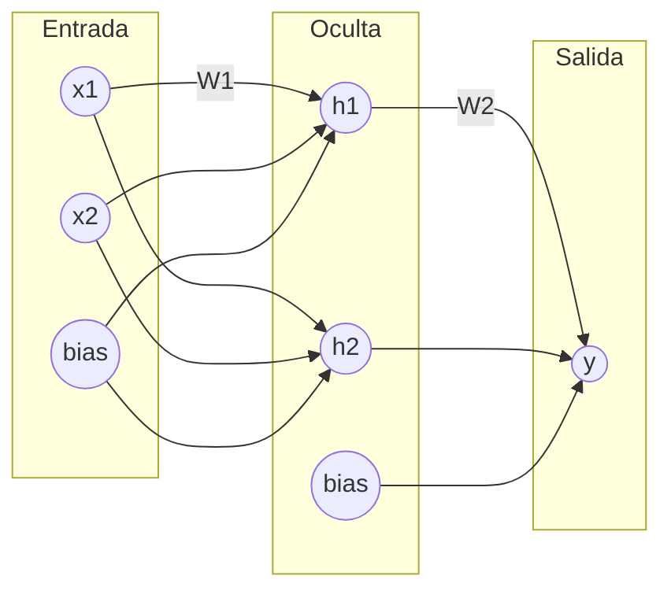

### 13.2 Cantidad de nodos ocultos

Es **difícil de determinar**: no existe una regla única y muchas veces se hace **empíricamente**. Ideas:

- Mantener el número de neuronas por capa **lo más bajo posible** (cada neurona es costo de procesamiento extra).
- **Regla de Baum-Haussler**:

$$N_{oculta} \leq \frac{N_{entren} \cdot E_{tolerable}}{N_{entrada} + N_{salida}}$$

donde $N_{entren}$ = número de patrones de entrenamiento, $E_{tolerable}$ = error deseado de la red, $N_{entrada}$ y $N_{salida}$ = número de nodos de entrada y de salida.
  - ✅ **Corroborado**: la regla original de Baum y Haussler (1989) usa la **suma** en el denominador (es la forma escrita arriba).
  - 📖 **Cátedra**: en la transcripción de las slides el separador del denominador es ambiguo y podría leerse como producto ($N_{entrada} \cdot N_{salida}$).

### 13.3 🎯 Funciones de activación (pregunta de parcial)

- El Perceptrón usa **escalón**; Backpropagation necesita funciones **continuas y diferenciables** (para poder derivar el error):
- **Sigmoide**: $salida = \frac{1}{1+e^{-suma}}$ → produce valores entre **0 y 1** (salidas "probabilísticas").
  - Si suma = 0 → salida = **0,5**; si la suma crece → tiende a **1**; si decrece → tiende a **0**.
- **Tangente hiperbólica**: produce valores entre **−1 y 1**.
- ¿Por qué éstas? <mark>Porque son **continuas y diferenciables**, requisito para propagar el error mediante derivadas</mark>.

```
escalon(s)  = 1 si s > 0; si no, 0             // Perceptrón — NO diferenciable (salta)
sigmoide(s) = 1 / (1 + e^(−s))                 // 0 a 1 — continua y diferenciable
tanh(s)                                        // −1 a 1 — misma forma de S

// Traza de la sigmoide:
//   sigmoide(0)   = 1/(1+e⁰)  = 1/2   = 0,5   → suma 0 cae justo en el medio
//   sigmoide(10)  = 1/(1+e⁻¹⁰) ≈ 0,9999       → satura hacia 1
//   sigmoide(−10) = 1/(1+e¹⁰)  ≈ 0,0000       → satura hacia 0

// La derivada de la sigmoide se expresa con su propia salida:
//   g'(s) = g(s) · (1 − g(s))  → por eso los deltas de backprop usan y·(1−y)
```

### 13.4 🎯 Funcionamiento simplificado del algoritmo (pregunta de parcial)

- Comienza con un conjunto de **pesos aleatorios**.
- La red **ajusta sus pesos cada vez que ve un par entrada/salida**.
- Cada par requiere **dos etapas**:
  1. **Paso hacia adelante**: se presenta un ejemplo de entrada y se permite que las activaciones se propaguen hasta alcanzar la capa de salida.
  2. **Paso hacia atrás**: la salida actual de la red se **compara con la salida objetivo** y se calcula el **error estimado** de las unidades de salida; se **ajustan los pesos** asociados a las unidades de salida para reducir esos errores; se **deriva el error estimado** de la capa de salida hacia las capas ocultas; por último, los errores se **propagan hacia atrás** hasta las conexiones procedentes de las unidades de entrada.

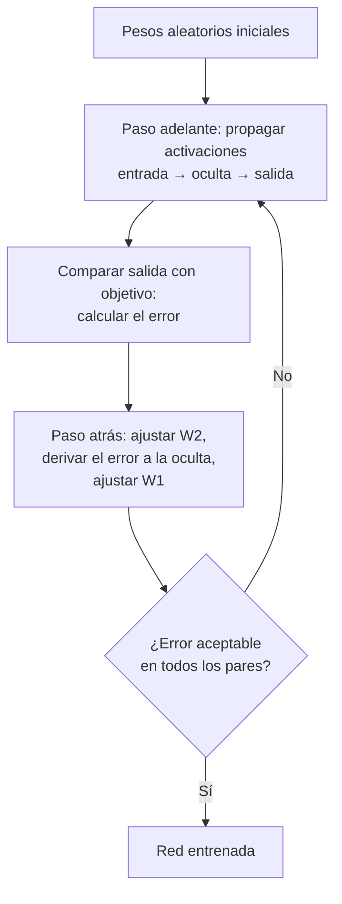

### 13.5 Algoritmo detallado (pasos iniciales según la cátedra)

1. Sea A = nº de unidades de entrada, C = nº de unidades de salida; **elegir B** = nº de unidades ocultas. Las capas de entrada y oculta poseen **una unidad extra usada como umbral** (bias).
2. **Inicializar los pesos** con valores aleatorios entre **−0,1 y 0,1**: $w1_{ij}$ y $w2_{ij}$.
3. Inicializar las activaciones de las unidades umbral (**nunca deben cambiar**): $x_0 = 1$ y $h_0 = 1$.
4. Elegir un par entrada/salida y asignar los niveles de activación a las unidades de entrada; propagar hacia adelante, calcular el error en la salida, retropropagar los errores ajustando primero $w2$ y luego $w1$; repetir con todos los pares hasta que el error sea aceptable.

**Backpropagation como procedimiento** — la red 2-2-1 que resuelve el XOR (lo que el Perceptrón solo no puede):

```
ALGORITMO backpropagation(pares (x, d)):       // XOR: (0,0)→0 (0,1)→1 (1,0)→1 (1,1)→0
    W1, W2 ← pesos aleatorios pequeños         // red 2-2-1 con bias en entrada y oculta
    REPETIR hasta que el error sea aceptable:
        PARA cada par (x, d):
            // ---- paso hacia adelante ----
            h ← sigmoide(W1 · x)               // activaciones de la capa oculta
            y ← sigmoide(W2 · h)               // salida de la red
            // ---- paso hacia atrás ----
            δy ← (d − y) · y·(1−y)             // error de salida · derivada de la sigmoide
            δh[i] ← δy · W2[i] · h[i]·(1−h[i]) // el error se DERIVA hacia cada oculta
                                               // (proporcional al peso que la conecta)
            W2 ← W2 + α · δy · h               // ajustar primero W2 (oculta→salida)...
            W1 ← W1 + α · δh · x               // ...y después W1 (entrada→oculta)

// Entrenada, la red responde ≈0 · ≈1 · ≈1 · ≈0: resolvió el XOR.
// El delta usa y·(1−y) porque la sigmoide es diferenciable — con la
// función escalón este paso sería imposible (no hay derivada).
```

Nota: según los pesos iniciales, la red puede caer en un **mínimo local** (las salidas quedan clavadas cerca de 0,5 y el error no baja más) — un fenómeno propio del descenso por gradiente que el Perceptrón no tiene; el límite del Perceptrón es otro (la separabilidad lineal).

### 13.6 🎯 Perceptrón vs. Backpropagation (comparación de parcial)

| Perceptrón | Perceptrón multicapa + Backpropagation |
|---|---|
| Monocapa (sin ocultas) | **Múltiples capas ocultas** |
| Solo problemas **linealmente separables** | Resuelve problemas **no lineales** |
| Función de activación **escalón** | **Sigmoide / tangente hiperbólica** (continuas y diferenciables) |
| Ajuste de pesos directo con el error | El error se **propaga hacia atrás** capa por capa |
| Supervisado | Supervisado |

---

## 14. Redes competitivas — Red de Kohonen

### 14.1 Fundamento biológico

- Basada en el principio de que en el cerebro **hay neuronas que se organizan en zonas** (mapas bidimensionales); p. ej., en el sistema auditivo hay una organización según la frecuencia.
- Parte de esa organización es **genéticamente heredada**, pero gran parte **se origina mediante el aprendizaje**.
- T. Kohonen presentó en **1982** una red con comportamiento similar: capaz de **formar mapas de características** como el cerebro humano.
- Aplicaciones: **reconocimiento de voz** y de **texto manuscrito**.

### 14.2 Variantes

- **LVQ (Learning Vector Quantization)**: para vectores de entrada de **una sola dimensión**.
- **TPM (Topology Preserving Map) o SOM (Self-Organizing Map)**: para vectores de entrada **bidimensionales o incluso tridimensionales** (en TPM).

### 14.3 🎯 Estructura y características (lista de parcial)

- Red **bicapa**: N neuronas de **entrada** y M de **salida**.
- Cada una de las N entradas se conecta con las M salidas mediante conexiones **feedforward**.
- Entre las neuronas de salida existen **conexiones laterales de inhibición** (peso negativo): cada neurona tiene **influencia sobre sus vecinas**. El valor de los pesos feedforward $w_{ij}$ durante el aprendizaje **depende de esas interacciones laterales**.
- Trabaja con **valores reales**.
- La función de activación de las neuronas de salida es de tipo **continua, lineal o sigmoidal**.
- Aprendizaje **no supervisado de tipo competitivo**, **off-line**: las neuronas de salida **compiten por activarse** y **solo una permanece activa** ante una determinada entrada (la **ganadora** / *winner takes all*).
- Divide el espacio en **vecindades**.

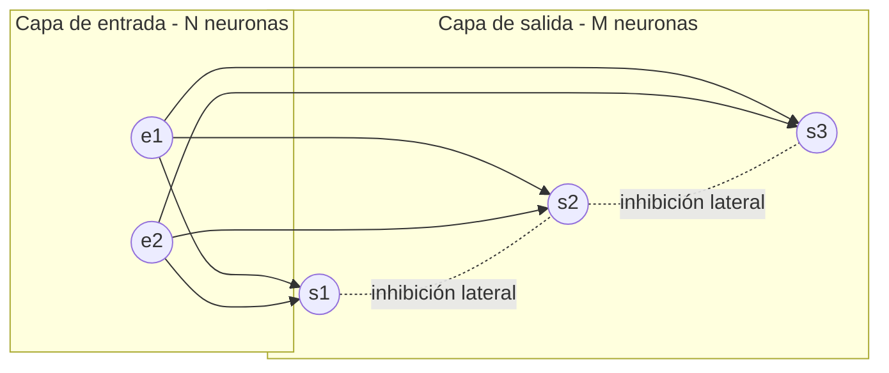

### 14.4 🎯 La función "sombrero mexicano" (pregunta de parcial)

La influencia de cada neurona de salida sobre las demás se modela con una función de tipo **sombrero mexicano** (ondícula de Ricker): <mark>representa la **influencia lateral** de la neurona p sobre la neurona j. Sus ejes son: **interacción lateral (Y)** vs. **distancia entre neuronas (X)** — excita fuertemente a las vecinas cercanas, inhibe a las intermedias y no afecta a las lejanas</mark>.

La salida de una neurona j ante un vector de entrada $E_k$ combina la parte feedforward y las interacciones laterales; la red **evoluciona hasta alcanzar un estado estable donde solo hay una neurona activa**.

### 14.5 Funcionamiento

Durante el funcionamiento, ante una entrada se calcula $\lVert E_k - W_j \rVert$, una **medida de la diferencia entre el vector de entrada y el vector de pesos** de las conexiones que llegan a cada neurona j: se pretende **encontrar el dato aprendido más parecido al de entrada** para averiguar qué neurona se activará.

### 14.6 🎯 Algoritmo de aprendizaje (pregunta de parcial)

1. **Inicializar los pesos** $w_{ij}$ con valores aleatorios pequeños y **fijar la zona inicial de vecindad** entre las neuronas de salida.
2. **Presentar una entrada** $E_k$ cuyas componentes son valores continuos.
3. **Determinar la neurona vencedora**: aquella j cuyo vector de pesos $W_j$ sea **el más parecido a la entrada** $E_k$; para ello se calculan las **distancias** entre ambos vectores, una por cada neurona de salida.
4. Una vez localizada la vencedora j*, **actualizar los pesos** de las conexiones feedforward que llegan a **dicha neurona y a sus vecinas** (acercándolos a la entrada).
5. **Repetir** hasta que los pesos se estabilicen y tiendan a un valor de error pequeño, **o por lo menos iterar un mínimo de 500 veces**.

**La competencia como procedimiento** (2 neuronas de salida "mapean" solas las 2 zonas de los datos, sin etiquetas):

```
ALGORITMO competencia_kohonen(datos):          // datos en dos zonas: cerca de (0,1; 0,1)
                                               // y cerca de (0,9; 0,9)
    W ← M vectores de pesos aleatorios         // 1. un vector por neurona de salida
    REPETIR al menos 500 veces:                // 5. mínimo de iteraciones
        e ← una entrada al azar                // 2. presentar una entrada
        ganadora ← neurona j con menor ||e − Wj||     // 3. competencia: gana la
                                               //    del vector de pesos más parecido
        Wganadora ← Wganadora + α · (e − Wganadora)   // 4. acercar sus pesos a la
                                               //    entrada (y los de sus VECINAS,
                                               //    según el sombrero mexicano)

// Al final cada vector de pesos queda en el centro de una zona:
// una neurona terminó cerca de (0,1; 0,15) y la otra cerca de (0,9; 0,85).
// La red "mapeó" los grupos sin recibir ninguna etiqueta.
```

---

## 15. Algoritmos Genéticos (AG)

### 15.1 Origen y definición

- 📖 **Cátedra**: las primeras ideas surgieron de la tesis de J. D. Bagley (1967), que 'influyó' en J. H. Holland, pionero de los AG. ✅ **Corroborado**: la relación es la inversa — Bagley fue doctorando de Holland; su tesis de 1967 (donde se acuñó el término 'algoritmo genético') se escribió bajo la supervisión de Holland, quien es el creador y pionero de los AG.
- Un sistema biológico eficiente desarrolla **estrategias exitosas de adaptación** para lograr su supervivencia: sobreviven los más aptos.
- Los AG **simulan la evolución de una población de individuos** mediante un **proceso iterativo** aplicado sobre un conjunto de estructuras. Cada estructura está compuesta de características que definen la **aptitud** del individuo en su entorno.
- Pueden concebirse como **métodos de optimización**: encontrar el máximo (o el valor más cercano al máximo) de una **función de aptitud** f asignada a cada individuo: $f(x_0) = \max_{x \in X} f(x)$.

### 15.2 Tabla de equivalencias genéticas (pregunta de parcial)

| Sistemas naturales | Algoritmos genéticos |
|---|---|
| **Cromosoma** | Individuo o estructura (una solución potencial, típicamente codificada en binario) |
| **Gen** | Característica o atributo |
| **Alelo** | Valor en una posición determinada |
| **Locus** | Posición en la estructura |
| **Genotipo** | Conjunto de genes o estructuras (potencial solución) |
| **Fenotipo** | Aptitud del individuo (resultado de pasar el cromosoma por la función de aptitud) |

**Ejemplo con las partes de un cromosoma** (cayó en el parcial 2025): sea el cromosoma **1011**, que codifica el valor **11** en el rango [0-15] con 4 bits (§15.9):

- **Gen**: cada bit del cromosoma es un gen (aquí hay 4 genes: 1, 0, 1 y 1).
- **Locus**: la posición dentro de la estructura; por ejemplo, la **posición 2** contando desde la izquierda.
- **Alelo**: el valor que hay en ese locus; en la posición 2 el alelo es **0**.
- **Genotipo**: la estructura completa: **1011**.
- **Fenotipo**: según la tabla de la cátedra, la **aptitud del individuo**: el resultado de pasar el valor decodificado del genotipo (11 en decimal) por la función de aptitud. El 11 es el genotipo decodificado; "fenotipo" queda reservado para la aptitud resultante.

### 15.3 Principios (selección natural de Darwin)

Se basa en la **selección natural**: los individuos que mejor se adaptan sobreviven; en cada generación debe heredarse la mejor configuración genética posible; los rasgos que favorecen el éxito deben estar más representados.

1. Los individuos de una población **tienen diferencias** (evitar la endogamia).
2. Las variaciones **pueden heredarse**.
3. Los organismos pueden tener **más descendientes de los que pueden sobrevivir** con los recursos disponibles.
4. Las variaciones que aumentan el éxito reproductivo tienen **mayor oportunidad de transmitirse**.

### 15.4 Aplicaciones y ventajas

- Resuelven **problemas complejos de forma rápida y eficiente**.
- Utilizan **muy poca información específica del problema**.
- Son **extensibles**: es fácil modificar o incorporar conocimiento en los operadores genéticos.
- Muy buenos para **problemas de optimización**: tamaño de enlaces en una red de comunicaciones, procesamiento de imágenes, reconocimiento de patrones.

### 15.5 Algoritmo simple

1. **Generar la población inicial** creando individuos aleatoriamente.
2. Cada generación se crea a partir de la anterior aplicando **tres operadores básicos**: **Selección, Cruza y Mutación**.
3. El proceso iterativo prosigue hasta cumplir alguna **condición de parada/corte**.
4. Al final, se elige el **mejor cromosoma** mediante la función de aptitud.

Aclaraciones de la cátedra: todo individuo seleccionado **se reemplaza por su sucesor** después de la cruza y mutación; los individuos **no seleccionados mueren inmediatamente**. No es obligatorio aplicar mutación en cada generación.

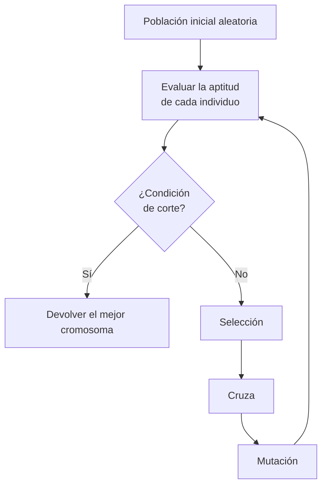

### 15.6 Métodos de selección

Dos familias: **proporcionales** (eligen según la aptitud relativa al resto de la población) y **basados en el orden** (confeccionan una tabla ordenada por aptitud).

**a) Ruleta (RWS, Goldberg 1989)** — proporcional:
A cada individuo se le asigna una **ranura de tamaño proporcional a su aptitud**; se "lanza una bolilla" tantas veces como individuos se quiera seleccionar. Ejemplo: individuo con aptitud 576 sobre un total de 1170 → 49,2% de la ruleta.

**b) Control del número esperado** — proporcional:
Se define $C_i = \frac{f_i}{\bar{f}}$ (aptitud del individuo dividido la aptitud promedio de la población), que determina la **cantidad de copias** a asignar a cada individuo. Nota de la cátedra: es determinante el **redondeo**: si los decimales son > 0,5 se suma 1.

**c) Elitista**:
Los métodos anteriores **no garantizan** preservar a los mejores (pueden ser reemplazados por sus hijos durante la cruza). El elitismo **preserva los mejores m individuos** de la generación actual incluyéndolos directamente en la siguiente. **Siempre se usa en combinación con otras variantes** (usarlo solo genera endogamia).

**d) Por ranking** — basado en el orden:
La población se ordena en forma **descendente por aptitud**; cada individuo recibe una cantidad de copias que **solo depende de su posición** en la tabla. Con n = tamaño de población y $R_{min} \in (0,1)$ = copias esperadas del **peor**:

$$copias(i) = R_{min} + 2\,\frac{(n-i)(1-R_{min})}{(n-1)}$$

- El **mejor** individuo recibe $2 - R_{min}$ copias; el **peor** recibe $R_{min}$.
- $(n-i)$ = inversión de la posición (valor alto → mejor posición); $(1-R_{min})$ = rango disponible a distribuir; $(n-1)$ = normalización por tamaño de población.
- Restricciones: $0 < R_{min}$ (el peor debe tener alguna chance) y $R_{min} < 1$ (si no, no habría diferencia entre individuos).

### 15.7 Métodos de cruza

- **Cruza simple (un punto)**: se elige **al azar** uno de los $l-1$ posibles puntos de cruza y se **intercambian los segmentos** entre los dos padres, generando dos hijos. Ej. con k=3: `XYY|XY` × `YYX|XX` → `XYYXX` y `YYXXY`.
- **Cruza multipunto**: el cromosoma se considera un **anillo** y se eligen **n puntos de cruza aleatorios**. La cruza simple es el caso particular n=1.
- **Cruza binomial**: para cada posición del hijo, se define $P_0$ = probabilidad de heredar el alelo **del padre** y $1-P_0$ = probabilidad de heredarlo **de la madre**.

**Selección y cruza paso a paso** (con los ejemplos de las slides como traza):

```
ALGORITMO ranking(población, Rmin):            // traza: n = 4, Rmin = 0,75
    ordenar la población por aptitud descendente
    PARA cada posición i de 1 a n:
        copias(i) ← Rmin + 2·(n−i)·(1−Rmin)/(n−1)

// i=1 (mejor): 0,75 + 2·3·0,25/3 = 1,25  = 2 − Rmin
// i=2:         0,75 + 2·2·0,25/3 = 1,08
// i=3:         0,75 + 2·1·0,25/3 = 0,92
// i=4 (peor):  0,75 + 0          = 0,75  = Rmin
// Σ copias = 4 = n → la población mantiene su tamaño

RULETA:  ranura(individuo) ← aptitud / Σ aptitudes
// aptitud 576 sobre un total de 1170 → 576/1170 = 49,2% de la ruleta

CRUZA SIMPLE (punto k = 3):  XYY|XY × YYX|XX  →  hijos XYYXX  y  YYXXY
// se corta en k y se intercambian los segmentos finales
```

### 15.8 Métodos de mutación

La mutación permite **mantener la diversidad** en la población, disminuyendo el riesgo de **convergencia prematura**. En binario: se toma un gen aleatorio y se lo invierte (0→1, 1→0).

- **Mutación simple**: se elige aleatoriamente un gen y se lo muta con una **probabilidad muy baja que se mantiene constante** durante las generaciones.
- **Mutación adaptativa por convergencia**: la probabilidad de mutación **varía según la información de la búsqueda genética**: **aumenta cuando la población es muy homogénea** y **disminuye cuando hay demasiada diversidad**.
- **Mutación adaptativa por temperatura**: **no usa información genética** de la población; la probabilidad $P_m(t)$ está acotada entre un mínimo y un máximo y se actualiza como $P_m(t+1) = P_m(t) + \lambda$. Según el signo de λ:
  - **Temperatura ascendente**: $P_m$ **aumenta** con las generaciones hasta un **máximo** y luego se mantiene constante. Objetivo: **mantener la diversidad** (la población tiende a volverse homogénea con el tiempo). La cota máxima existe para permitir la **supervivencia de buenos individuos**; sin ella la población podría **no converger nunca**.
  - **Temperatura descendente**: $P_m$ **disminuye** hasta un **mínimo** y luego se mantiene constante. Objetivo: **exploración alta en las primeras generaciones** evitando la convergencia prematura. La cota mínima debe ser **mayor a 0**: sin mutación se corre el riesgo de **perder estructuras interesantes**.

### 15.9 Diseño de un AG para un problema (ejercicio típico)

Dado un problema de optimización (p. ej., maximizar $y = -x^2 + 2x + 7$ para el precio x):

1. **Codificación del cromosoma**: elegir longitud en bits según el rango (p. ej., rango [0-15] → 4 bits).
2. **Población inicial**: para cada bit, colocar 1 si un número aleatorio > 0,5; 0 en caso contrario.
3. **Función de aptitud**: la propia función a maximizar (evaluar cada cromosoma decodificado).
4. **Selección**: calcular probabilidades de emparejamiento (p. ej., ruleta).
5. **Cruza**: p. ej., cruza simple por el punto medio; los hijos reemplazan a los padres.
6. **Mutación**: aplicar según la probabilidad de mutación sobre la población.
7. **Condición de corte**: si se cumple, parar; si no, volver a 3 con la nueva población.

---

## 16. Algoritmos evolucionarios y AG paralelos (cursado nuevo — clase 8)

### 16.1 Metodología de diseño de AG

Peculiaridad de los AG: **no necesitan conocimiento específico del problema** — una vez definida la **función de aptitud** y la **representación del cromosoma**, no hace falta conocimiento adicional para implementar el algoritmo.

**Fases para resolver un problema con AG:**

- **Fase dependiente del problema**: 1) Análisis del problema → 2) Diseño del cromosoma → 3) Elección de la función de aptitud.
- **Fase independiente del problema**: 4) Elección de los operadores genéticos → 5) Implementación del AG → 6) Análisis de resultados.

### 16.2 Algoritmos evolucionarios (AE)

Los AG pertenecen a una clase más genérica: **algoritmos evolucionarios**, que incluye: **Algoritmos Genéticos** (secuenciales y paralelos), **Programación Evolucionaria** y **Estrategia Evolucionaria**.

**Algoritmo evolucionario genérico:**

```
t ← 0
Generar población inicial P(t)
Evaluar P(t)
Hasta (condición de parada):
    t ← t + 1
    Seleccionar P(t)
    Recombinar P(t)
    Mutar P(t)
    Evaluar P(t)
    Supervivencia P(t)
```

**Comparación de los tres tipos (tabla de parcial):**

| | Representación | Selección | Cruza | Mutación |
|---|---|---|---|---|
| **Programación evolucionaria** | Dependiente del problema | Determinística | **No utiliza** | Operador **principal** |
| **Estrategia evolucionaria** | Dependiente del problema | Ranking | Operador secundario | Operador **principal** |
| **Algoritmo genético** | **Independiente** del problema | Estocástica | Operador **principal** | Operador secundario |

**Programación evolucionaria (PE)** — Fogel, 1966:

- Representación adaptada al dominio; individuos habitualmente como **vector de números reales**.
- Los n individuos son seleccionados como **padres** y luego **mutados**, generando n hijos.
- Los hijos se evalúan y se eligen n **sobrevivientes** usando la función de aptitud.
- **No utiliza recombinación/cruza**.

**Estrategia evolucionaria (EE)** — Rechenberg, 1973:

- Representación adaptada al dominio (vector de reales). Usada típicamente en **optimización hidrodinámica**.
- **Selección por ranking**: los n mejores son elegidos como padres.
- Los padres producen hijos por **cruza**, incorporando perturbaciones mediante la **mutación** (operador principal).
- **Supervivencia determinística**, en una de dos formas: los n mejores **hijos** reemplazan a los padres, o se eligen los n mejores **entre hijos y padres**.

### 16.3 Algoritmos genéticos paralelos

Se usan cuando el problema es **dificultoso** y se necesita una **gran población**. Cuatro categorías:

**a) Global:**

- Se paraleliza la **evaluación de los individuos** y la aplicación de los operadores.
- Cada individuo tiene probabilidad de cruzarse **con el resto** (población única).
- En la evaluación, un subconjunto de individuos se asigna a cada procesador; la comunicación se da al comienzo y al final. Dos variantes:
  - **Multiprocesador de memoria compartida**: los individuos se almacenan en dicha memoria; cada procesador lee su individuo y escribe el resultado.
  - **Multiprocesador de memoria distribuida**: la población se almacena en un procesador **servidor** que envía individuos a los **clientes** para evaluación, recolecta resultados y aplica los operadores para producir la próxima generación.

**b) Grano grueso:**

- La población se divide en **pocas subpoblaciones de gran tamaño**, cada una en un procesador, donde se aplican todos los operadores.
- Aparece un nuevo operador: la **migración**, que depende de:
  - la **topología de conexión**: *island* (migra a cualquier subpoblación) o *stepping stone* (solo a subpoblaciones vecinas);
  - la **tasa de migración** (¿cuántos individuos?);
  - el **intervalo de migración** (¿cada cuánto?).
- Se espera **convergencia rápida** que puede ser atenuada por la migración.

**c) Grano fino:**

- La población se divide en **muchas subpoblaciones muy pequeñas** (lo ideal: **1 individuo por subpoblación**), cada una en su procesador.
- Ideales cuando **el cálculo de la función de aptitud es muy complejo/costoso**.

**d) Híbrido:** combinación de características de los tres anteriores.

---

## 17. Sistemas expertos (cursado nuevo — clase 9)

### 17.1 Definición

Son programas capaces de: aconsejar, categorizar, analizar, comunicar, consultar, diseñar, **diagnosticar**, explicar, explorar, formar conceptos, interpretar, etc. Es decir, **programas capaces de manejar problemas que normalmente requieren la intervención humana** (de un experto) para su resolución.

### 17.2 Roles en su construcción

- **Experto de campo**: revela información acerca de **cómo y cuáles son los pasos** que le permiten resolver un problema (sus **heurísticas**).
- **Ingeniero de conocimiento**: da **forma simbólica y manipulable** a la información proporcionada por el experto; debe **descubrir** las heurísticas del experto y diseñarlas/programarlas en el sistema.

### 17.3 Características

- Pueden realizar **inferencias a partir de datos incompletos o inciertos**.
- **Explican y justifican** lo que están haciendo (sus respuestas).
- Pueden **adquirir nuevos conocimientos** y **reestructurar/reorganizar** el conocimiento.
- Pueden **quebrantar reglas** (manejar excepciones).
- Pueden **determinar si un problema está dentro del dominio de su experiencia** o no.

### 17.4 Arquitectura de un sistema experto basado en reglas (pregunta esperable)

| Componente | Función |
|---|---|
| **Base de conocimiento (reglas)** | Contiene las reglas SI–ENTONCES del dominio |
| **Memoria activa (hechos)** | Base de datos global de los hechos usados por las reglas |
| **Mecanismo de inferencia** | Decide cuáles reglas satisfacen los hechos, las **prioriza** y **ejecuta la de mayor prioridad** |
| **Agenda** | Lista con prioridades asignadas a las reglas, **creada por el mecanismo de inferencia** |
| **Medio de explicación** | Explica al usuario el **razonamiento** del sistema |
| **Medio para la adquisición de conocimiento** | Vía automática para que el usuario introduzca conocimiento **sin necesitar al ingeniero de conocimiento** |
| **Interfaz de usuario** | Mecanismo de comunicación entre usuario y sistema |

Ejemplo de regla: `Regla luz_roja: SI la luz es roja ENTONCES alto`.

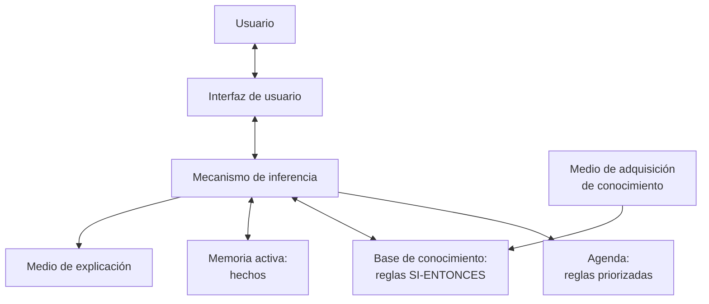

### 17.5 PROLOG

- Lenguaje de programación lógica usado para construir sistemas expertos.
- Sus cláusulas están basadas en **cláusulas de Horn**: $p_1 \land p_2 \land \dots \land p_m \Rightarrow p$.
- En PROLOG se escribe: `p :- p1, p2, ..., pm` ("p es verdadero si p1 y p2 y … pm lo son").

### 17.6 Modelado del conocimiento

Propósito: dar **forma entendible** (para construir el sistema experto) a los distintos tipos de conocimiento del dominio que maneja el experto. Hay **tres tipos**:

**a) Conocimiento fáctico** — describe los **objetos conceptuales** del dominio. Se modela con dos técnicas:

- **Tabla CAV (Concepto–Atributo–Valor)**: p. ej., Concepto = Electrodo; Atributo = Penetración; Valores = {Alta, Media, Baja}.
- **Diccionario**: define cada término y sus valores posibles (p. ej., "Contenido de Hidrógeno dado: mide la cantidad de hidrógeno del electrodo; valores Alto, Medio, Bajo").

**b) Conocimiento táctico** — describe las **relaciones que vinculan** los objetos conceptuales del dominio. Se modela con:

- **Tabla PER (Palabra del Experto – Regla)**: registra la cita textual del experto y la regla SI–ENTONCES que se deriva de ella.

**c) Conocimiento estratégico** — describe **cómo las distintas partes del dominio se aplican para resolver una tarea**: se descompone cada tarea en **subtareas** (granularidad) estableciendo las **pre y post condiciones** de cada una. Se modela con:

- **Diagrama Jerárquico de Tareas**: árbol de tareas/subtareas con sus precondiciones y postcondiciones (p. ej., Tarea 1 "Seleccionar electrodo" → Tarea 1.1 "Establecer características dadas" → Tarea 1.2 "Inferir tipo de electrodo").

---

# PARTE III — QUÉ SE EVALÚA

## 18. Mapa de examen

> Las resoluciones detalladas de todos los parciales están en la [Parte V](#parte-v--resolución-de-parciales) (§22–27). Recomendación: intentá resolverlos primero y usá las resoluciones para corregirte.

Ambos parciales tienen **5 ejercicios de 20 puntos**, mezcla de cálculo y teoría. En los de cálculo siempre piden **especificar la fórmula y los pasos aplicados**; en los teóricos, "explique con sus palabras y describa". Este mapa indica qué se pregunta y en qué sección de este documento está la teoría para responderlo — resolvé los PDF de `parciales/` como autoevaluación.

### Primer parcial

| Tipo de ejercicio | Qué piden | Teoría necesaria |
|---|---|---|
| **Cálculo de información** | Dado un dataset: información total de la tabla, entropía y ganancia de un atributo | §4.5 (dominar el ejemplo del león completo) |
| **Matriz de confusión** | Calcular 3 métricas (rotan: Accuracy, TPR, TNR, FPR, FOR) + **explicar qué significa** el valor obtenido | §7.1, §7.2 (fórmulas + plantillas de interpretación) |
| **TDIDT** | Partes constitutivas del árbol; construir reglas desde un árbol **o** el árbol desde reglas | §4.2, §4.3 |
| **Escalado** | Aplicar MinMaxScaler a un dataset + explicar qué significa escalar con ese método | §8.5 |
| **Clustering (teórico)** | Describir K-medias o EM: algoritmo, características principales, ideas en que se basa; para EM: mejoras respecto de K-medias | §8.2, §8.3 |
| **Teoría de ML** | Medidas de actuación; los dos grandes grupos de algoritmos con descripción y ejemplos | §3.4, §3.5 |

### Segundo parcial

| Tipo de ejercicio | Qué piden | Teoría necesaria |
|---|---|---|
| **Hopfield** | ¿El gráfico de la red es correcto?; cuántos patrones almacena una red de N nodos (y cuántas neuronas para X patrones); qué significa la matriz W y su diagonal en 0 | §11.2, §11.4 |
| **Regresión lineal** | Cómo debe ser el dataset; qué función se minimiza y cómo; cómo debe ser el coeficiente de determinación / de correlación | §9.2, §9.3, §9.6 |
| **Neurona** | Partes de la neurona biológica y su funcionamiento; construir la neurona artificial equivalente describiendo cada parte | §10.2, §10.4 |
| **Separabilidad lineal** | Dada una tabla de verdad de 3 variables: ¿es resoluble con un Perceptrón simple? ¿Por qué? Graficar la topología si es posible | §12.2, §12.4 (analizar si existe el hiperplano separador y justificar) |
| **Backpropagation** | Describir el algoritmo; características del perceptrón multicapa; qué funciones de activación se usan y por qué | §13.3, §13.4, §13.6 |
| **Perceptrón** | Algoritmo de entrenamiento; partes; ante qué problemas falla y por qué | §12.2, §12.3, §12.4 |
| **Kohonen** | Algoritmo de aprendizaje; características de la red; qué función cumple el sombrero mexicano | §14.3, §14.4, §14.6 |

En el cursado nuevo también son evaluables **algoritmos genéticos** (§15: expresiones genéticas, algoritmo simple, métodos de selección/cruza/mutación, diseño de un AG para un problema), **algoritmos evolucionarios y AG paralelos** (§16) y **sistemas expertos** (§17: arquitectura y modelado del conocimiento).

### Consejos transversales

- En los cálculos, **escribir siempre la fórmula genérica primero**, después reemplazar valores y recién ahí el resultado.
- En las preguntas "explique qué significa la medida obtenida", usar las plantillas de interpretación de §7.2.
- Las preguntas teóricas piden las **listas de características** tal como están en las tablas y viñetas de este documento (son casi textuales de las slides).
- Justificar siempre los "¿por qué?": linealmente separable/no separable, diagonal en 0, funciones continuas y diferenciables, etc.

## 19. Formulario rápido

**Información / árboles:**

- $I(p;n) = -\frac{p}{p+n}\log_2\frac{p}{p+n} - \frac{n}{p+n}\log_2\frac{n}{p+n}$
- $E(A) = \sum_i \frac{p_i+n_i}{p+n} I(p_i;n_i)$  →  $G(A) = I - E(A)$
- Subconjunto puro → I = 0; subconjunto 50/50 → I = 1 bit.

**Métricas de clasificación:**

- Accuracy = (TP+TN)/total · TPR = TP/(TP+FN) · TNR = TN/(TN+FP)
- FPR = FP/(FP+TN) · FOR = FN/(FN+TN) · Precisión = TP/(TP+FP)
- F-measure = 2·P·R/(P+R) · κ = (p₀−pₑ)/(1−pₑ)

**Escalado:**

- MinMax: $x' = (x-x_{min})/(x_{max}-x_{min})$ · Estándar: $x' = (x-\mu)/\sigma$

**Regresión:**

- $h_\theta(x) = \theta_1 x + \theta_0$ · $J(\theta) = \frac{1}{2n}\sum(h_\theta(x^{(i)})-y^{(i)})^2$
- $\theta_j \Leftarrow \theta_j - \alpha \frac{\partial J}{\partial \theta_j}$ · Vectorizado: $H=X^T\Theta$, $D=H-Y$, $\Theta = \Theta - \alpha\frac{1}{n}XD$

**Redes neuronales:**

- Hopfield: patrones = 0,14·N · $W=\sum E_k^T E_k - mI$ · Hebbiano: $\Delta w_{ij}=y_i y_j$
- Perceptrón: $\Delta w = \eta(d-y)x$ · recta: $\sum w_i x_i = 0$
- Sigmoide: $1/(1+e^{-suma})$ (0 a 1; suma=0 → 0,5) · Tanh (−1 a 1)
- Baum-Haussler (✅ forma corroborada): $N_{oculta} \leq \frac{N_{entren}\cdot E_{tolerable}}{N_{entrada}+N_{salida}}$

**Algoritmos genéticos:**

- Control nº esperado: $C_i = f_i/\bar{f}$ (decimales > 0,5 → +1 copia)
- Ranking: $copias(i) = R_{min} + 2\frac{(n-i)(1-R_{min})}{n-1}$; mejor = $2-R_{min}$, peor = $R_{min}$, con $0 < R_{min} < 1$

## 20. Repaso de fórmulas calculables (fichas de estudio)

Todas las fórmulas con las que **se calcula algo** en la materia, juntas para aprenderlas y repasarlas. **Método**: tapá la ficha dejando visible solo el título, escribí de memoria la fórmula y el mini-ejemplo en una hoja, destapá y compará. Las que falles vuelven a la pasada siguiente. (El [formulario](#19-formulario-rápido) es la versión comprimida para el repaso final; estas fichas son para **aprenderlas**.)

### 20.1 Información y árboles

**Ficha 1 — Información total de la tabla**

$$I(p;n) = -\frac{p}{p+n}\log_2\frac{p}{p+n} - \frac{n}{p+n}\log_2\frac{n}{p+n}$$

- **Qué calcula**: la incertidumbre (en **bits**) de la clase en la tabla completa.
- **Variables**: p = ejemplos positivos, n = negativos.
- **Mini-ejemplo**: $I(3;5) = 0{,}531 + 0{,}424 = 0{,}9544$ bits.
- **Casos borde para verificar**: subconjunto puro → 0 · mitad y mitad → 1 bit.

**Ficha 2 — Entropía de un atributo**

$$E(A) = \sum_{i=1}^{v} \frac{p_i+n_i}{p+n}\, I(p_i;n_i)$$

- **Qué calcula**: el promedio **ponderado** de la información de cada valor del atributo.
- **Variables**: $p_i, n_i$ = positivos/negativos del subconjunto con el valor i; el peso es el tamaño relativo de ese subconjunto.
- **Mini-ejemplo**: $E(tamaño) = \frac{4}{8}(1) + \frac{1}{8}(0) + \frac{3}{8}(0) = 0{,}5$.

**Ficha 3 — Ganancia de información**

$$G(A) = I(p;n) - E(A)$$

- **Qué calcula**: cuánta incertidumbre **elimina** conocer el valor de A. El atributo de mayor G es la **raíz** del árbol.
- **Mini-ejemplo**: $G(tamaño) = 0{,}9544 - 0{,}5 = 0{,}4544$ → raíz (le gana a peludo 0,3475 y edad 0,0033).

**Ficha 4 — Precisión de una regla (PRISM)**

$$\frac{p}{t}$$

- **Qué calcula**: qué tan "pura" es una condición candidata; p = instancias positivas cubiertas, t = total cubiertas.
- **Regla de uso**: se agrega la condición de **mayor p/t** (empate → la de mayor p); p/t = 1 → regla perfecta.
- **Mini-ejemplo**: Tamaño=MEDIANO → 1/1 = 1 ✓.

### 20.2 Métricas de clasificación

Todas con el mismo ejemplo (TP=40, FN=10, FP=20, TN=130, total 200):

| Ficha | Métrica | Fórmula | Ejemplo | Truco para recordarla |
|---|---|---|---|---|
| 5 | Exactitud | $(TP+TN)/total$ | 170/200 = 0,85 | Diagonal sobre todo; **inútil con desbalance** |
| 6 | TPR / Recall | $TP/(TP+FN)$ | 40/50 = 0,80 | **Fila** de los positivos reales |
| 7 | TNR / Especificidad | $TN/(TN+FP)$ | 130/150 = 0,867 | **Fila** de los negativos reales |
| 8 | FPR | $FP/(FP+TN)$ | 20/150 = 0,133 | Falsas alarmas sobre la fila negativa; FPR = 1 − TNR |
| 9 | FOR | $FN/(FN+TN)$ | 10/140 = 0,071 | **Columna** "predicho negativo" |
| 10 | Precisión | $TP/(TP+FP)$ | 40/60 = 0,667 | **Columna** "predicho positivo" |
| 11 | F-measure | $2\cdot\frac{P\cdot R}{P+R}$ | 0,727 | Media **armónica** de Precisión y Recall |
| 12 | MCC (✅ 4 celdas) | $\frac{TP\cdot TN - FP\cdot FN}{\sqrt{(TP+FP)(TP+FN)(TN+FP)(TN+FN)}}$ | 0,63 | Diagonal buena menos diagonal mala, normalizada; −1 a +1 |

**Ficha 13 — Kappa de Cohen**

$$\kappa = \frac{p_o - p_e}{1 - p_e}$$

- **Variables**: $p_o$ = proporción de coincidencias observadas; $p_e$ = azar (por cada categoría, producto de las proporciones de ambos evaluadores; luego se suman).
- **Mini-ejemplo**: $p_o = 36/50 = 0{,}72$; $p_e = 0{,}5 \cdot 0{,}46 + 0{,}5 \cdot 0{,}54 = 0{,}50$; $\kappa = 0{,}22/0{,}50 = 0{,}44$ → concordancia **moderada** (Landis & Koch).

### 20.3 Escalado y distancias

**Ficha 14 — MinMaxScaler**

$$x' = \frac{x - x_{min}}{x_{max} - x_{min}}$$

- **Qué hace**: confina los valores al rango [0,1]; el mínimo queda en 0 y el máximo en 1.
- **Mini-ejemplo**: {2, 5, 8, 10} → 0 · 0,375 · 0,75 · 1.

**Ficha 15 — Escalado estándar**

$$x' = \frac{x - \mu}{\sigma}$$

- **Qué hace**: centra en media 0 con desviación 1 (restar la media, dividir por la desviación típica).

**Ficha 16 — Distancia euclídea (al cuadrado)**

$$d^2(x, c) = \sum_i (x_i - c_i)^2$$

- **Dónde se usa**: K-medias (dato vs. centroide) y Kohonen (entrada vs. vector de pesos $\lVert E_k - W_j \rVert$); gana la menor distancia.

### 20.4 Regresión lineal

**Ficha 17 — El modelo**

$$h_\theta(x) = \theta_1 x + \theta_0$$

- $\theta_1$ = pendiente, $\theta_0$ = ordenada al origen; la recta pasa por el centro de la nube.

**Ficha 18 — Función de coste (MSE)**

$$J(\theta) = \frac{1}{2n}\sum_{i=1}^{n}\left(h_\theta(x^{(i)}) - y^{(i)}\right)^2$$

- **Qué calcula**: el promedio de los errores al cuadrado; es **lo que se minimiza** con descenso por el gradiente. J = 0 → ajuste perfecto.

**Ficha 19 — Descenso por el gradiente**

$$\theta_j \Leftarrow \theta_j - \alpha \frac{\partial}{\partial \theta_j} J(\theta) \qquad \text{con} \qquad \frac{\partial J}{\partial \theta_0} = \frac{1}{n}\sum(h-y) \quad y \quad \frac{\partial J}{\partial \theta_1} = \frac{1}{n}\sum(h-y)\cdot x$$

- Actualización **simultánea** de ambos θ; α chica = lento y preciso, α grande = riesgo de divergir.

**Ficha 20 — R y R² (rangos que hay que saber de memoria)**

- **R** (correlación): 0 = independientes · 1 = relación lineal exacta · signo = directa/inversa.
- **R²** (determinación): entre **0 y 1**, más cerca de 1 mejor (proporción de variabilidad explicada).

### 20.5 Redes neuronales

**Ficha 21 — Suma ponderada + activación (toda neurona)**

$$suma_j = \sum_{i=0}^{n} w_{ij}\, x_i \qquad y_j = g(suma_j)$$

- $x_0 = 1$ es el bias; escalón: 1 si suma > 0 (Perceptrón) · sigmoide/tanh (Backprop).

**Ficha 22 — Matriz de pesos de Hopfield**

$$W = \sum_{k=1}^{m} E_k^T E_k - m \cdot I$$

- Producto de cada patrón por su transpuesta, sumados, **menos m·I** para dejar la diagonal en 0 (sin autoconexiones).
- **Mini-ejemplo**: E1=[1,1,1,−1], E2=[−1,−1,−1,1] → fuera de la diagonal ±2, diagonal 0.

**Ficha 23 — Capacidad de Hopfield (las dos direcciones)**

$$patrones = 0{,}14 \cdot N \qquad \Leftrightarrow \qquad N = \frac{patrones}{0{,}14} \text{ (redondear ↑ a entero)}$$

- Regla mnemónica: **cada 7 neuronas, 1 patrón**.

**Ficha 24 — Aprendizaje del Perceptrón**

$$\Delta w = \eta \cdot (d - y) \cdot x \qquad \text{y la recta separadora: } w_0 + w_1x_1 + w_2x_2 = 0$$

- Solo se ajusta **cuando hay error** (d ≠ y); η = tasa de aprendizaje.
- **Mini-ejemplo**: el AND converge a w = [−1; 1; 0,5] → recta $x_1 + 0{,}5x_2 - 1 = 0$.

**Ficha 25 — Sigmoide y su derivada**

$$g(s) = \frac{1}{1+e^{-s}} \qquad g'(s) = g(s)\cdot(1-g(s))$$

- Valores 0 a 1; g(0) = **0,5**. La derivada se escribe con la propia salida → los deltas de backprop usan $y(1-y)$. Tanh: −1 a 1.

**Ficha 26 — Deltas de Backpropagation (red 2-2-1)**

$$\delta_y = (d-y)\cdot y(1-y) \qquad \delta_{h_i} = \delta_y \cdot W2_i \cdot h_i(1-h_i) \qquad W \Leftarrow W + \alpha\,\delta\,\cdot\text{entrada}$$

- Orden: calcular error de salida → derivarlo a la oculta → ajustar **primero W2, después W1**.

**Ficha 27 — Baum-Haussler (nodos ocultos)**

$$N_{oculta} \leq \frac{N_{entren} \cdot E_{tolerable}}{N_{entrada} + N_{salida}}$$

- ✅ Suma en el denominador (forma corroborada; 📖 en las slides el separador es ambiguo).

**Ficha 28 — Actualización de Kohonen**

$$W_{ganadora} \Leftarrow W_{ganadora} + \alpha\,(E_k - W_{ganadora})$$

- La ganadora es la de **menor distancia** a la entrada; se actualizan ella **y sus vecinas** (sombrero mexicano); mínimo 500 iteraciones.

### 20.6 Algoritmos genéticos

**Ficha 29 — Control del número esperado**

$$C_i = \frac{f_i}{\bar{f}}$$

- Aptitud del individuo sobre la aptitud **promedio** = copias a asignar; decimales > 0,5 → se suma 1.

**Ficha 30 — Selección por ranking**

$$copias(i) = R_{min} + 2\,\frac{(n-i)(1-R_{min})}{(n-1)}$$

- **Propiedades para verificar el cálculo**: mejor = $2-R_{min}$ · peor = $R_{min}$ · $\sum copias = n$ · $0 < R_{min} < 1$.
- **Mini-ejemplo** (n=4, $R_{min}$=0,75): 1,25 · 1,08 · 0,92 · 0,75.

**Ficha 31 — Ruleta**

$$ranura_i = \frac{f_i}{\sum_j f_j}$$

- **Mini-ejemplo**: aptitud 576 sobre 1170 total → 49,2% de la ruleta.

### 20.7 Autoevaluación exprés (solo preguntas — las respuestas son las fichas)

1. Escribí de memoria la fórmula de la información total y verificala con I(3;5).
2. ¿Qué diferencia hay entre entropía de un atributo y ganancia? Escribí ambas.
3. Con TP=40, FN=10, FP=20, TN=130: calculá exactitud, TPR, TNR, FPR, FOR y precisión **sin mirar**.
4. ¿Cuáles métricas se leen por fila y cuáles por columna de la matriz de confusión?
5. Escribí la fórmula de Kappa y qué significa cada p.
6. Escalá {2, 5, 8, 10} con MinMax y explicá qué significa escalar.
7. ¿Qué función minimiza la regresión lineal y con qué regla se actualizan los θ?
8. ¿Entre qué valores se mueve R²? ¿Qué indica?
9. Escribí la fórmula de W de Hopfield y explicá por qué se resta m·I.
10. ¿Cuántos patrones almacena una red de 50 neuronas? ¿Cuántas neuronas para 3 patrones?
11. Escribí la regla de aprendizaje del Perceptrón. ¿Cuándo se ajustan los pesos?
12. ¿Cuánto vale la sigmoide en 0? ¿Cuál es su derivada y por qué le importa a backprop?
13. Con n=4 y Rmin=0,75, calculá las copias por ranking y verificá que sumen 4.

---

*Documento generado a partir de los materiales de la cátedra (slides cursado nuevo 2024/2025, resúmenes previos y bibliografía de referencia). Las resoluciones detalladas de todos los parciales de `parciales/` (2023 y 2025) están en la Parte V (§22–27), verificadas contra la teoría de este resumen.*

---

# PARTE IV — COMPARADOR DE MODELOS (PARA EL FINAL)

## 21. Comparador de modelos — características, diferencias y elección

Objetivo de esta sección: internalizar las características de **cada modelo de la materia**, poder **compararlos entre sí** y **elegir el mejor modelo para un dataset dado** — exactamente el ejercicio que se toma en el final. Todo lo que sigue sale de las secciones citadas de este resumen; ante cualquier duda, volver a la sección de origen.

### Tabla maestra (1/3) — Supervisados clásicos

| Modelo | Objetivo | Tipo de aprendizaje | Datos que necesita | Salida | Ventajas | Desventajas | Aplicaciones típicas |
|---|---|---|---|---|---|---|---|
| **Árboles TDIDT: ID3 / C4.5 (J48)** (§4) | Clasificar induciendo un árbol de decisión | Supervisado inductivo | Ejemplos etiquetados; atributos con valores discretos | Árbol (hojas = clase); reglas equivalentes, una por hoja (§4.3) | Sencillo, fácil de implementar y poderoso (§4.1); modelo legible | Solo clasificación con clase conocida; recalcula la ganancia en cada nodo | Clasificación general; el clásico del 1er parcial |
| **1R** (§5.1) | Clasificar con un solo atributo | Supervisado | Ejemplos etiquetados | Árbol de un solo nivel: reglas sobre 1 atributo | Simple, rápido, sorprendentemente competitivo (§5.2) | Modelo muy limitado: todo se decide con un atributo | Línea base rápida de clasificación (OneR en WEKA) |
| **PRISM** (§5.2) | Reglas exactas por clase (cobertura) | Supervisado, "separa y reinarás" | Ejemplos etiquetados | Reglas SI–ENTONCES por clase (maximizan p/t) | Cubre cada clase excluyendo las instancias ajenas | Más elaborado que 1R: construye condición por condición, clase por clase | Generación de reglas de clasificación |
| **Regresión lineal** (§9) | Pronosticar un valor continuo | Supervisado (método causal) | Relación lineal, ~30+ observaciones, variables continuas, poca multicolinealidad (§9.2) | Valor numérico: ŷ = θ1·x + θ0 | R y R² miden la calidad del ajuste; descenso por gradiente minimiza el MSE | Exige relación lineal; riesgo de underfitting/overfitting (§9.5); α mal elegida puede divergir | Pronóstico de valores (precios, demanda); M5P como árbol de regresión (§9.7) |

### Tabla maestra (2/3) — Clustering (no supervisados)

| Modelo | Objetivo | Tipo de aprendizaje | Datos que necesita | Salida | Ventajas | Desventajas | Aplicaciones típicas |
|---|---|---|---|---|---|---|---|
| **K-medias** (§8.2) | k grupos minimizando la distancia al centroide | No supervisado, particional | Solo numéricos, normalizados, k conocido | k clusters **fijos y disjuntos** + centroides | Admite ruido; simple (asignar → mover la media) | Depende mucho de las semillas; k fijo; no usar con k > 25; solo numéricos | Segmentación de mercado, redes sociales, astronomía (§8.1) |
| **EM** (§8.3) | Clusters como gaussianas con pertenencia gradual | No supervisado, probabilístico | Solo numéricos, normalizados; k **no** necesita ser fijo | Gaussianas (μ, σ) y grado de pertenencia de cada dato | Mejora K-medias: pertenencia **no disjunta**, número de clases ajustable, semillas por estadística | Solo numéricos; requiere normalización; hay que podar clases degeneradas (σ casi nula o duplicadas) | Agrupamiento cuando k es desconocido o los grupos se solapan |
| **Cobweb** (§8.4) | Jerarquía de clusters construida instancia a instancia | No supervisado, jerárquico e **incremental** | Instancias que llegan de a una | Árbol de clasificación (hojas = clusters) | Incremental; jerarquía completa guiada por category utility | Sensible a acuity y cut-off; ubicar una instancia puede exigir reconstruir todo el árbol | Clustering incremental con estructura jerárquica |

### Tabla maestra (3/3) — Redes neuronales y otros

| Modelo | Objetivo | Tipo de aprendizaje | Datos que necesita | Salida | Ventajas | Desventajas | Aplicaciones típicas |
|---|---|---|---|---|---|---|---|
| **Perceptrón simple** (§12) | Clasificación binaria con una recta/hiperplano | Supervisado (Δw = η·(d−y)·x) | Ejemplos etiquetados **linealmente separables** | 1 o 0 (escalón sobre la suma ponderada) | Simple; converge cuando el problema es separable (AND, OR) | **Falla ante problemas no linealmente separables** (XOR): el entrenamiento no termina nunca (§12.4) | Compuertas AND/OR; fronteras lineales |
| **MLP + Backpropagation** (§13) | Clasificar/aproximar relaciones **no lineales** | Supervisado; error propagado hacia atrás | Pares entrada/salida; funciones de activación continuas y diferenciables | Activaciones de la capa de salida (sigmoide: 0 a 1) | Aproximador universal ("calcula cualquier cosa"); resuelve XOR | Nº de nodos ocultos difícil de determinar (empírico, Baum-Haussler); puede caer en mínimos locales (§13.5) | Problemas no lineales en general |
| **Red de Hopfield** (§11) | Memoria asociativa: recordar patrones | No supervisado, hebbiano, off-line | Patrones como vectores **bipolares** [1, −1] (los 0 se convierten a −1) | El patrón memorizado más parecido a la entrada | **Siempre converge** a un patrón aprendido, aun con entrada parcial o ruidosa | Capacidad limitada: 0,14·N patrones (1 patrón cada 7 neuronas); sin autoconexiones (diagonal de W en 0) | Reconocimiento de patrones |
| **Red de Kohonen** (§14) | Mapas de características con vecindades | No supervisado **competitivo**, off-line | Valores reales, sin etiquetas | Neurona ganadora (winner takes all) / mapa de vecindades | Forma mapas como el cerebro; agrupa sin etiquetas | Requiere iterar un mínimo de ~500 veces; inhibición lateral compleja (sombrero mexicano) | Reconocimiento de voz y de texto manuscrito (§14.1) |
| **Algoritmos genéticos** (§15) | Optimizar: máximo de una función de aptitud | Evolutivo (selección + cruza + mutación) | Codificación del cromosoma + función de aptitud; **muy poca información del problema** (§15.4, §16.1) | El mejor cromosoma (solución óptima o cercana) | Rápidos y eficientes en problemas complejos; extensibles | Riesgo de convergencia prematura si se pierde diversidad (de ahí la mutación, §15.8) | Optimización: redes de comunicaciones, imágenes, reconocimiento de patrones |
| **AG paralelos** (§16.3) | Igual que AG, con gran población | Evolutivo, distribuido | Problema dificultoso que exige gran población | Ídem AG | Paraleliza evaluación (global) o divide la población (grano grueso/fino) | Nuevos parámetros: migración (topología, tasa, intervalo) | Aptitud muy costosa → grano fino (1 individuo por subpoblación) |
| **Sistemas expertos** (§17) | Razonar como un experto humano | Conocimiento explícito (no aprende de datos: lo adquiere del experto vía ingeniero de conocimiento) | Reglas SI–ENTONCES + hechos (base de conocimiento + memoria activa) | Conclusiones priorizadas por el mecanismo de inferencia + **explicación** | Infiere con datos incompletos o inciertos; **explica y justifica** sus respuestas; reconoce los límites de su dominio | Requiere experto de campo e ingeniero de conocimiento (§17.2) | Diagnóstico, consulta, diseño; R1 de DEC (§1.4) |

### ¿Qué modelo elijo para mi dataset?

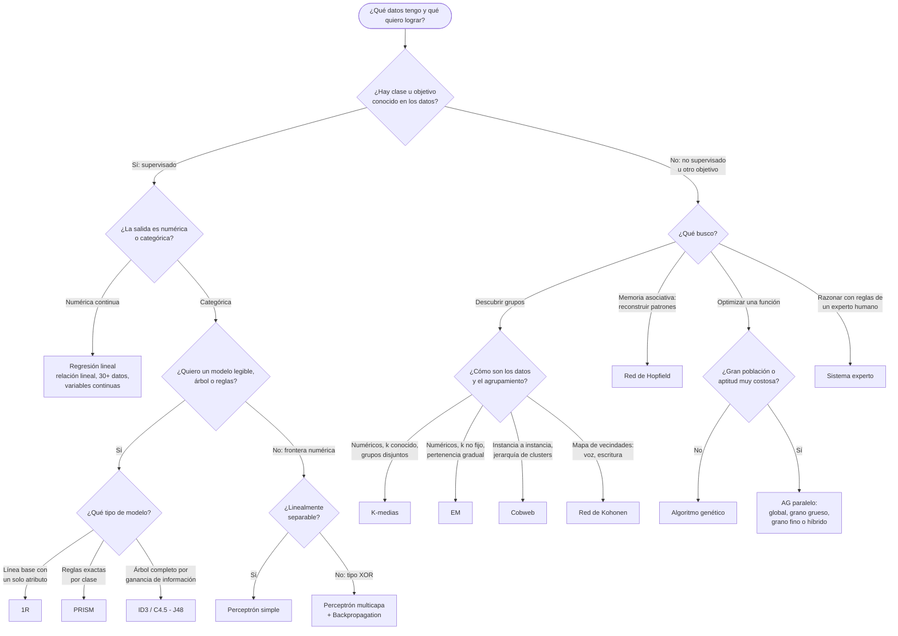

Recordatorio transversal: cualquier camino que termine en clustering (K-medias, EM) exige **normalizar** antes (§8.5), porque los grupos se forman a partir de distancias.

### Comparaciones típicas de examen

| Comparación | Respuesta lista para el examen |
|---|---|
| **1R vs PRISM** (§5) | 1R genera un árbol de un solo nivel: elige el único atributo cuyo conjunto de reglas tiene la menor proporción de error y clasifica todo con él (simple, rápido, sorprendentemente competitivo). PRISM es un método de cobertura ("separa y reinarás"): para cada clase construye reglas condición por condición maximizando p/t, hasta cubrir todas sus instancias excluyendo las ajenas. |
| **Árbol vs reglas** (§4.3) | Son representaciones equivalentes del mismo conocimiento: del árbol se obtiene una regla por hoja recorriendo cada camino raíz→hoja y conjugando con AND las condiciones de las ramas. El proceso inverso también existe: de las reglas se reconstruye el árbol, y los caminos no cubiertos terminan en la clase del "SINO". |
| **ID3 vs C4.5 / J48** (§4.1) | Ambos pertenecen a la familia TDIDT de Quinlan: ID3 (1979) es el algoritmo base, que en cada nodo elige el atributo de mayor ganancia de información; C4.5 (1993) es su evolución posterior dentro de la misma familia, y J48 es la implementación de C4.5 en WEKA. |
| **K-medias vs EM** (§8.2, §8.3) | K-medias produce agrupaciones fijas y disjuntas con k fijo, asignando cada dato al centroide más cercano (distancia cuadrática); depende mucho de las semillas. EM lo mejora con gaussianas: pertenencia gradual (no disjunta), número de clases no fijo y semillas calculadas con estadística (media y varianza). Ambos: solo datos numéricos y requieren normalización. |
| **K-medias vs Cobweb** (§8.2, §8.4) | K-medias es particional: k clusters planos y disjuntos, iterando sobre el conjunto completo hasta que los centroides no se mueven. Cobweb es jerárquico e incremental: agrupa instancia a instancia formando un árbol de clasificación guiado por category utility, con los parámetros acuity (ramificación) y cut-off (poda). |
| **Perceptrón vs MLP + Backpropagation** (§13.6) | Perceptrón: monocapa, activación escalón, solo problemas linealmente separables, ajuste directo de pesos con el error. MLP + Backprop: capas ocultas, activaciones continuas y diferenciables (sigmoide/tanh), resuelve problemas no lineales como el XOR propagando el error hacia atrás capa por capa. |
| **Hopfield vs Kohonen** (§11, §14) | Hopfield es una memoria asociativa monocapa totalmente conectada (conexiones simétricas, diagonal de W en 0, valores bipolares, aprendizaje hebbiano) que converge al patrón almacenado más parecido. Kohonen es una red bicapa competitiva (feedforward + inhibición lateral) con valores reales, donde solo la ganadora se activa y se forman mapas de vecindades. |
| **Kohonen vs K-medias** (¡se parecen!) (§8.2, §14, fichas 16 y 28) | Los dos agrupan sin etiquetas usando la distancia euclídea entre el dato y un vector de referencia (centroide vs. vector de pesos Wj), y los dos "acercan" ese vector a su grupo. Diferencia: K-medias recalcula la media de cada grupo en bloque; Kohonen es una red competitiva que actualiza incrementalmente los pesos de la neurona ganadora **y sus vecinas** (sombrero mexicano), generando un mapa con vecindades. |
| **Regresión lineal vs redes neuronales** (§9, §13) | La regresión ajusta un modelo lineal explícito ŷ = θ1·x + θ0 minimizando el MSE por descenso por gradiente; exige relación lineal y variables continuas. Las redes multicapa son aproximadores universales: capturan relaciones no lineales, con el conocimiento distribuido en los pesos. Punto en común: ambas minimizan un error siguiendo el gradiente. |
| **AG vs redes neuronales** (§15, §10.3) | El AG no aprende de ejemplos: optimiza evolucionando una población de soluciones con selección, cruza y mutación guiadas por una función de aptitud, y usa muy poca información específica del problema. La red neuronal aprende de datos ajustando pesos: el conocimiento queda codificado en los pesos de las conexiones. |
| **AG secuencial vs AG paralelo** (§16.3) | El paralelo se usa cuando el problema es dificultoso y se necesita una gran población. Cuatro categorías: global (población única, se paraleliza la evaluación), grano grueso (pocas subpoblaciones grandes + operador de migración: topología island/stepping stone, tasa e intervalo), grano fino (muchas subpoblaciones muy pequeñas, ideal 1 individuo, para aptitudes muy costosas) e híbrido. |
| **Sistema experto vs red neuronal** (§17, §10.3) | El sistema experto representa conocimiento explícito de un experto humano como reglas SI–ENTONCES, infiere incluso con datos incompletos o inciertos y **explica y justifica** sus respuestas. La red neuronal aprende de ejemplos y su conocimiento queda implícito en pesos numéricos, sin explicación del razonamiento. |

### Elegir modelo: casos tipo

El ejercicio del final: dado un dataset o un objetivo, nombrar el modelo y justificar en una línea.

| Escenario | Modelo | Justificación |
|---|---|---|
| Tabla de atributos nominales con clase conocida; se pide un modelo legible | **ID3 / C4.5 (J48)** | Supervisado inductivo: el atributo de mayor ganancia es la raíz y cada hoja da una regla legible (§4). |
| Dataset numérico sin etiquetas y k conocido de antemano | **K-medias** | Agrupa en k clusters disjuntos minimizando la distancia al centroide; normalizar antes (§8.2, §8.5). |
| Dataset numérico sin etiquetas y k desconocido | **EM** | Permite un número de clases no fijo y pertenencia gradual con gaussianas; ajusta k podando clases degeneradas (§8.3). |
| Reconstruir un patrón con ruido o incompleto | **Hopfield** | Memoria asociativa: siempre converge al patrón almacenado más parecido, aun con entrada parcial (§11). |
| Predecir un precio (valor continuo) con relación lineal y 30+ observaciones | **Regresión lineal** | Salida continua y dataset que cumple los requisitos (§9.2); se minimiza el MSE por gradiente (§9.3). |
| Tabla de verdad no linealmente separable (tipo XOR) | **MLP + Backpropagation** | El perceptrón simple falla porque no existe recta separadora; la red multicapa con sigmoide lo resuelve (§12.4, §13). |
| Optimizar una función conociendo muy poco del problema; si la aptitud es muy costosa, versión paralela | **AG (grano fino si es paralelo)** | Solo requiere cromosoma + función de aptitud (§16.1); el grano fino es ideal cuando calcular la aptitud es muy costoso (§16.3). |
| Diagnóstico que debe justificar su razonamiento ante el usuario | **Sistema experto** | Infiere con datos incompletos o inciertos y explica y justifica sus respuestas mediante el medio de explicación (§17.3, §17.4). |

Trampas frecuentes al elegir: (1) si hay etiquetas, **no** es clustering; (2) si la salida es continua, **no** es clasificación; (3) K-medias/EM solo aceptan numéricos y siempre con normalización; (4) Hopfield no clasifica: **recuerda** patrones; (5) el AG no predice nada: **optimiza** una función de aptitud.

---

# PARTE V — RESOLUCIÓN DE PARCIALES

Resoluciones detalladas de todos los parciales de `parciales/`, con fórmulas, cuentas verificadas y referencia a la sección de la teoría. Recomendación: intentá resolver el parcial primero y usá esto para corregirte.

## 22. Resolución — Parcial 1 (2023)

**Ejercicio 1** (20 ptos.) — Información total, entropía y ganancia

Dataset de 6 registros (A1, A2, Clase) con Clase ∈ {P, N}: las clases son P, P, N, P, N, P. Calcular (a) la información total de la tabla y (b) la entropía y ganancia del atributo A2.

**Respuesta:**

Conteo de clases: p = 4 (P), n = 2 (N), total = 6.

**a) Información total de la tabla**

Fórmula:

I(p;n) = −(p/(p+n))·log₂(p/(p+n)) − (n/(p+n))·log₂(n/(p+n))

Sustitución:

I(4;2) = −(4/6)·log₂(4/6) − (2/6)·log₂(2/6)
       = −0,6667·(−0,585) − 0,3333·(−1,585)
       = 0,390 + 0,528
       = **0,918 bits**

**b) Entropía y ganancia de A2**

Partición por valores de A2:

| A2 | Registros | P | N | I(pᵢ;nᵢ) |
|---|---|---|---|---|
| T | 2 (filas 1 y 3) | 1 | 1 | I(1;1) = −(1/2)·log₂(1/2) − (1/2)·log₂(1/2) = 0,5 + 0,5 = 1 |
| F | 4 (filas 2, 4, 5 y 6) | 3 | 1 | I(3;1) = −(3/4)·log₂(3/4) − (1/4)·log₂(1/4) = 0,311 + 0,5 = 0,811 |

Entropía (promedio ponderado de la información de cada valor):

E(A2) = Σ (pᵢ+nᵢ)/(p+n) · I(pᵢ;nᵢ)
E(A2) = (2/6)·1 + (4/6)·0,811 = 0,333 + 0,541 = **0,874 bits**

Ganancia:

G(A2) = I(p;n) − E(A2) = 0,918 − 0,874 = **0,044 bits**

Interpretación: conocer A2 elimina muy poca incertidumbre (0,044 bits); es un atributo pobre para dividir. Un subconjunto puro tendría información 0 y uno 50/50 (como A2 = T) tiene información máxima, 1 bit.

→ Ver §4.5

---

**Ejercicio 2** (20 ptos.) — Matriz de confusión y métricas

Matriz (fila = clase real, columna = predicción; clase positiva = 1): real 0 → [150, 10]; real 1 → [88, 120]. Calcular Accuracy, TNR, TPR y explicar el TPR obtenido.

**Respuesta:**

Identificación de celdas (clase positiva = 1):

- TP = 120 (real 1, predicho 1)
- FN = 88 (real 1, predicho 0)
- FP = 10 (real 0, predicho 1)
- TN = 150 (real 0, predicho 0)
- Total = 150 + 10 + 88 + 120 = 368

Los aciertos (TP y TN) están en la diagonal principal; los errores (FP y FN) fuera de ella.

**a) Exactitud (Accuracy)**

Accuracy = (TP + TN) / (TP + FN + FP + TN)
Accuracy = (120 + 150) / 368 = 270 / 368 = **0,7337 (73,4 %)**

El modelo clasifica correctamente el 73,4 % del total de casos.

**b) TNR (Especificidad)**

TNR = TN / (TN + FP)
TNR = 150 / (150 + 10) = 150 / 160 = **0,9375 (93,75 %)**

El modelo discrimina correctamente el 93,75 % de los casos negativos reales (clase 0).

**c) TPR (Recall / Sensibilidad)**

TPR = TP / (TP + FN)
TPR = 120 / (120 + 88) = 120 / 208 = **0,5769 (57,7 %)**

**d) Significado del TPR obtenido**

El TPR mide la capacidad del modelo de detectar los casos positivos o relevantes: de todos los casos que realmente son de la clase 1, el modelo detecta correctamente el 57,7 %. El 42,3 % restante (88 casos) son falsos negativos, es decir, positivos reales que el modelo clasifica erróneamente como clase 0. Es un valor bajo comparado con la especificidad: el clasificador es bueno reconociendo negativos pero flojo detectando positivos.

(Truco: TPR y TNR se leen por fila — lo real; Precisión se lee por columna — lo predicho.)

→ Ver §7.1 y §7.2

---

**Ejercicio 3** (20 ptos.) — TDIDT: partes constitutivas y reglas de decisión

Dado el árbol TDIDT con raíz Edad (ramas < 20 y >= 20), nodos Exp, Pres, Col y hojas Sincope / Vida / Muerte: (a) partes constitutivas; (b) reglas de decisión y proceso para obtenerlas.

El árbol del enunciado:

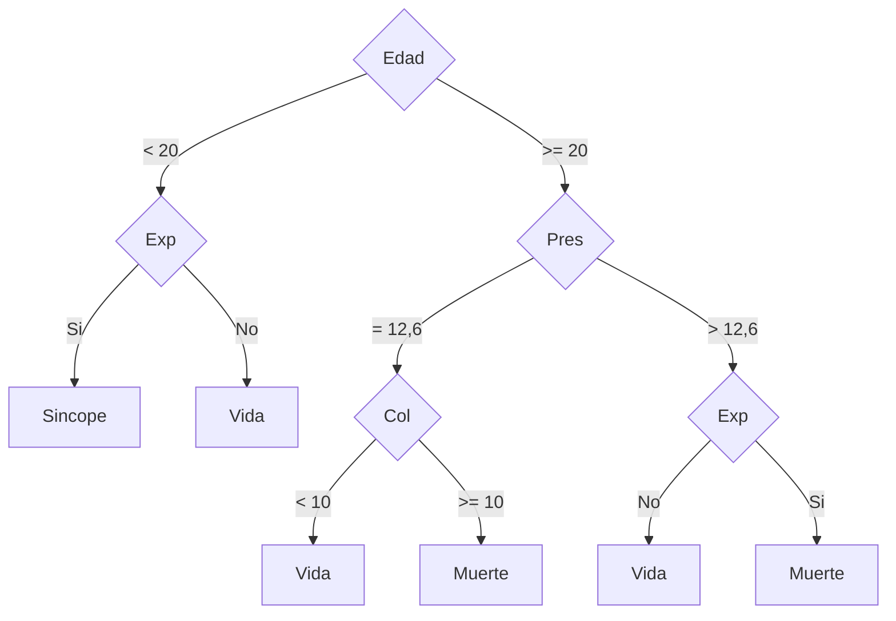

**Respuesta:**

**a) Partes constitutivas del árbol**

- **Nodo raíz**: el atributo con mayor ganancia de información; es el punto de entrada del árbol. Aquí: **Edad**.
- **Nodos internos**: cada uno corresponde a una prueba sobre un atributo. Aquí: **Exp, Pres, Col** (y Exp nuevamente en la rama derecha).
- **Ramas (arcos)**: etiquetadas con los posibles valores del atributo del nodo del que salen. Aquí: < 20 / >= 20; Si / No; = 12,6 / > 12,6; < 10 / >= 10.
- **Hojas**: especifican el valor de la clase, la decisión final. Aquí: **Sincope, Vida, Muerte**.

**b) Reglas de decisión y proceso de obtención**

Proceso: se recorre **cada camino desde la raíz hasta cada hoja**, conjugando con Y (AND) las condiciones (atributo = valor) de cada rama atravesada; la hoja da el consecuente. Se genera **una regla por hoja**, de manera ordenada (de izquierda a derecha). El conjunto de reglas resultante es equivalente al árbol.

Reglas (6 hojas → 6 reglas):

1. SI Edad < 20 Y Exp = Si ENTONCES Sincope
2. SI Edad < 20 Y Exp = No ENTONCES Vida
3. SI Edad >= 20 Y Pres = 12,6 Y Col < 10 ENTONCES Vida
4. SI Edad >= 20 Y Pres = 12,6 Y Col >= 10 ENTONCES Muerte
5. SI Edad >= 20 Y Pres > 12,6 Y Exp = No ENTONCES Vida
6. SI Edad >= 20 Y Pres > 12,6 Y Exp = Si ENTONCES Muerte

→ Ver §4.2 y §4.3

---

**Ejercicio 4** (20 ptos.) — Escalado MinMaxScaler

Dado X1 = {11, 399, 591, 911}: (a) escalar con MinMaxScaler indicando la fórmula; (b) explicar qué significa escalar con este método.

**Respuesta:**

**a) Escalado**

Fórmula:

x' = (x − x_min) / (x_max − x_min)

Con x_min = 11, x_max = 911 → rango = 911 − 11 = 900:

| X1 | Cálculo | X1 escalado |
|---|---|---|
| 11 | (11 − 11) / 900 = 0 / 900 | 0 |
| 399 | (399 − 11) / 900 = 388 / 900 | 0,431 |
| 591 | (591 − 11) / 900 = 580 / 900 | 0,644 |
| 911 | (911 − 11) / 900 = 900 / 900 | 1 |

El mínimo siempre queda en 0 y el máximo en 1.

**b) Qué significa escalar con este método**

Significa transformar los valores para **confinarlos en un rango fijo [0,1]** (en general [a,b]), de modo que atributos con escalas muy distintas queden comparables y **ninguno domine las distancias**. Esto es clave en algoritmos basados en distancias (como los de clustering): si un atributo tiene escala mucho mayor que otro, dominaría el cálculo de la distancia y sesgaría los grupos. Limitación señalada por la cátedra: min-max no es adecuado para datos estables ni con picos (outliers), porque un valor extremo comprime todo el resto del rango.

→ Ver §8.5

---

**Ejercicio 5** (20 ptos.) — K-medias (K-means)

Explicar (a) el algoritmo K-medias, (b) sus principales características, (c) las ideas en que se basa.

**Respuesta:**

**a) El algoritmo**

K-medias agrupa objetos en **k grupos (clusters)** basándose en sus características, **minimizando la suma de distancias entre cada objeto y el centroide (semilla) de su cluster**. Es un algoritmo de aprendizaje **no supervisado** (los datos no tienen etiquetas). Paso a paso:

1. Se parte de los datos.
2. Se plantan las k semillas (centroides iniciales, usualmente al azar).
3. Se asigna cada dato a la semilla más cercana.
4. Se desplaza cada semilla al centro (media) de su grupo.
5. Se repiten los pasos 3–4 hasta que los centroides ya no se mueven o no hay cambios en la asignación (convergencia).

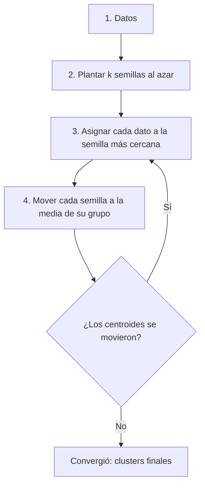

**b) Principales características**

- Solo admite **datos numéricos**.
- Usa **distancia cuadrática** (euclídea al cuadrado).
- **Requiere normalización** de los datos (los grupos se forman a partir de distancias).
- **Admite ruido**.
- Produce agrupaciones **fijas y disjuntas**: cada punto pertenece a exactamente un cluster.
- **Depende mucho de las semillas iniciales** (puede converger a soluciones distintas).
- Nota de la cátedra: no usar con k > 25.
- Para elegir k se usa el **método del codo**: se busca el k a partir del cual aumentar k ya no mejora sustancialmente la distancia media intra-cluster.

**c) Ideas en que se basa**

- **Minimización de la varianza intra-cluster**: formalmente construye k grupos S = {S₁, ..., S_k} minimizando Σᵢ Σ_{xⱼ ∈ Sᵢ} ‖xⱼ − μᵢ‖², la suma de las distancias al cuadrado de cada objeto a la media (centroide) de su grupo.
- **Grafos o diagramas de Voronoi**: cada centroide define una región de Voronoi (el conjunto de puntos más cercanos a él que a cualquier otro centroide); las fronteras entre clusters son las mediatrices entre semillas.
- La idea intuitiva: objetos similares deben quedar cerca del mismo centro; iterar asignación → recentrado refina los grupos hasta la convergencia.

→ Ver §8.2

## 23. Resolución — Recuperatorio Parcial 1 (2023)

**Ejercicio 1** (20 ptos.) — Matriz de confusión: Accuracy, FPR, FOR e interpretación

Matriz dada (fila = clase real, columna = predicción; se toma **Gripe** como clase positiva):

|  | Pred. Gripe | Pred. Resfriado |
|---|---|---|
| **Real Gripe** | TP = 250 | FN = 110 |
| **Real Resfriado** | FP = 20 | TN = 220 |

Total = 250 + 110 + 20 + 220 = 600.

**Respuesta:**

**a) Exactitud (Accuracy).**
Fórmula: Exactitud = (TP + TN) / (TP + FN + FP + TN)
Sustitución: (250 + 220) / 600 = 470 / 600
Resultado: **0,7833 (78,33 %)**

**b) False Positive Rate (FPR).**
Fórmula: FPR = FP / (FP + TN) — se lee sobre la fila de los negativos reales.
Sustitución: 20 / (20 + 220) = 20 / 240
Resultado: **0,0833 (8,33 %)** → probabilidad de "falsa alarma": el 8,33 % de los resfriados reales fueron marcados como gripe.

**c) False Omission Rate (FOR).**
Fórmula: FOR = FN / (FN + TN) — se lee sobre la columna "predicho negativo".
Sustitución: 110 / (110 + 220) = 110 / 330
Resultado: **0,3333 (33,33 %)** → el 33,33 % de las predicciones "Resfriado" son incorrectas (gripes omitidas).

**d) Significado de la Exactitud obtenida.**
La exactitud mide el **porcentaje de predicciones correctas sobre el total de casos**: aquí el modelo clasifica correctamente el 78,33 % de los 600 pacientes (470 aciertos: 250 gripes bien detectadas + 220 resfriados bien detectados). Advertencia de la cátedra: en conjuntos de datos **poco equilibrados la exactitud no es una métrica útil** — un clasificador que marque a todos como "sanos" frente a una enfermedad rara puede alcanzar 99 % de exactitud y ser totalmente inútil. En este caso las clases están razonablemente equilibradas (360 vs. 240), por lo que el valor sí es informativo; aun así conviene complementarlo con TPR/FPR: el punto débil del modelo es que omite 110 gripes (FOR alto, 33,33 %).

→ Ver §7.1 y §7.2

---

**Ejercicio 2** (20 ptos.) — Construir el árbol TDIDT a partir de reglas

Reglas: Si X=1 y Y=1 ⇒ A · Si Z=1 y W=1 ⇒ A · Sino B. Todos los atributos toman valores {1, 2}.

**Respuesta:**

**a) Árbol.** Procedimiento inverso de la cátedra: se elige una raíz entre los atributos de las reglas, se ramifica por cada valor posible, los caminos cubiertos por una regla terminan en su clase y todo camino no cubierto termina en la clase por defecto B. Tomando X como raíz: por la rama X=1 sigue Y (primera regla); si Y=1 se llega a la hoja A. Si la primera regla falla (X=2, o X=1 con Y=2) todavía puede cumplirse la segunda regla, por lo que en esos caminos debe evaluarse Z y luego W. El subárbol Z–W se **replica** en ambas ramas:

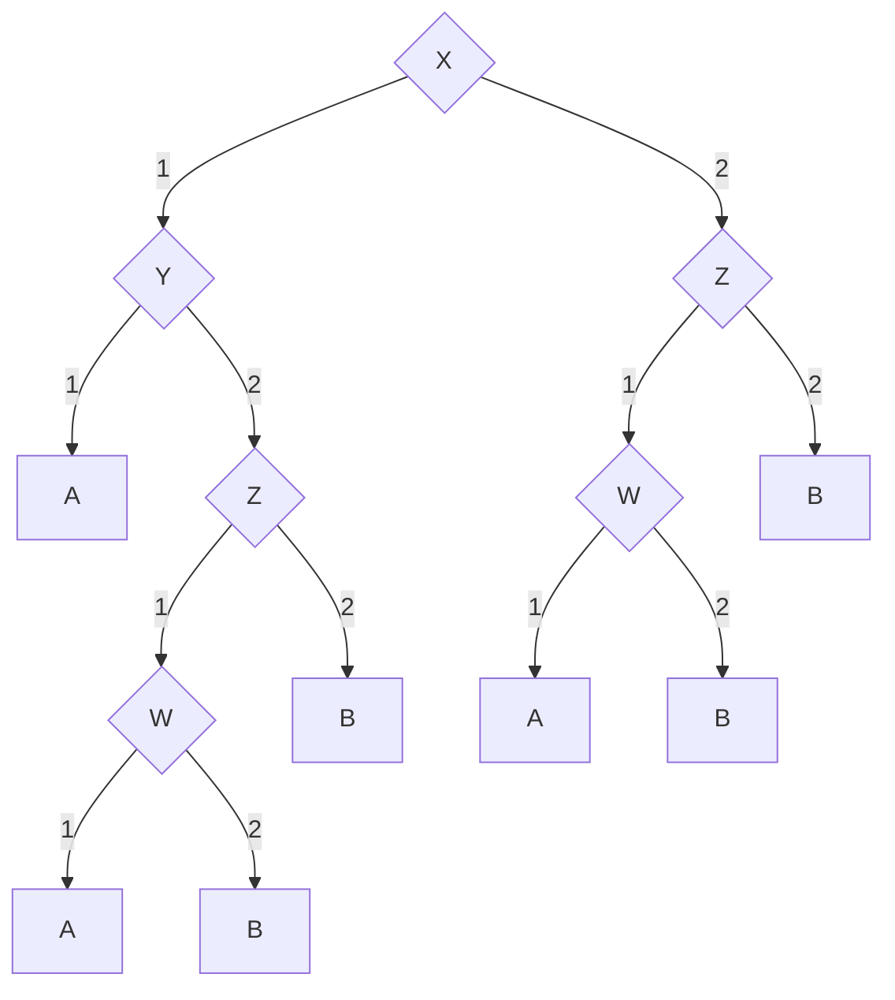

Verificación: la regla 1 corresponde al camino X=1, Y=1 → A; la regla 2 corresponde a los caminos X=1, Y=2, Z=1, W=1 → A y X=2, Z=1, W=1 → A; todos los caminos restantes terminan en B (el "sino"). Cada regla original queda cubierta por al menos un camino raíz→hoja.

**b) Partes constitutivas del árbol:**

- **Nodo raíz**: X — punto de entrada del árbol (en ID3 sería el atributo con mayor ganancia de información).
- **Nodos internos**: Y, Z y W — cada uno corresponde a una **prueba sobre un atributo**.
- **Ramas (arcos)**: etiquetadas con los **valores posibles** del atributo del nodo del que salen (aquí 1 y 2).
- **Hojas**: especifican el **valor de la clase** (la decisión final): A o B.

→ Ver §4.2 y §4.3

---

**Ejercicio 3** (20 ptos.) — Información total, entropía y ganancia del atributo Tamaño

Dataset de 6 instancias; Clase: **Invertir** (positiva) en las filas 1, 2, 4 y 6; **No invertir** (negativa) en las filas 3 y 5 → p = 4, n = 2.

**Respuesta:**

**a) Información total de la tabla.**
Fórmula: I(p;n) = −(p/(p+n))·log₂(p/(p+n)) − (n/(p+n))·log₂(n/(p+n))
Sustitución: I(4;2) = −(4/6)·log₂(4/6) − (2/6)·log₂(2/6)
= −0,6667·(−0,585) − 0,3333·(−1,585)
= 0,3900 + 0,5283
Resultado: **I(4;2) = 0,9183 bits**

**b) Entropía y ganancia del atributo Tamaño** (valores: Chico, Grande).

Subconjuntos:
- **Chico** (filas 1, 2, 6): 3 Invertir, 0 No invertir → p₁ = 3, n₁ = 0 → I(3;0) = 0 (subconjunto **puro**: información nula).
- **Grande** (filas 3, 4, 5): 1 Invertir, 2 No invertir → p₂ = 1, n₂ = 2 →
  I(1;2) = −(1/3)·log₂(1/3) − (2/3)·log₂(2/3) = 0,5283 + 0,3900 = **0,9183**.

Entropía:
Fórmula: E(A) = Σ ((pᵢ+nᵢ)/(p+n)) · I(pᵢ;nᵢ)
Sustitución: E(Tamaño) = (3/6)·I(3;0) + (3/6)·I(1;2) = 0,5·0 + 0,5·0,9183
Resultado: **E(Tamaño) = 0,4591**

Ganancia:
Fórmula: G(A) = I(p;n) − E(A)
Sustitución: G(Tamaño) = 0,9183 − 0,4591
Resultado: **G(Tamaño) = 0,4591**

Interpretación: conocer el Tamaño elimina la mitad de la incertidumbre de la tabla (la rama Chico queda pura: siempre Invertir); es un candidato fuerte a raíz del árbol.

→ Ver §4.5

---

**Ejercicio 4** (20 ptos.) — Medidas de actuación y grandes grupos del aprendizaje automático

**Respuesta:**

**a) Principales medidas de actuación del aprendizaje automático:**

- **Generalidad**: capacidad del método de aplicarse a distintos dominios o problemas, no solo a aquel para el que fue diseñado.
- **Robustez**: capacidad de funcionar correctamente ante ruido, datos incompletos o inconsistentes.
- **Eficacia**: qué tan bien resuelve la tarea (calidad de los resultados).
- **Eficiencia**: cuántos recursos (tiempo, cómputo, datos) consume para lograrlo.

**b) Los dos grandes grupos** (clasificación por tipo de supervisión):

1. **Aprendizaje supervisado**: el algoritmo se entrena con un **histórico de datos etiquetados** y "aprende" a asignar la etiqueta de salida adecuada a un nuevo valor (predice la salida). Se usa típicamente para **clasificación** y **regresión**. Ejemplos: detector de spam, árboles de decisión (ID3, C4.5, J48), regresión lineal, perceptrón, backpropagation.
2. **Aprendizaje no supervisado**: **no se dispone de datos etiquetados**; se conocen las entradas pero no hay salida asociada. Tiene **carácter exploratorio**: busca estructura oculta en los datos. Ejemplos: **clustering o agrupamiento** (K-medias, EM, Cobweb), redes de Kohonen, Hopfield. Cuidado con las correlaciones espurias: que dos variables se agrupen no implica causalidad.

(La cátedra menciona además un tercer grupo, el aprendizaje **por refuerzo**: el agente aprende interactuando con el entorno mediante premios y castigos; se puede citar como complemento.)

→ Ver §3.4 y §3.5

---

**Ejercicio 5** (20 ptos.) — Algoritmo EM: descripción, características y mejoras sobre K-medias

**Respuesta:**

**a) El algoritmo EM (Expectation-Maximization).**
Es un algoritmo de **clustering (aprendizaje no supervisado)** que mejora a K-medias usando **campanas de Gauss**: en lugar de asignar cada dato a un único cluster, cada dato tiene un **grado de pertenencia probabilístico** a cada gaussiana. Itera dos pasos:

- **Paso E (Esperanza)**: se calcula el **grado de pertenencia** de cada dato a cada gaussiana (probabilidad de pertenecer a cada una, donde μ es el centroide de la gaussiana).
- **Paso M (Maximización)**: se **recalculan la media y la varianza** de cada gaussiana para que se ubiquen en el centro de su conjunto de datos.

Termina cuando las medias y varianzas son **muy similares a las del paso anterior**.

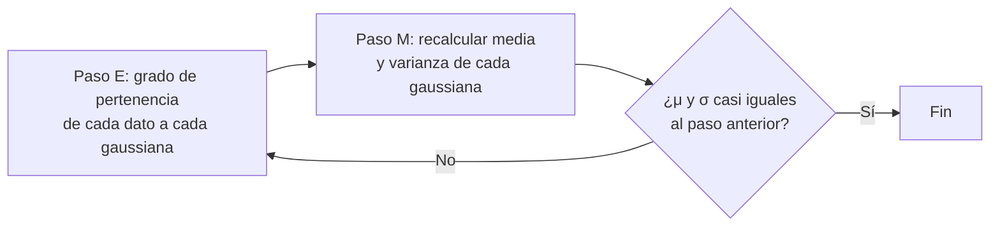

Sobre la campana de Gauss: la **media** está en el centro de la campana, la **desviación estándar** en el punto de inflexión, y la intersección de un dato con la curva da su grado de pertenencia (a mayor Y, mayor pertenencia).

**b) Principales características:**

- Mejora K-medias con **gaussianas**.
- Permite un número de clases **no fijo**.
- Agrupaciones **no disjuntas** (un dato puede pertenecer parcialmente a varios clusters).
- **Calcula las semillas con estadística** (media y varianza).
- Solo admite valores **numéricos**.
- **Requiere normalización** de los datos.

**c) Mejoras respecto de K-medias:**

- **Pertenencia probabilística vs. asignación dura**: K-medias produce agrupaciones fijas y disjuntas (cada punto pertenece a exactamente un cluster); EM asigna grados de pertenencia, por lo que las agrupaciones son no disjuntas.
- **Número de clases no fijo**: K-medias exige fijar k de antemano (y elegirlo con el método del codo); EM permite ajustar el número de clases durante el proceso (se eliminan clases de varianza casi nula o pares de clases con medias y varianzas muy similares).
- **Semillas calculadas con estadística**: K-medias depende mucho de las semillas iniciales al azar (puede converger a soluciones distintas); EM calcula sus semillas con media y varianza.

→ Ver §8.2 y §8.3

## 24. Resolución — Parcial 2 (2023)

**Ejercicio 1** (20 ptos.) — Red de Hopfield

El gráfico muestra 7 nodos, cada uno con una entrada (e1…e7) y una salida (s1…s7), pero sin ninguna conexión entre los nodos. Se pide: a) ¿el gráfico es correcto?; b) ¿cuántos patrones puede almacenar una red con esa cantidad de nodos?; c) ¿qué significa que la diagonal principal de W sea 0?

**Respuesta:**

**a) El gráfico NO es correcto.** Una red de Hopfield es una red **monocapa totalmente conectada**: la salida de cada nodo se conecta a **todos los demás** nodos, con conexiones **multidireccionales y simétricas** (w_ij = w_ji), y **ninguna neurona se conecta consigo misma** (§11.2). El gráfico dibujado presenta 7 nodos **aislados** (cada uno solo lleva su entrada e_i a su salida s_i, sin interconexiones entre nodos), por lo que no cumple la condición de red totalmente conectada.

Con N neuronas el gráfico correcto debe tener el número de conexiones no dirigidas (§11.2):

    conexiones = C(N,2) = N·(N−1)/2

Para N = 7:

    conexiones = 7·(7−1)/2 = 7·6/2 = 42/2 = 21 conexiones

El gráfico mostrado tiene 0 conexiones entre nodos → faltan las 21 conexiones → **incorrecto**. (Si además apareciera un lazo de un nodo a sí mismo, también sería incorrecto.)

**b) Aproximadamente 1 patrón.** La capacidad de una red de Hopfield se estima empíricamente (§11.2, §11.5): cada 7 neuronas puede almacenar 1 patrón, o de forma general

    cantidad de patrones = 0,14 · N

Con N = 7 neuronas (la misma cantidad de nodos del gráfico):

    patrones = 0,14 · 7 = 0,98 ≈ 1 patrón

Es decir, una red de 7 nodos puede almacenar aproximadamente **1 patrón**.

**c) Que la diagonal principal de W sea 0 significa que no se permite la conexión de una neurona consigo misma** (§11.4, §11.2). Cada posición w_ij con i = j representaría el peso de una neurona hacia sí misma; como en Hopfield ese tipo de autoconexión no existe, todos esos elementos valen siempre 0. En el cálculo de la matriz de pesos esto se garantiza restando la identidad:

    W = Σ (E_kᵀ · E_k) − m · I     (m = cantidad de patrones)

La resta de m·I cancela exactamente la diagonal, dejándola en cero. La matriz W representa las conexiones sinápticas entre neuronas y la fuerza de esas conexiones (donde reside el conocimiento de la red); la diagonal en 0 codifica la restricción de "sin autoconexión".

→ Ver §11.2, §11.4, §11.5

---

**Ejercicio 2** (20 ptos.) — Regresión lineal

a) ¿Cómo debe ser el dataset? b) ¿Qué función se busca minimizar? c) ¿Cómo debe ser el coeficiente de determinación?

**Respuesta:**

**a) Requisitos del dataset** (§9.2):

1. **Relación lineal** entre las variables (dependiente vs. independientes).
2. **Suficientes datos**: mínimo aproximadamente 30 observaciones.
3. Variables **continuas**.
4. **Poca multicolinealidad**: las variables independientes no deben estar fuertemente correlacionadas entre sí.

**b) Se busca minimizar el Error Cuadrático Medio (MSE)**, que es la función coste J(θ), siguiendo el principio del **descenso por el gradiente** (§9.3). Fórmula:

    MSE = J(θ) = (1/2n) · Σ_{i=1..n} ( h_θ(x⁽ⁱ⁾) − y⁽ⁱ⁾ )²

donde h_θ(x) = θ₁·x + θ₀ es la recta del modelo, y⁽ⁱ⁾ es el valor real y n el número de ejemplos. Explicación: se buscan los valores de θ₀ y θ₁ para los que la recta estimada h_θ(x) se acerque lo máximo posible a los valores reales y de los ejemplos; minimizar J(θ) equivale a minimizar la diferencia (el error) entre lo predicho y lo observado. Para ello se aplica la regla de actualización, repitiendo hasta converger:

    θ_j ← θ_j − α · (∂/∂θ_j) J(θ)

con α = tasa de aprendizaje (α chica: converge lento pero preciso; α grande: rápido pero puede pasarse del mínimo o diverger). El mínimo se alcanza cuando la derivada parcial se hace 0.

**c) El coeficiente de determinación R² debe estar entre 0 y 1, y cuanto más cerca de 1, mejor** (§9.6). Indica porcentualmente qué proporción de la variabilidad de la variable dependiente queda explicada por el modelo; un R² cercano a 1 significa que el modelo explica la mayor parte de esa variabilidad (mejor ajuste). (No confundir con R, el coeficiente de correlación, que va de −1 a 1 e indica el nivel y sentido de la asociación.)

→ Ver §9.2, §9.3, §9.6

---

**Ejercicio 3** (20 ptos.) — Neurona biológica y su equivalente artificial

a) Explicar las partes principales de la neurona biológica y su funcionamiento. b) Construir la neurona artificial equivalente, describiendo cada parte y su funcionamiento.

**Respuesta:**

**a) Partes principales de la neurona biológica y funcionamiento** (§10.2):

- **Dendritas**: **reciben** las señales de entrada desde otras neuronas a través de los puntos de conexión llamados **sinapsis**.
- **Soma (cuerpo celular)**: **combina e integra** las señales recibidas (procesa) y decide si emite señal de salida.
- **Axón**: **transporta** la señal de salida desde el soma hacia los terminales, ramificándose en su extremo.
- **Terminales sinápticos/axónicos**: **distribuyen** la información (liberan neurotransmisores) hacia las dendritas de un nuevo conjunto de neuronas.

Funcionamiento: las señales que llegan por las dendritas pueden ser **excitatorias o inhibitorias**; el soma realiza la **suma ponderada** de esas señales y, si esa suma **supera el umbral de activación** en tiempo suficiente, la neurona **se dispara**, enviando un impulso por el axón hacia otras neuronas. Las señales son de dos tipos: eléctrica (por el axón) y química (entre terminales y dendritas).

**b) Neurona artificial equivalente** (§10.4). Cada parte biológica tiene su correspondencia:

| Neurona biológica | Neurona artificial |
|---|---|
| Dendritas / sinapsis | Entradas x_i con pesos w_ij |
| Soma (integración) | Suma ponderada Σ_i w_ij · x_i |
| Umbral de disparo | Función de activación g(·) |
| Axón / terminales | Salida y_j hacia otras neuronas |

Topología y funcionamiento:

```
  x0 = 1 ───w0──╮
  x1 ─────w1────┤
  x2 ─────w2────┼──▶  Σ = Σ wi·xi  ──▶  g(Σ)  ──▶  y
   ⋮            │     (soma:           (umbral/       (axón: salida
  xn ─────wn────╯      integración)     activación)     hacia otras)
 (dendritas con
  pesos sinápticos)
```

- Cada conexión tiene un **peso numérico** w_ij que fija la fuerza y el signo: si w_ij > 0 la conexión es **excitadora**, si w_ij < 0 es **inhibidora**, si w_ij = 0 no hay conexión (equivale a las señales excitatorias/inhibitorias biológicas).
- La unidad calcula primero la **suma ponderada de sus entradas**: suma_j = Σ_{i=0..n} w_ij · x_i (equivale a la integración del soma). La entrada x₀ = 1 con su peso w₀ actúa como umbral/bias.
- Luego aplica la **función de activación g** a esa suma para producir la salida: y_j = g(suma_j). La función habilita la unidad (salida cerca de +1) cuando se dan las entradas adecuadas y la desactiva en caso contrario (equivale al umbral de disparo).
- La salida y_j se propaga hacia otras neuronas (equivale al axón/terminales).

→ Ver §10.2, §10.4

---

**Ejercicio 4** (20 ptos.) — Perceptrón simple sobre un dataset de 3 entradas

Dataset (X1, X2, X3 → Ys): la salida es 1 solo en la fila (1,1,1); en las otras 7 filas es 0. Es decir, la función **AND de 3 variables**. a) ¿Se puede resolver con un Perceptrón simple? ¿Por qué? b) De ser posible, graficar la topología.

**Respuesta:**

**a) SÍ es posible resolverlo con un Perceptrón simple, porque la tabla es linealmente separable.** Un Perceptrón simple resuelve cualquier problema en el que exista un **hiperplano** que separe perfectamente las clases (§12.2, §12.4). Aquí hay un **único** punto positivo, el vértice (1,1,1), y los otros 7 vértices del cubo son clase 0. Un único punto positivo ubicado en un vértice del cubo **siempre** puede aislarse con un plano (§12.4, caso AND corroborado). El hiperplano separador es:

    x1 + x2 + x3 − 2,5 = 0     →     pesos w1 = w2 = w3 = 1, umbral/bias w0 = −2,5

Con la regla de salida "y = 1 si suma > 0; y = 0 si no" (§12.2), verificamos las 8 filas (suma = x1+x2+x3−2,5):

    (0,0,0): 0 − 2,5 = −2,5 < 0 → 0 ✓
    (0,0,1): 1 − 2,5 = −1,5 < 0 → 0 ✓
    (0,1,0): 1 − 2,5 = −1,5 < 0 → 0 ✓
    (0,1,1): 2 − 2,5 = −0,5 < 0 → 0 ✓
    (1,0,0): 1 − 2,5 = −1,5 < 0 → 0 ✓
    (1,0,1): 2 − 2,5 = −0,5 < 0 → 0 ✓
    (1,1,0): 2 − 2,5 = −0,5 < 0 → 0 ✓
    (1,1,1): 3 − 2,5 = +0,5 > 0 → 1 ✓

Las 8 filas coinciden con la columna Ys → el plano separa correctamente → **resoluble con Perceptrón simple**.

Nota de la cátedra (§12.4): en un resumen previo figuraba como respuesta esperada que "el AND de 3 variables NO es linealmente separable porque el único caso con salida 1 es (1,1,1)". Ese razonamiento está marcado como **incorrecto**: justamente por tener un solo positivo en un vértice, siempre existe un plano separador (las únicas funciones booleanas de referencia NO separables son XOR y XNOR). La respuesta correcta y corroborada es que **SÍ** se resuelve, con el desarrollo del hiperplano anterior.

**b) Topología: Perceptrón de 3 entradas + bias.**

```
  x0 = 1 ──w0 = −2,5──╮
  x1 ──────w1 = 1─────┤
  x2 ──────w2 = 1─────┼──▶  Σ = Σ wi·xi  ──▶  escalón  ──▶  y ∈ {0, 1}
  x3 ──────w3 = 1─────╯
```

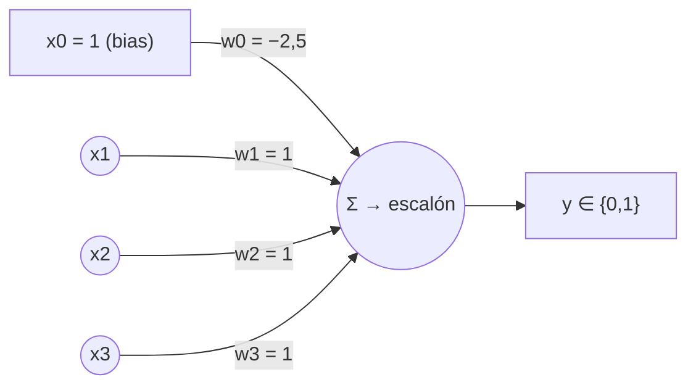

Es una única neurona (monocapa, feedforward): suma ponderada de las 3 entradas más el bias, seguida de la función escalón. Los pesos w1=w2=w3=1 y el umbral −2,5 son un juego válido; el algoritmo de entrenamiento supervisado (Δw = η·(d−y)·x, §12.3) converge a un conjunto de pesos equivalente porque el problema es linealmente separable.

→ Ver §12.2, §12.3, §12.4

---

**Ejercicio 5** (20 ptos.) — Backpropagation

a) Explicar el algoritmo de Backpropagation. b) Principales características de un Perceptrón multicapa entrenado con Backpropagation. c) ¿Qué funciones de activación suelen usarse y por qué?

**Respuesta:**

**a) Algoritmo de Backpropagation** (§13.4, §13.5). Es el algoritmo de entrenamiento **supervisado** de las redes multicapa (entrada → oculta(s) → salida). El conocimiento de la red se codifica en los pesos de las conexiones. Comienza con **pesos aleatorios pequeños** (entre −0,1 y 0,1) y ajusta los pesos cada vez que ve un par entrada/salida. Cada par requiere **dos etapas**:

1. **Paso hacia adelante (forward)**: se presenta el ejemplo de entrada y se dejan propagar las activaciones desde la capa de entrada hacia la oculta y de ésta hacia la de salida (h = g(W1·x); y = g(W2·h)), hasta obtener la salida de la red.
2. **Paso hacia atrás (backward)**: la salida obtenida se **compara con la salida objetivo** y se calcula el **error** de las unidades de salida. Se ajustan primero los pesos de la capa de salida (W2) para reducir ese error; luego el error se **deriva/propaga hacia atrás** hacia las capas ocultas (proporcional a los pesos que las conectan) y se ajustan los pesos de entrada→oculta (W1).

El proceso se repite con todos los pares hasta que el error sea aceptable. Esquema:


Al basarse en el descenso por el gradiente, puede caer en un **mínimo local** (las salidas quedan clavadas cerca de 0,5 y el error no baja). Gracias a la retropropagación, la red multicapa **resuelve problemas no lineales** como el XOR, que el Perceptrón simple no puede.

**b) Características principales del Perceptrón multicapa con Backpropagation** (§13.1, §13.6):

- Tiene **múltiples capas**: entrada, una o más **capas ocultas**, y salida (a diferencia del Perceptrón, que es monocapa).
- Resuelve **problemas no linealmente separables** (no lineales); son **aproximadores universales** (pueden calcular "cualquier cosa").
- El **conocimiento está codificado en los pesos** de las conexiones.
- Usa funciones de activación **continuas y diferenciables** (sigmoide / tangente hiperbólica), no la escalón.
- El error **se propaga hacia atrás** capa por capa para ajustar los pesos (primero W2, luego W1).
- Entrenamiento **supervisado**.
- Las capas de entrada y oculta poseen una unidad extra de **bias/umbral** cuya activación (x₀=1, h₀=1) nunca cambia.

**c) Funciones de activación: sigmoide y tangente hiperbólica** (§13.3):

- **Sigmoide**: salida = 1 / (1 + e^(−suma)) → produce valores entre **0 y 1** (interpretables como probabilidades). Si suma = 0 la salida es 0,5; si la suma crece tiende a 1 y si decrece tiende a 0.
- **Tangente hiperbólica (tanh)**: misma forma de "S" pero produce valores entre **−1 y 1**.

¿Por qué éstas y no la escalón? Porque son **continuas y diferenciables**, requisito indispensable para poder **derivar el error** y propagarlo hacia atrás (el descenso por el gradiente necesita la derivada). La función escalón del Perceptrón "salta" y **no es diferenciable**, por lo que no permitiría retropropagar. De hecho, los deltas de backprop usan la derivada de la sigmoide expresada con su propia salida: g'(s) = g(s)·(1 − g(s)), es decir y·(1−y).

→ Ver §13.1, §13.3, §13.4, §13.5, §13.6

## 25. Resolución — Recuperatorio 2 (2023)

**Ejercicio 1** (20 ptos.) — Red de Hopfield: capacidad y matriz W

Pregunta: a) ¿cómo sería el gráfico de la red si se desean almacenar 1,5 patrones? b) ¿qué significa la matriz de pesos W en el algoritmo de aprendizaje?

**Respuesta:**

**a)** Fórmula de capacidad de la cátedra: cantidad de patrones = 0,14 · N (equivalente: cada 7 neuronas se almacena 1 patrón). Para pasar de patrones a neuronas se despeja N:

N = P / 0,14 = 1,5 / 0,14 = 10,71… → **11 neuronas** (se redondea hacia arriba porque la cantidad de neuronas debe ser un número entero).

Verificación por la otra regla: 1,5 patrones · 7 neuronas/patrón = 10,5 → 11 neuronas. Y al revés: 0,14 · 11 = 1,54 ≥ 1,5 ✓.

Aclaración conceptual que espera la cátedra: una cantidad fraccionaria de patrones **no es almacenable como tal** (los patrones son unidades discretas); el despeje indica cuántas neuronas cubrirían esa capacidad.

El gráfico es entonces una red **monocapa de 11 neuronas totalmente conectada**: la salida de cada nodo se conecta a **todos** los demás, con conexiones **multidireccionales y simétricas** (wij = wji) y **ninguna neurona conectada consigo misma**. Cantidad de conexiones: N(N−1)/2 = 11 · 10 / 2 = **55**.

Esquema reducido de la idea (con la aclaración en el examen de que son 11 nodos, todos contra todos, sin lazos propios):

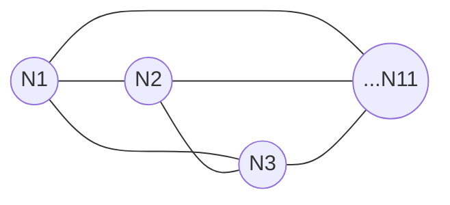

**b)** La matriz de pesos W **representa las conexiones sinápticas entre las neuronas y determina la fuerza de esas conexiones: es donde reside el conocimiento de la red**. Se calcula off-line (aprendizaje no supervisado, de tipo Hebbiano) a partir de los patrones a memorizar:

W = Σ (de k=1 a m) Ekᵀ · Ek − m · I

Se suma el producto de cada patrón por su transpuesta y se resta la identidad multiplicada por la cantidad de patrones **porque las neuronas no pueden conectarse consigo mismas**: por eso toda posición con i = j (la diagonal principal) vale siempre 0. Además W es simétrica (wij = wji), reflejando que las conexiones son multidireccionales.

→ Ver §11.2, §11.4, §11.5

---

**Ejercicio 2** (20 ptos.) — Regresión lineal: dataset, función a minimizar y coeficiente de correlación

Pregunta: a) ¿cómo debe ser el dataset? b) ¿qué función se busca minimizar? c) ¿cómo debe ser el coeficiente de correlación?

**Respuesta:**

**a)** El dataset debe cumplir cuatro condiciones:

1. **Relación lineal** entre las variables.
2. **Suficientes datos**: mínimo ~30 observaciones.
3. Variables **continuas** (la salida de la regresión es continua, a diferencia de la clasificación).
4. **Poca multicolinealidad**: las variables independientes no deben estar fuertemente correlacionadas entre sí.

**b)** Se busca minimizar el **Error Cuadrático Medio (MSE)**, la función coste J(θ):

MSE = J(θ) = (1/2n) · Σ (de i=1 a n) (h_θ(x⁽ⁱ⁾) − y⁽ⁱ⁾)²

donde h_θ(x) = θ1·x + θ0 es el modelo (recta de regresión), y⁽ⁱ⁾ los valores reales y n la cantidad de ejemplos. Se buscan los valores de θ para los que h_θ(x) se acerque lo máximo posible a los y de los ejemplos. La minimización se hace por **descenso por el gradiente**, repitiendo hasta converger:

θj ⇐ θj − α · ∂J(θ)/∂θj

El mínimo se alcanza cuando la derivada parcial vale 0. Sobre la tasa de aprendizaje α: si es pequeña desciende lento pero preciso; si es grande desciende rápido pero puede pasarse del mínimo e incluso divergir.

**c)** El **coeficiente de correlación R** indica el nivel de asociación entre la variable dependiente y la independiente (es adimensional). Su interpretación:

- R = 0: variables independientes.
- R = 1: relación lineal exacta.
- R > 0: relación directa (al aumentar x, aumenta y).
- R < 0: relación inversa (al aumentar una, disminuye la otra).

Para que la regresión lineal sea aplicable y el modelo sea bueno, R debe ser **lo más cercano posible a 1 en valor absoluto** (fuerte asociación lineal, directa o inversa); un R cercano a 0 indica que no hay relación lineal y el método no corresponde. Complemento: el coeficiente de determinación R² (entre 0 y 1) indica porcentualmente el cambio de la dependiente explicado por el modelo; mientras más cerca de 1, mejor.

→ Ver §9.2, §9.3, §9.6

---

**Ejercicio 3** (20 ptos.) — Perceptrón: entrenamiento, partes y limitación

Pregunta: a) funcionamiento del algoritmo de entrenamiento; b) partes del Perceptrón; c) ¿ante cuáles problemas falla y por qué?

**Respuesta:**

**a)** Algoritmo de entrenamiento (supervisado):

1. **Inicializar** los pesos con valores aleatorios pequeños.
2. Para cada patrón de entrada, **calcular la salida**: y = escalón(Σ wi·xi).
3. Si hay error, **ajustar los pesos**: Δw = η · (d − y) · x, donde d es la salida deseada, y la salida obtenida y η la tasa de aprendizaje (en el ejemplo de la cátedra, η = 0,5).
4. **Repetir** hasta la convergencia: error 0 sobre todos los patrones de entrenamiento.

**b)** Partes del Perceptrón (imita a una neurona):

- **Entradas** x1…xn: los valores del patrón (equivalen a las dendritas).
- **Pesos** w1…wn: fuerza y signo de cada conexión (sinapsis); codifican el conocimiento.
- **Entrada de umbral/bias**: x0 = 1 con peso w0 (umbral ajustable).
- **Función suma ponderada** (soma/integración): suma = Σ (de i=0 a n) wi·xi.
- **Función de salida escalón** (umbral de disparo): y = 1 si suma > 0; y = 0 (o −1) en caso contrario.
- **Salida** y (axón): resultado binario hacia adelante; las conexiones son unidireccionales (feedforward).

```
  x0 = 1 ───w0──╮
  x1 ─────w1────┼──▶  Σ  ──▶  escalón  ──▶  y ∈ {0, 1}
  x2 ─────w2────╯
```

**c)** El Perceptrón **falla ante problemas que NO son linealmente separables**. El caso emblemático es la compuerta **XOR**: no existe ninguna recta que separe los puntos {(0,1), (1,0)} de {(0,0), (1,1)}. La razón: igualando la suma ponderada a cero (w0 + w1·x1 + w2·x2 = 0) el Perceptrón solo define **una recta** (o un hiperplano en más dimensiones) como superficie de decisión; si las clases no pueden separarse con una recta/hiperplano, el algoritmo de entrenamiento nunca converge (los pesos giran en círculos). La solución con dos perceptrones encadenados existe, pero su algoritmo de aprendizaje no puede ajustar los pesos entre perceptrones (no sabe repartir el error hacia atrás): se necesita backpropagation.

→ Ver §12.1, §12.2, §12.3, §12.4

---

**Ejercicio 4** (20 ptos.) — Tabla de 3 variables: ¿resoluble con un Perceptrón?

Pregunta: dado el dataset de 3 entradas con Ys = 0 solo en (0,0,0) y Ys = 1 en los 7 casos restantes: a) ¿es resoluble con un Perceptrón? ¿Por qué? b) De ser posible, graficarlo.

**Respuesta:**

**a) Sí, es posible.** La tabla es la compuerta **OR de 3 variables** (la salida es 0 únicamente cuando todas las entradas son 0, y 1 si al menos una entrada vale 1). Método: se ubican los 2³ = 8 puntos en el cubo unitario y se analiza si existe un plano w0 + w1·x1 + w2·x2 + w3·x3 = 0 que separe los 1 de los 0. Como el único punto de clase 0 es el origen (0,0,0) —un solo vértice del cubo—, **sí existe un plano separador**: el OR de n variables ES linealmente separable. Sirve el plano:

x1 + x2 + x3 − 0,5 = 0   (es decir w1 = w2 = w3 = 1; w0 = −0,5)

Verificación sobre la tabla completa (salida = 1 si suma > 0):

- (0,0,0): 0 + 0 + 0 − 0,5 = −0,5 ≤ 0 → salida 0 ✓
- (0,0,1), (0,1,0), (1,0,0): 1 − 0,5 = 0,5 > 0 → salida 1 ✓
- (0,1,1), (1,0,1), (1,1,0): 2 − 0,5 = 1,5 > 0 → salida 1 ✓
- (1,1,1): 3 − 0,5 = 2,5 > 0 → salida 1 ✓

Los 8 casos coinciden con Ys: el plano separa perfectamente ambas clases.

**b)** Perceptrón de 3 entradas + bias, con los pesos hallados:

```
  x0 = 1 ───(w0 = −0,5)──╮
  x1 ─────(w1 = 1)───────┤
  x2 ─────(w2 = 1)───────┼──▶  Σ = Σ wi·xi  ──▶  escalón  ──▶  y ∈ {0, 1}
  x3 ─────(w3 = 1)───────╯
```

En el examen conviene dibujar: los 4 círculos de entrada (x0 = 1, x1, x2, x3), las flechas hacia el nodo de suma con los pesos rotulados (−0,5; 1; 1; 1), luego el bloque de la función escalón y la salida y. Se acompaña con la ecuación del plano separador x1 + x2 + x3 − 0,5 = 0 y la verificación anterior.

→ Ver §12.2, §12.4

---

**Ejercicio 5** (20 ptos.) — Red de Kohonen: algoritmo, características y sombrero mexicano

Pregunta: a) el algoritmo de Kohonen; b) principales características de la red; c) función de la onduleta sombrero mexicano (ondícula de Ricker).

**Respuesta:**

**a)** Algoritmo de aprendizaje de Kohonen:

1. **Inicializar los pesos** wij con valores aleatorios pequeños y **fijar la zona inicial de vecindad** entre las neuronas de salida.
2. **Presentar una entrada** Ek cuyas componentes son valores continuos.
3. **Determinar la neurona vencedora**: aquella j cuyo vector de pesos Wj sea el más parecido a la entrada; para ello se calcula la distancia ‖Ek − Wj‖ para cada neurona de salida (competencia: gana la de menor distancia, *winner takes all*).
4. **Actualizar los pesos** de las conexiones feedforward que llegan a la vencedora **y a sus vecinas**, acercándolos a la entrada: Wganadora ⇐ Wganadora + α · (Ek − Wganadora).
5. **Repetir** hasta que los pesos se estabilicen con un error pequeño, o por lo menos iterar un mínimo de 500 veces.

Al final, cada vector de pesos queda en el centro de una zona de los datos: la red "mapea" los grupos sin recibir ninguna etiqueta.

**b)** Principales características:

- Red **bicapa**: N neuronas de entrada y M de salida.
- Cada entrada se conecta con las M salidas mediante conexiones **feedforward**.
- Entre las neuronas de salida existen **conexiones laterales de inhibición** (peso negativo): cada neurona influye sobre sus vecinas, y el valor de los pesos feedforward durante el aprendizaje depende de esas interacciones laterales.
- Trabaja con **valores reales**; la función de activación de las salidas es **continua, lineal o sigmoidal**.
- Aprendizaje **no supervisado de tipo competitivo, off-line**: las neuronas de salida compiten por activarse y **solo una permanece activa** ante una determinada entrada (la ganadora).
- Divide el espacio de entrada en **vecindades** (forma mapas de características, como el cerebro: SOM/TPM para entradas 2D-3D, LVQ para 1D).


**c)** La función **sombrero mexicano** (ondícula de Ricker) modela la **influencia lateral** de la neurona p sobre la neurona j. Sus ejes son: **interacción lateral (Y)** vs. **distancia entre neuronas (X)**. Su forma hace que la neurona ganadora **excite fuertemente a las vecinas cercanas, inhiba a las intermedias y no afecte a las lejanas**. Gracias a esa interacción, la salida de cada neurona combina la parte feedforward con las influencias laterales y la red **evoluciona hasta un estado estable donde solo queda una neurona activa**; además define qué vecinas acompañan a la ganadora en la actualización de pesos, lo que produce la organización topológica del mapa (vecindades).

→ Ver §14.3, §14.4, §14.5, §14.6

## 26. Resolución — Parcial 1 (2025)

**Ejercicio 1** (20 ptos.) — Matriz de confusión: Accuracy y TPR

Dada la matriz de confusión (filas = clase real, columnas = clase predicha; se toma "Largo" como clase positiva): Largo/Largo = 120, Largo/Corto = 5, Corto/Largo = 8, Corto/Corto = 210. Calcular Accuracy, TPR y explicar qué significa la exactitud.

**Respuesta:**

Identificación de las celdas (los aciertos quedan en la diagonal principal):

- TP = 120 (Largo real predicho Largo)
- FN = 5 (Largo real predicho Corto)
- FP = 8 (Corto real predicho Largo)
- TN = 210 (Corto real predicho Corto)
- Total = 120 + 5 + 8 + 210 = 343

a) **Exactitud (Accuracy)**

Fórmula: Exactitud = (TP + TN) / (TP + FN + FP + TN)

Sustitución: Exactitud = (120 + 210) / 343 = 330 / 343

Resultado: **Exactitud ≈ 0,962 (96,2%)**

b) **True Positive Rate (TPR / Recall / Sensibilidad)** — se lee por fila (lo real):

Fórmula: TPR = TP / (TP + FN)

Sustitución: TPR = 120 / (120 + 5) = 120 / 125

Resultado: **TPR = 0,96 (96%)** → el modelo detecta el 96% de los casos "Largo" reales (capacidad de detectar los casos positivos o relevantes).

c) **Qué significa la Exactitud:** es el porcentaje de predicciones correctas sobre el total de casos; aquí, el modelo clasifica correctamente el 96,2% del total. Advertencia clave de la cátedra: en conjuntos de datos poco equilibrados NO es una métrica útil — si el algoritmo clasifica a todos como sanos ante una enfermedad rara puede tener 99% de exactitud y ser totalmente inútil (no detecta ni un enfermo).

→ Ver §7.1 y §7.2

---

**Ejercicio 2** (20 ptos.) — K-medias: zonas iniciales, idea del algoritmo y dataset

Dado un conjunto de 5 semillas en el plano X1–X2: graficar las zonas iniciales para 5 grupos, explicar la idea de K-medias y cómo debe ser el dataset.

**Respuesta:**

a) **Gráfico de las zonas iniciales (k = 5):** con 5 semillas y 5 grupos, cada semilla define su propia zona. Las zonas iniciales son las **regiones de Voronoi** de cada semilla: la región de una semilla es el conjunto de puntos del plano más cercanos a ella que a cualquier otra semilla. Para dibujarlas se trazan las **mediatrices** (perpendiculares por el punto medio) entre cada par de semillas vecinas; esas mediatrices son las fronteras entre zonas. Resultado: el plano queda dividido en 5 regiones poligonales, cada una conteniendo exactamente una semilla.

Esquema (fronteras ≈ mediatrices entre semillas vecinas; cada zona Zi contiene a su semilla xi):

```
X2
│   Z3    ┊    Z1     ┊    Z2
│         ┊    x1     ┊       x2
│   x3    ┊           ┊
│┄┄┄┄┄┄┄┄┄┄┄┄┄┄┄┄┄┄┄┄┄┄┄┄┄┄┄┄┄┄┄
│         ┊    Z5     ┊    Z4
│         ┊     x5    ┊     x4
└──────────────────────────────── X1
```

(En el examen: marcar las 5 semillas, unir mentalmente cada par de vecinas, trazar la mediatriz de cada par y sombrear las 5 regiones resultantes; las fronteras reales son segmentos de esas mediatrices, no necesariamente rectas horizontales/verticales.)

b) **Idea en la que se basa K-medias:** agrupa los objetos en k grupos (clusters) basándose en sus características, **minimizando la suma de distancias (cuadráticas) entre cada objeto y el centroide (semilla) de su cluster**. Funciona iterativamente: (1) se plantan k semillas, (2) se asigna cada dato a la semilla más cercana, (3) se desplaza cada semilla a la media de su grupo, y se repite 2–3 hasta que los centroides ya no se mueven. Las zonas de los clusters quedan definidas por los diagramas de Voronoi de los centroides.

c) **Cómo debe ser el dataset:** debe contener **solo datos numéricos** (K-medias usa distancia euclídea al cuadrado, no aplica a atributos categóricos), los datos deben estar **normalizados** (atributos en escalas similares, para que ninguno domine las distancias) y **sin etiquetas de clase** (es aprendizaje no supervisado). El algoritmo admite ruido, pero depende mucho de las semillas iniciales y la cátedra recomienda no usarlo con k > 25.

→ Ver §8.2 y §8.5

---

**Ejercicio 3** (20 ptos.) — Reglas de decisión → TDIDT, partes del árbol y J48

Dadas las reglas: IF LONGITUD='Mediana' THEN SI; IF LONGITUD='Larga' AND PINTADA='Si' THEN SI; IF LONGITUD='Larga' AND PINTADA='No' THEN NO; IF LONGITUD='Chica' THEN NO. Graficar el TDIDT con raíz LONGITUD, explicar sus partes y la técnica de selección de atributos de J48.

**Respuesta:**

a) **Árbol TDIDT** (raíz = LONGITUD; una rama por valor; la regla con dos condiciones obliga a un nodo interno PINTADA en la rama 'Larga'):

```mermaid
graph TD
    L[LONGITUD] -->|Mediana| S1[SI]
    L -->|Larga| P[PINTADA]
    L -->|Chica| N1[NO]
    P -->|Si| S2[SI]
    P -->|No| N2[NO]
```

Verificación: cada regla original corresponde a exactamente un camino raíz→hoja (Mediana→SI; Larga∧Si→SI; Larga∧No→NO; Chica→NO). Hay una hoja por regla.

b) **Partes constitutivas del árbol:**

- **Nodo raíz**: el atributo con mayor ganancia de información; punto de entrada del árbol (aquí, LONGITUD).
- **Nodos internos**: cada uno corresponde a una prueba sobre un atributo (aquí, PINTADA).
- **Ramas (arcos)**: etiquetadas con los posibles valores del atributo del nodo del que salen (Mediana, Larga, Chica; Si, No).
- **Hojas**: especifican el valor de la clase, la decisión final (SI / NO).

c) **Técnica de J48 para elegir atributos:** J48 es la implementación en WEKA de C4.5, de la familia TDIDT. La técnica utilizada es la **ganancia de información**: en cada nodo se elige el atributo con mayor ganancia. Se calcula así:

1. Información total de la tabla: I(p;n) = −(p/(p+n))·log2(p/(p+n)) − (n/(p+n))·log2(n/(p+n)), con p positivos y n negativos.
2. Entropía del atributo A (promedio ponderado de la información de cada valor): E(A) = Σᵢ ((pᵢ+nᵢ)/(p+n)) · I(pᵢ;nᵢ).
3. Ganancia: G(A) = I(p;n) − E(A).

El atributo con mayor G(A) se ubica en el nodo (el de mayor ganancia de todos es la raíz) y el proceso se repite recursivamente en cada subconjunto, como indica el algoritmo ID3/C4.5.

→ Ver §4.2, §4.3, §4.4 y §4.5

---

**Ejercicio 4** (20 ptos.) — StandardScaler sobre {5, 98, 6, 200}

Escalar el dataset X1 = {5, 98, 6, 200} con StandardScaler (especificando fórmulas) e indicar en qué grupo de algoritmos conviene aplicarlo.

**Respuesta:**

a) **Fórmulas** (σ poblacional, N = 4):

- μ = (1/N) · Σ xᵢ
- σ = √( (1/N) · Σ (xᵢ − μ)² )
- x' = (x − μ) / σ

**Cálculo de la media:**

μ = (5 + 98 + 6 + 200) / 4 = 309 / 4 = **77,25**

**Cálculo de la desviación estándar:**

σ² = [ (5−77,25)² + (98−77,25)² + (6−77,25)² + (200−77,25)² ] / 4
   = [ (−72,25)² + (20,75)² + (−71,25)² + (122,75)² ] / 4
   = [ 5220,0625 + 430,5625 + 5076,5625 + 15067,5625 ] / 4
   = 25794,75 / 4 = 6448,6875

σ = √6448,6875 ≈ **80,30**

**Valores escalados** x' = (x − 77,25) / 80,30:

| X1 | X1 escalado |
|---|---|
| 5 | (5 − 77,25)/80,30 = −72,25/80,30 ≈ **−0,90** |
| 98 | (98 − 77,25)/80,30 = 20,75/80,30 ≈ **0,26** |
| 6 | (6 − 77,25)/80,30 = −71,25/80,30 ≈ **−0,89** |
| 200 | (200 − 77,25)/80,30 = 122,75/80,30 ≈ **1,53** |

Verificación: −0,90 + 0,26 − 0,89 + 1,53 ≈ 0 → correcto, los datos escalados quedan centrados en media 0 y desviación 1.

b) **¿En qué grupo de algoritmos conviene aplicarlo?** En los algoritmos de **clustering (agrupamiento)** vistos: K-medias y EM. Ambos exigen datos numéricos normalizados porque forman los grupos **a partir de distancias**: si hay atributos con escalas muy diferentes, los de escala mayor dominarán las distancias. El StandardScaler deja todas las características con media 0 y desviación 1, haciéndolas comparables.

→ Ver §8.5 (y §8.2, §8.3 para el requisito de normalización de K-medias y EM)

---

**Ejercicio 5** (20 ptos.) — Algoritmo EM: descripción, características y comparación de clusters

Explicar el algoritmo EM, sus principales características, y decidir qué cluster agrupa mejor si EM devuelve Cluster 1 (μ = 0,38; σ = 0,1) y Cluster 2 (μ = 0,37; σ = 0,001).

**Respuesta:**

a) **El algoritmo EM (Expectation-Maximization):** es un algoritmo de clustering (aprendizaje no supervisado) que **mejora K-medias usando gaussianas**: en lugar de asignaciones duras, cada dato tiene un **grado de pertenencia probabilístico** a cada cluster, modelado con campanas de Gauss. Itera dos pasos:

- **Paso E (Esperanza)**: calcula el grado de pertenencia de cada dato a cada gaussiana (probabilidad de pertenecer a cada una, donde μ es el centroide de la gaussiana). Gráficamente, la intersección de la coordenada del dato con la curva da su grado de pertenencia: cuanto más alta la Y, mayor la pertenencia.
- **Paso M (Maximización)**: recalcula la media y la varianza de cada gaussiana para que se ubiquen en el centro de su conjunto de datos.

Termina cuando las medias y varianzas son muy similares a las del paso anterior.

```mermaid
graph LR
    E[Paso E: grado de pertenencia<br>de cada dato a cada gaussiana] --> M[Paso M: recalcular media<br>y varianza de cada gaussiana]
    M --> C{¿μ y σ casi iguales<br>al paso anterior?}
    C -->|No| E
    C -->|Sí| F[Fin]
```

b) **Principales características de EM** (lista de la cátedra):

- Mejora K-medias con **gaussianas**.
- Permite un número de clases **NO fijo**.
- Agrupaciones **NO disjuntas** (un dato puede pertenecer parcialmente a varios clusters).
- **Calcula las semillas con estadística** (media y varianza).
- Solo valores **numéricos**.
- **Requiere normalización** de los datos.

En la campana de Gauss: la media está en el centro de la campana y la desviación estándar en el punto de inflexión de la curva.

c) **¿Qué cluster agrupa mejor?** El **Cluster 2** (μ = 0,37; σ = 0,001). A menor desviación estándar, los datos están más concentrados alrededor de la media. Como 0,001 < 0,1, los datos del Cluster 2 están mucho más pegados a su media que los del Cluster 1 → el Cluster 2 agrupa mejor a sus datos. (No confundir con la regla "varianza casi nula → se quita la clase": esa regla pertenece al ajuste del número de clases durante la búsqueda de cuántas clases usar; comparando dos clusters finales ya formados, una σ chica es una virtud, no un motivo de eliminación.)

→ Ver §8.3

## 27. Resolución — Parcial 2 (2025)

**Ejercicio 1** (25 ptos.) — Perceptrón: regla de aprendizaje y problema XOR

Pregunta: a) fórmula de los pesos Wk+1; b) plantear el ajuste con Wk = [1 8 6], εk = 2, α = 0,5, Xk = [3 1 8]; c) qué solución ofrece el Perceptrón para un problema no linealmente separable como el XOR.

**Respuesta:**

**a)** La regla de aprendizaje del Perceptrón ajusta los pesos solo cuando hay error, sumando al peso actual una corrección proporcional al error y a la entrada:

Wk+1 = Wk + α · εk · Xk

donde:
- Wk = vector de pesos actual,
- α (o η) = tasa de aprendizaje,
- εk = error del patrón k, es decir εk = (d − y): salida deseada menos salida obtenida,
- Xk = vector de entrada del patrón k.

Es la misma regla Δw = η · (d − y) · x de la cátedra: si no hay error (d = y → εk = 0) los pesos no cambian.

**b)** Solo se pide el planteo (sustitución en la fórmula):

Wk+1 = [1 8 6] + 0,5 · 2 · [3 1 8]

(Si se quisiera completar: 0,5 · 2 = 1, entonces Wk+1 = [1+3  8+1  6+8] = [4 9 14]; pero el enunciado aclara que basta con plantear la fórmula.)

**c)** El Perceptrón simple falla ante problemas no linealmente separables: para el XOR no existe ninguna recta que separe los puntos {(0,1), (1,0)} de {(0,0), (1,1)}. La solución que se ofrece es **combinar dos perceptrones**: la salida del primer perceptrón (un AND con pesos 1,0; 1,0 y umbral −1,5) sirve como entrada del segundo (un OR con pesos 1,0; 1,0 y umbral −0,5) mediante una **conexión contrapesada muy negativa (−9,0)**.

```mermaid
graph LR
    x1((x1)) --> P1[Perceptron 1: AND<br>pesos 1,0 y 1,0 - umbral -1,5]
    x2((x2)) --> P1
    x1 --> P2[Perceptron 2: OR<br>pesos 1,0 y 1,0 - umbral -0,5]
    x2 --> P2
    P1 -- conexion contrapesada -9,0 --> P2
    P2 --> y((salida XOR))
```

**El inconveniente**: el algoritmo de aprendizaje del Perceptrón **no puede ajustar correctamente los pesos entre los perceptrones** (no sabe repartir el error hacia atrás). Por eso, para entrenar esta arquitectura multicapa se necesita **Backpropagation**.

→ Ver §12.3, §12.4

---

**Ejercicio 2** (20 ptos.) — Hopfield: matriz W

Pregunta: a) qué representa la matriz W; b) calcularla con los patrones P1 = [1 0], P2 = [1 1], P3 = [0 1]; c) cómo debe ser la diagonal principal y qué significa.

**Respuesta:**

**a)** La matriz W representa las **conexiones sinápticas entre las neuronas** de la red y determina la **fuerza de esas conexiones**: es donde reside el conocimiento de la red (los patrones memorizados).

**b)** Fórmula:

W = Σ (k=1..m) Ekᵀ · Ek − m · I

Paso previo obligatorio: los patrones vienen en binario {0, 1}, pero Hopfield trabaja con valores **bipolares [1, −1]**, así que primero se convierte cada 0 en −1:

E1 = [1 −1] ; E2 = [1 1] ; E3 = [−1 1]  (m = 3 patrones de 2 componentes)

Productos externos Ekᵀ · Ek:

```
E1ᵀ·E1 = [ 1 −1]     E2ᵀ·E2 = [1 1]     E3ᵀ·E3 = [ 1 −1]
         [−1  1]              [1 1]              [−1  1]
```

Suma de los tres productos:

```
Σ Ekᵀ·Ek = [ 3 −1]
           [−1  3]
```

Restar m·I = 3·I:

```
W = [ 3 −1] − [3 0] = [ 0 −1]
    [−1  3]   [0 3]   [−1  0]
```

Chequeo: diagonal en 0 y matriz simétrica (w12 = w21 = −1), como exige el modelo. El error típico es no convertir los 0 a −1 (con los patrones crudos saldría w12 = 1 en lugar de −1).

**c)** La diagonal principal de W debe estar **toda en 0**. Significa que **no se permite la conexión de una neurona consigo misma**: por eso en la fórmula se resta m·I, para anular toda posición con i = j. Además, las conexiones son simétricas (wij = wji).

→ Ver §11.2, §11.4

---

**Ejercicio 3** (25 ptos.) — Regresión lineal: función a minimizar

Pregunta: a) qué función se minimiza; b) escribirla y explicarla; c) cómo saber que se alcanzó un mínimo local.

**Respuesta:**

**a)** Se debe minimizar el **Error Cuadrático Medio (MSE)**, expresado como la **función coste J(θ)**, siguiendo el principio del **descenso por el gradiente**.

**b)**

J(θ) = (1/2n) · Σ (i=1..n) ( hθ(x⁽ⁱ⁾) − y⁽ⁱ⁾ )²

donde:
- hθ(x) = θ1·x + θ0 es el modelo (la recta: θ1 pendiente, θ0 ordenada al origen),
- y⁽ⁱ⁾ es el valor real observado del ejemplo i, y hθ(x⁽ⁱ⁾) el valor estimado,
- n es la cantidad de ejemplos.

Explicación: para cada ejemplo se toma la diferencia entre lo que predice el modelo y el valor real (el error), se eleva al cuadrado (para que no se cancelen positivos con negativos y penalizar más los errores grandes) y se promedia sobre todos los ejemplos. Se buscan los valores de θ que hagan que hθ(x) se acerque lo máximo posible a los y de los ejemplos. La regla de actualización (repetir hasta converger) es:

θj ⇐ θj − α · ∂J(θ)/∂θj

con α = tasa de aprendizaje (pequeña: lenta pero precisa; grande: rápida pero puede pasarse del mínimo e incluso divergir).

**c)** Sabemos que alcanzamos un mínimo (local) cuando las **derivadas parciales de la función coste se anulan**:

∂J(θ)/∂θj = 0

En ese punto el gradiente es cero y la regla de actualización deja de modificar los θ (θj ⇐ θj − α·0 = θj): los parámetros ya no cambian y el coste deja de disminuir entre iteraciones (condición de parada |Jt − Jt−1| < ε, o bien |θt − θt−1| < ε).

→ Ver §9.3, §9.4

---

**Ejercicio 4** (15 ptos.) — Algoritmos Genéticos: equivalencias, cromosoma, operadores y funcionamiento

Pregunta: a) completar la tabla de equivalencias (Cromosoma, Alelo, Locus); b) ejemplo con las partes de un cromosoma; c) operadores principales; d) funcionamiento de un AG.

**Respuesta:**

**a)**

| Sistema natural | Algoritmo genético |
|---|---|
| Cromosoma | Individuo o estructura (una solución potencial, típicamente codificada en binario) |
| Alelo | Valor en una posición determinada |
| Locus | Posición en la estructura |

**b)** Ejemplo: sea el cromosoma **1011**, que codifica el valor 11 en el rango [0-15] con 4 bits:

- **Gen**: cada bit del cromosoma (aquí hay 4 genes: 1, 0, 1 y 1).
- **Locus**: la posición dentro de la estructura; por ejemplo, la posición 2 contando desde la izquierda.
- **Alelo**: el valor que hay en ese locus; en la posición 2 el alelo es **0**.
- **Genotipo**: la estructura completa: **1011**.
- **Fenotipo**: la **aptitud del individuo**: el resultado de pasar el valor decodificado del genotipo (11 en decimal) por la función de aptitud (§15.2).

**c)** Los tres operadores básicos son: **Selección, Cruza y Mutación**.

**d)** Funcionamiento:

1. **Generar la población inicial** creando individuos aleatoriamente.
2. Evaluar la **aptitud** de cada individuo con la función de aptitud.
3. Cada generación se crea a partir de la anterior aplicando los tres operadores: **selección** (los más aptos tienen más chances de reproducirse), **cruza** (intercambio de segmentos entre padres para generar hijos) y **mutación** (alteración aleatoria de genes para mantener la diversidad). Todo individuo seleccionado se reemplaza por su sucesor tras la cruza y mutación; los no seleccionados mueren.
4. El proceso iterativo prosigue hasta cumplir alguna **condición de parada/corte**.
5. Al final se elige el **mejor cromosoma** mediante la función de aptitud.

```mermaid
graph TD
    A[Poblacion inicial aleatoria] --> B[Evaluar la aptitud de cada individuo]
    B --> C{Condicion de corte}
    C -->|Si| G[Devolver el mejor cromosoma]
    C -->|No| D[Seleccion]
    D --> E[Cruza]
    E --> F[Mutacion]
    F --> B
```

→ Ver §15.2, §15.5

---

**Ejercicio 5** (15 ptos.) — Backpropagation

Pregunta: a) explicar el algoritmo de Backpropagation; b) características del Perceptrón multicapa entrenado con Backpropagation; c) qué funciones de activación se usan y por qué.

**Respuesta:**

**a)** Backpropagation entrena redes multicapa. Comienza con un conjunto de **pesos aleatorios** y la red **ajusta sus pesos cada vez que ve un par entrada/salida**. Cada par requiere **dos etapas**:

1. **Paso hacia adelante**: se presenta el ejemplo de entrada y se permite que las activaciones se propaguen (entrada → oculta → salida) hasta alcanzar la capa de salida.
2. **Paso hacia atrás**: la salida actual se **compara con la salida objetivo** y se calcula el **error** de las unidades de salida; se **ajustan los pesos** asociados a las unidades de salida (W2) para reducir esos errores; se **deriva el error estimado** hacia las capas ocultas (proporcional al peso que las conecta); por último, los errores se **propagan hacia atrás** hasta las conexiones procedentes de las unidades de entrada (ajustando W1).

Se repite con todos los pares hasta que el error sea aceptable.

**b)** Características del Perceptrón multicapa entrenado con Backpropagation:

- Estructura en capas: **entrada → oculta(s) → salida** (puede haber más de una oculta), con **una unidad extra de umbral (bias)** en entrada y oculta.
- **El conocimiento de la red está codificado en los pesos** de las conexiones (W1: entrada-oculta; W2: oculta-salida).
- Resuelve problemas **no lineales** (como el XOR), a diferencia del Perceptrón simple, que solo resuelve problemas linealmente separables — son aproximadores universales.
- Usa funciones de activación **continuas y diferenciables** (sigmoide/tanh) en lugar del escalón.
- El error se **propaga hacia atrás capa por capa** (el Perceptrón ajusta directo con el error).
- Aprendizaje **supervisado**.
- La cantidad de nodos ocultos es difícil de determinar (empírica; regla de Baum-Haussler como cota).

**c)** Se usan la **sigmoide**, salida = 1/(1 + e^(−suma)), que produce valores entre **0 y 1** (con suma = 0 → 0,5), y la **tangente hiperbólica**, que produce valores entre **−1 y 1**. ¿Por qué? Porque son **continuas y diferenciables**, requisito indispensable para propagar el error mediante derivadas (la derivada de la sigmoide se expresa con su propia salida: g'(s) = g(s)·(1 − g(s)), de ahí el término y·(1−y) en los deltas). La función escalón del Perceptrón no sirve: no es diferenciable.

→ Ver §13.1, §13.3, §13.4, §13.6

